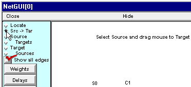
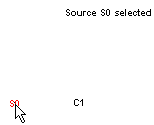
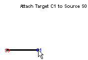
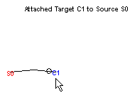

.. _step_3_connect_cells:

Step 3. Connect the cells
============

Connecting the cells actually entails two closely related subtasks :

- setting up the architecture of the network (what projects to what)

- specifying parameters for these connections (e.g. delays and weights)

A. We need to set up the network architecture.
-----------

Click on the Src -> Tar radio button, then read the new hint in the network layout field.

Click on S0 and hold the mouse button down while you drag the cursor toward C1.

When the cursor is on top of C1, the thin "rubber band" will become a thick black line, and the hint in the layout field will change to the message shown here:

To complete the attachment, just release the mouse button. The projection ("edge") from S0 to C1 will appear as a thin line with a slight bend near its midpoint. The O marks the downstream end of the projection.

This is a good time to save the Network Builder to a session file, if you haven't already done so.

Next we will specify the strength of this synaptic connection.