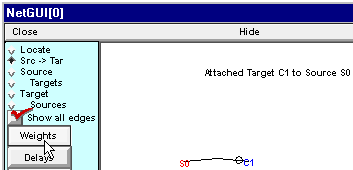
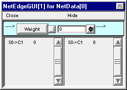
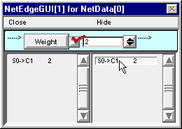

.. _step_3_connect_cells_continued:

Step 3. Connect the cells
=========

Continued
-------

B. We need to specify the parameters of the synaptic connections.
-----------

The default initial value of all synaptic weights is 0, i.e. the presynaptic cell will have no effect on the postsynaptic cell. To change this, click on the Weights button . . .

and this window appears:

This tool is intended to facilitate copying weights to one or more synapses in a network. Its bottom panel contains two lists, one on the left and one on the right. These lists show the weights of all of the edges (synaptic connections) in the network.

The top panel contains a numeric field that you can set manually (direct entry, spinner, etc.). Alternatively, you can set the value in this field by clicking on any edge in the left list.

If you click on an edge in the right list, its weight will be set to the value that appears in the Weight field in the top panel.

For this example, we want each spike from the presynaptic cell to trigger a spike in the postsynaptic cell, so just set the Weight to 2 . . .

and then click on the S0->C1 edge in the right list.

After you're finished with the NetEdgeGUI window, just close it. If you need to see it again, you can bring it back by clicking on the Weights button in the Network Builder.

Clicking on the Delays button brings up a tool that allows you to examine and change the delays in a network in a very similar way. For this simple example, we will leave the connection from S0 to C1 with its default delay of 1 ms.

Wouldn't you like to save the Network Builder to a session file?

Then we'll be almost ready to test our network.

