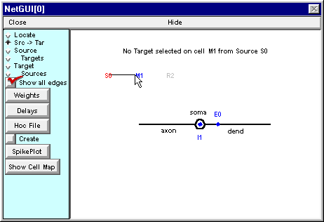
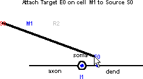
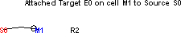
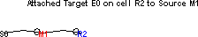
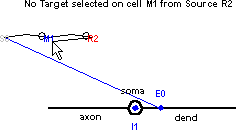
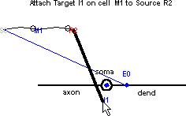
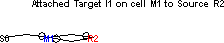

.. _step_3_connect_the_cells:

Step 3. Connect the cells
=======

Connecting cells in a net involves setting up the architecture of the network (what projects to what) and specifying the parameters for these connections (delays and weights).

A. We need to set up the network architecture.
------------

The initial steps for attaching a source to a target on a biophysical model neuron are identical to attaching a source to a target on an artificial cell.

Click on the Src -> Tar radio button, then read the new hint in the network layout field ("Select Source and drag mouse to Target").

Start by attaching S0 to the excitatory synapse on the dendrite of M1. Click on S0 and hold the mouse button down while dragging the cursor toward M1. When the cursor is close to M1, three things happen  :

1.
    the message in the layout field changes from "Source S0 selected" to "No Target selected on cell M1 from Source S0"

2.
    the M1 label turns blue

3.
    a shape plot of M1 appears in the middle of the layout area, showing each potential target for the connection you are about to make

At this point, if you just release the mouse button, no connection will be established. Instead, go ahead and drag the cursor to E0 on the shape plot of M1 -- not to the blue dot on the dendrite, but to the label "E0". The thin "rubber band" will become a thick black line, and the hint in the layout field will change to the message shown here.

To complete the attachment, just release the mouse button.

Next connect M1 to the excitatory synapse on R2. The result should look like this.

Finally, connect R2 to the inhibitory synapse on the soma of M1. The shape plot reveals the pre-existing projection from S0 to E0 on M1.

Don't let that distract you. Drag the cursor down to I1  .  .  .

 .  .  . and then release it to establish the connection.

This is a good time to save the Network Builder to a session file, if you haven't already done so.

Next we will specify the strengths of the synaptic connections.
