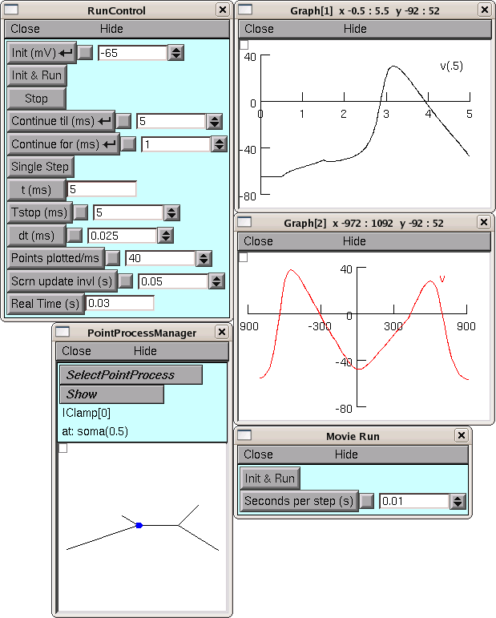

.. _use_the_model_specification:

Step 4. Use the model specification
===================================

Here is the response of the fuly configured model to a brief depolarizing current. 

The CellBuilder was hidden for this illustration, in order to save screen space.

:download:`parameterizedcode.zip <data/parameterizedcode.zip>` contains the files (init.hoc, tapercell.ses and iclamprig.ses) that were used to generate this figure. 