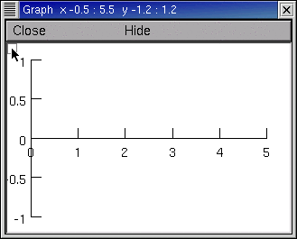
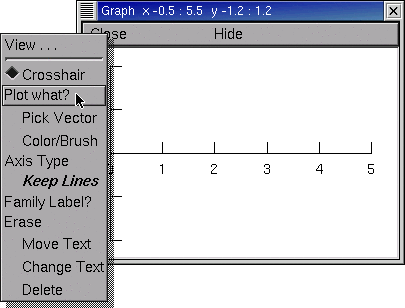
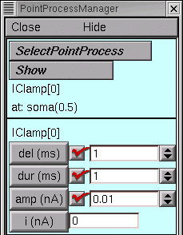
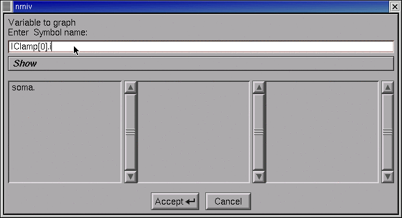
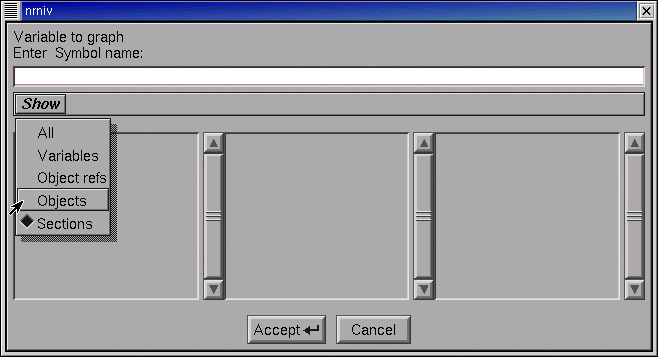
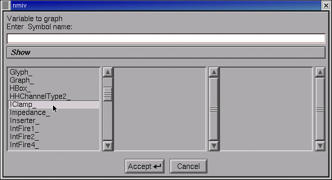
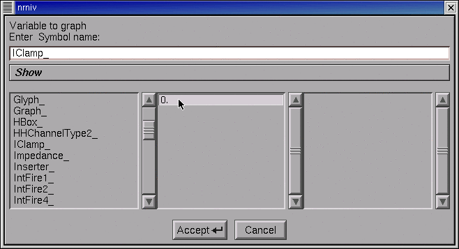
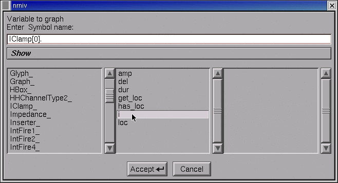
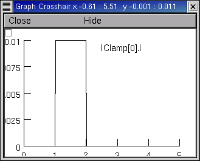

.. _using_plotwhat_to_specify_a_variable_to_be_plotted:

Using "Plot what?" to Specify a Variable to be plotted
======================================================

It is often necessary to plot variables other than membrane potential. This can be done from hoc, but it is also very easy with the GUI. Each Graph has a "Plot what?" tool that you can use to specify the name of the variable you want to graph. Let's use this to set up a graph of the current delivered by an IClamp.

Bring up a current axis graph (:menuselection:`NEURON Main Menu --> Graph --> Current axis`),
then click on the graph's menu square to get its primary menu.

Select Plot what?

This brings up a Plot what? tool.

What you do now depends on whether or not you know the name of what you want to plot.

If you used a PointProcessManager (PPM) to create your IClamp, the PPM's :menuselection:`Show --> Parameters` will tell you everything you need to know. In this example, the object's name is IClamp[0] and the variable that belongs to this object is called i, so the complete hoc name is IClamp[0].i

So click in the Plot what? tool's edit field, type IClamp[0].i, and then click on the Accept button.

If you don't know the exact name of something that belongs to an object,
click on the Plot what? tool's Show button and select the Objects item.

The left panel displays the root names of all classes.

Use its scroll bar to locate IClamp_, and then double click on IClamp_.

Now IClamp_ appears in the Plot what?'s edit field. Also, the middle panel shows the "index" of every existing instance of the IClamp class.

In this tutorial, there is only one IClamp object, and its index is 0.

Double click on the 0.

The edit field now contains IClamp[0], and the middle panel shows the public variables, functions, and procedures that belong to it.

Double click on the i.

At last the edit field contains IClamp[0].i, so click on Accept.

The graph now contains a label "IClamp[0]..." but its right end is hidden by the window frame.

In the graph's primary menu select Move. Click on the "IClamp[0]..." and drag it to the left so the entire string is visible. Restore the graph to Crosshair mode (go back to the graph's primary menu and select Crosshair).

Run a simulation. If necessary, rescale by using the graph's View = plot (in the secondary graph menu).

The power of Plot what? extends well beyond this mundane example. Plot what? is actually a "variable name browser" that can be used to discover and construct the complete hoc name for any variable, including objects and their public variables and methods. This is very handy when you need to refer to something with a strange name that is easy to forget or mistype, like the parameter that governs the voltage sensitivity of a time constant for a state transition in a ChannelBuilder. Now, was that called ChannelBuild[0].aliases.tauC2O.k  . . . ?

