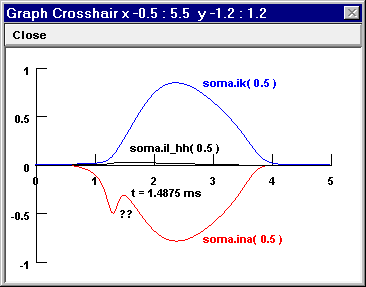
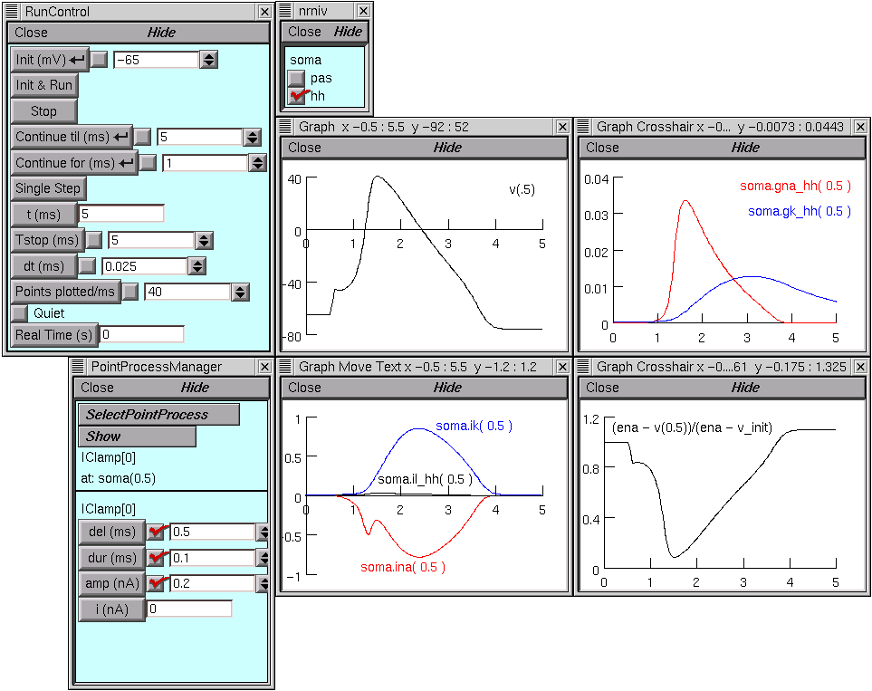
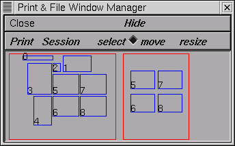
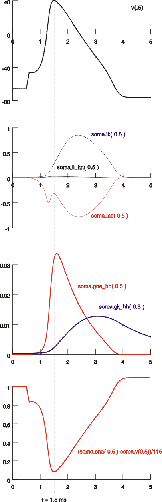

.. _working_with_postscript_and_idraw_figures:

Working with PostScript and idraw figures
=========================================

Exercise
--------

The chief aim of this exercise is to give you practice using graph windows and files created by NEURON.

The system
++++++++++

A patch of squid axon membrane with surface area 100 µm^2, to which a current pulse is applied to trigger an action potential.

The modeling experiment
+++++++++++++++++++++++

1.
    Start NEURON with its standard GUI with /course/grafex as the working directory, and invoke :menuselection:`NEURON Main Menu --> Build --> single compartment` to create a single section with a total surface area of 100 µm^2 and nseg = 1. Then insert the hh mechanism using the Distributed Mechanism Inserter (the small window with checkboxes), and attach a current clamp that delivers a 0.2 nA current step starting at t = 0.5 ms and lasting 0.1 ms (use the PointProcessManager).

    Plot Vm vs. t in one graph, and INa, IK, and Ileak vs. t in another. Make the colors of the current traces red, blue, and black respectively. Check that Tstop = 5 ms and run a simulation.

    Note the notch in INa(t). If this is real, how can it be explained?

2.
    Bring up a third graph with a State axis for plotting gNa(t) and gK(t), and repeat the simulation. Are the conductance time courses what you expected?

    Operational hint: use View = plot to automatically rescale the axes of this graph. Don't like the computer's choice of X and Y ranges & tick marks? :ref:`Try this <fixing_funny_axes>`

3.
    Given the outcome of part 2, what accounts for the appearance of INa(t)? Confirm your hypothesis, or get another clue, by bringing up a fourth graph window to plot the time course of something else.

    Hint: Consider entering an algebraic expression into the editing field of the Plot what? tool. :ref:`What to plot? <plot_what>`

    Another hint: If you get tired of trying to set up all these plots, just use NEURON to execute :download:`solution.ses <data/solution.ses.txt>` (i.e. nrngui ``solution.ses``, or click on the nrngui icon, then :menuselection:`File --> load session`, and choose ``solution.ses``).

Dressing up these figures for publication
+++++++++++++++++++++++

Using features of NEURON's graph windows
~~~~~~~~~~~~~~~~~~~~~

Use the Color/Brush tool to distinguish traces clearly from each other within a graph window, and to be consistent across graph windows.

Use Change text to create labels as necessary

Use Set View to make sure the x and y axes have reasonable ranges & tick marks, e.g. 0 - 1 by 0.2 instead of 0.1 - 1.05 by 0.19.

1.
    Save a session file that contains the graphical user interface you created to explore this problem. Hint: :menuselection:`NEURON Main Menu --> File --> save session`.

    ex.

2.
    Use the Print & File Window Manager (PFWM) to make a montage of the graphs that tell the story.

Then:

a. 
    create a hard copy printout of them (:menuselection:`PFWM --> Print --> To Printer`).

b. 
    save these results to an ASCII file (:menuselection:`PFWM --> Print --> Ascii`). Examine the contents of this file to see the format in which the trace data from the different graphs were saved. Also note the values for t in the voltage, current, and conductance data arrays. Why does t start at 0 for voltage, -0.0125 ms for current, and 0.0125 ms for conductance?

c.
    save the montage as an image file (:menuselection:`PFWM --> Print --> Idraw`). This produces an encapsulated PostScript file that you can edit with idraw (included with the UNIX/Linux version of NEURON) or import into a "draw" program such as CorelDraw for editing.

Editing the image file
~~~~~~~~~~~~~~~~~

Edit and annotate a copy of the image file you created in the previous step to bring it to publishable (?) quality, and make a hardcopy printout.

- mark and label features of interest
- eliminate distracting elements
- be sure plot lines use colors and styles that are distinctive within a graph yet consistent between graphs
- make sure that lines are thick enough (including axes and tick marks), and that labels are large enough; avoid serif typefaces in figures that will be turned into slides
- align and arrange graphs vertically and horizontally for convenient side-by-side comparisons

ex.

*Using idraw*

See :download:`man pages <data/idraw-readme.txt>` (idraw-README.txt) from Vectaport. Other documentation (not needed for this exercise, but maybe nice to have): using.idraw.ps.Z user's guide from MIT, and a PDF version of :download:`more man pages <data/idraw-more.pdf>` (which used to be available from CERN (http://www.cern.ch/PTTOOL/Grif/Paper.html) as idraw.ps.Z).

When NEURON saves a window to an idraw file, all the elements in the window are grouped together. To change any one of these elements, they must first be ungrouped (:menuselection:`Structure --> Ungroup`).

When NEURON saves more than one window to an idraw file, the relative locations of the windows are not preserved--they're piled up on top of each other like a stack of cards. Select and move them apart one by one.

Further comments
++++++++++++

idraw and LaTeX
~~~~~~~~~~

Since an idraw file is an encapsulated postscript (EPS) file, it contains a BoundingBox statement. This has useful information for placing these figures in a LaTeX file, e.g. an image file named temp1.id with

``%%BoundingBox: -6 2 255 163``

would be placed by

.. code::
    c++

    \begin{figure}[htb]    
    \begin{center} \begin{picture}(261,161)
    \special{psfile=temp1.id hoffset=6 voffset=-2}
    \end{picture} \end{center}
    \caption{HH action potential with 0.25 nA, 0.1 ms current pulse stimulus.}
    \end{figure}

Tips and tools for MSWindows
~~~~~~~~~~~~~~~~~

idraw doesn't exist for MSWindows. However, CorelDraw and many other vector graphics editors can import and export PostScript and EPS files, including idraw files. You may have to tell the Registry what to do about files that end in .id, or it might be easiest to save your idraw files with the extension .eps in the first place.

The basic functions of vector graphics editing programs are all pretty much the same as those of idraw, although some operational details will be different. Here are some :ref:`specific differences between idraw and CorelDraw <differences_between_idraw_and_coreidraw>`; most other MSWin "draw" programs are likely to be closer to CorelDraw in these regards.

Whatever draw program you use, you may also want to pick up GSVIEW and ghostscript (available free on the WWW). These are very good for previewing PS & EPS files, converting PS to EPS, inserting & extracting TIFF preview images (bitmaps). Note that GNU ghostview (for UNIX/Linux) is NOT the same as GSVIEW, and lacks many features of the latter! Sorry, there does not seem to be a UNIX/Linux implementation of GSVIEW.

A word about preview bitmaps appended to PostScript or EPS files. They're a good way to bring out cross-platform incompatibilities. TIFF and other preview images, while helpful for MSWin word processing programs, are not particularly useful under UNIX/Linux and can substantially increase file size. And the TIFF image "standard" is all too flexible, with the result that Mac TIFFs assume a different screen resolution than PC TIFFs. This can have very interesting side-effects that will amaze your friends and puzzle your collaborators.

.. toctree::
    :hidden:

    fixing_funny_axes.rst
    plot_what.rst
    differences_between_idraw_and_core.rst