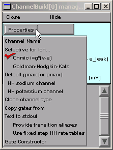

.. _properties:

Step 2. Specify the channel's basic properties
==============================================

Clicking on the Properties button reveals a menu that allows us to 
specify the basic properties of the channel.

Let's review the items in this menu.

The Properties Menu
-------------------

**Channel Name**
    Like the "suffix" in an NMODL-specified channel.
    Changing the name of the channel will change the suffix.

**Selective for Ion . . .**
    Similar to the USEION statement.  Your initial choices
    are **NonSpecific**, **na**, **k**, and **Create a new type**.
    If you choose **Create a new type**, 
    up pops a little window with an edit field 
    so you can type the name of the new ion followed by a space and
    then a number for its charge (this is analogous to NMODL's 
    **USEION x VALENCE n** syntax).
    
    Example: to create a chloride current, type **cl -1**
    
    After you create a new type of ion, it is automatically
    available at the hoc level and integrated into all relevant GUI tools 
    (including this one!).

**Ohmic i=g*(v-e)**
    **and**
**Goldman-Hodgkin-Katz**
    Specify whether the current-voltage relationship 
    is instantaneously linear ("ohmic") 
    or governed by the nonlinear GHK equation.
    A checkmark indicates which option has been selected;
    the default is "ohmic."

**Default gmax (or pmax)**
    Used to specify maximum conductance of an ohmic channel, 
    or permeability of a GHK channel.

**HH sodium channel**
    **and**
**HH potassium channel**
    Shortcuts for quickly configuring the Channel Builder 
    to model one of the classical squid axon active currents--a
    good starting point for many new channel models.

**Clone channel type**
    Spawns another Channel builder 
    whose specifications are identical to the present one, 
    with a single exception :  an automatically generated "index" 
    is appended to the "channel name."
    so that the two mechanisms won't interfere with each other.
    This is a good way to create a family of related channels.

**Copy gates from**
    Imports gate properties from another Channel builder.
    This is an alternative way to create a family of related channels.

**Text to stdout**
    Prints a concise description of the channel to stdout, 
    i.e. the same window as the oc> prompt.

**Gate Constructor**
    Brings up a tool for specifying gate properties.

Let's use the items in the Properties menu 
to fix the channel's name, ion, and default conductance and equilibrium potential.

----

A. Specify the channel's name.
------------------------------

Select

    Properties / Channel Name

and a window with an edit field appears.

Click inside the edit field and change the name as desired
(for this example I decided on myna).

Now click on the Accept button, or press the Enter key on the keyboard.
The window will disappear and the new name will appear in the Channel Builder.

----

B. Specify the channel's ion.
-----------------------------

Select

    Properties / Selective for Ion . . .

and a secondary menu appears that lists the available ions.

From the list of available ions, choose na

After releasing the mouse button, notice the changes 
in the top panel of the Channel Builder:

* "NonSpecific ohmic ion current" is now "na ohmic ion current"
* "i_myna = g_myna * (v - e_myna)" is now "ina = g_myna * (v - ena)"
* "Default gmax = 0 (S/cm2)  e = 0 (mV)" is now "Default gmax = 0 (S/cm2)"

----

C. Specify the channel's default conductance and equilibrium potential.
-----------------------------------------------------------------------

Select

    Properties / Default gmax

This brings up a "Default gmax" window that we can use to specify the default conductance.

For this example we need a value of 0.12 S/cm2.

The sodium equilibrium potential ena already has a default value, 
so we don't have to do anything about it.

    What if our mechanism used some new ion x whose 
    equilibrium potential ex is not already known to NEURON?
    
    1. The Channel Builder would automatically assign ex a default value of 0.
    2. The "Default gmax" window would offer a second row with widgets and 
       and a numeric field so we could specify a nonzero value for ex.

Now that we have specified the basic properties of this channel, 
here's what the Channel Builder looks like :

----

Time to save everything to a session file!
I called mine hhchannel.ses

Next we will specify the gating of our new channel.

----

[ `Outline <outline.html>`_ |
`Previous <startchnlbld.html>`_ |
`Next <hhstates.html>`_ ]

*Copyright © 2004-2005 by N.T. Carnevale and M.L. Hines, All Rights Reserved.*
