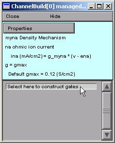
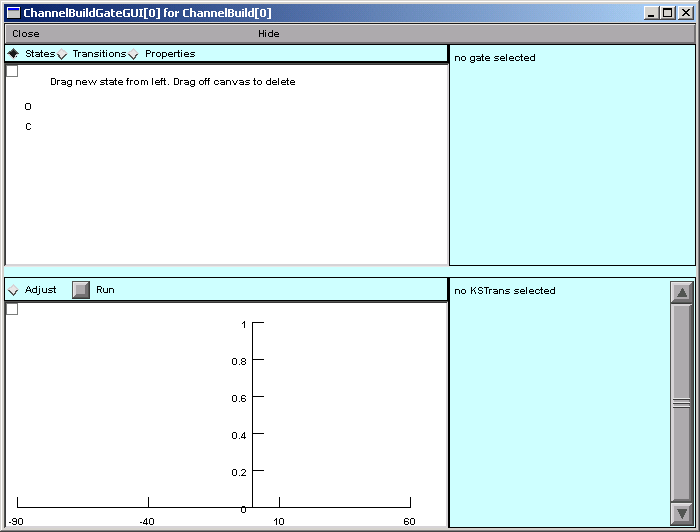
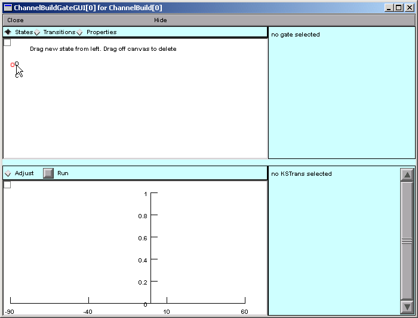
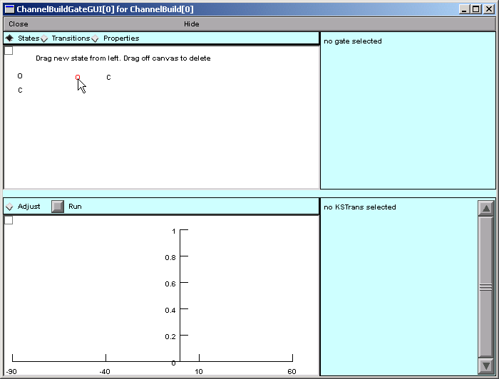
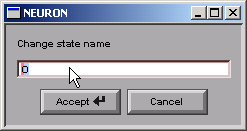
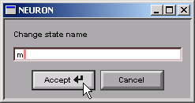

Step 3. Specify channel gating
==============================

The differential equations 
and kinetic schemes that regulate channel gating equations will 
eventually be displayed in the bottom panel of the Channel Builder.
At first, however, the only thing in this panel is the prompt

    "Select here to construct gates"

So click on this prompt

and a ChannelBuildGateGUI tool appears (we'll call it the GateGUI).
This tool is used to specify gating that may involve any combination of 
HH-style equations and/or kinetic reactions.

Clicking on the GateGUI's Close button dismisses this window, 
but you can always get it back by 
clicking on the corresponding item in the bottom panel of the Channel Builder.
But if you close the Channel Builder, you'll lose everything--unless you saved it to 
a session file.

**A "big picture" perspective on what we're trying to do**

Broadly speaking, in order to specify channel gating, 
we have to accomplish three related tasks:

1. Specify the states that control channel gating.
2. Specify transitions between kinetic scheme states.
3. Specify the equations that describe the voltage sensitivity of HH-style states
   
   or
   
   specify voltage and ligand effects on transitions between kinetic scheme states.

With that in mind, the organization and use of the GateGUI tool is easy to understand.
The top panel of this tool contains a canvas, which is used to create and destroy states 
and set up transitions between them.
Above the canvas are three radio buttons labeled States, Transitions, and Properties.
These buttons control what happens when you click and drag on items in the canvas.
They correspond directly to the three related tasks we have to accomplish, 
and their left to right sequence hints at the order in which we will use them.

----

A. Specify the states that control channel gating.
--------------------------------------------------

Make sure the States button is selected.

The canvas's "palette" offers two items called O and C.
Clicking on one of these spawns a new state, 

which you should then drag over to a convenient location on the canvas and release.

.. image:: ./figs/spawngate1.gif

Do this several times to get the hang of it.
Each new state will be named C, C2, C3 . . . and O, O2, O3 etc. 
(the "1" is omitted from the first C and O).
To delete a state, just drag it off the canvas.

    Notice that each time you create a new state, a new equation of the form
        x' = ax*(1 - x) - bx*x
    
    appears in the bottom panel of the Channel Builder.
    
    Also, each time you delete a state, the corresponding equation *disappears*.

When you have had enough practice spawning and deleting states, 
make sure you end up with only two states.

Let's change the names of these states to m and h.
You may already have noticed that you can reposition states with 
the usual "click and drag".
But if you just click and release *without* dragging

up pops a panel for changing the name of the state.

Notice that this also changes the corresponding equation in the bottom panel of the Channel Builder.

Now change the name of the other state to h.

You're ready for the next step when the Channel Builder looks like this :

----

.. _transitions:

B. Specify transitions between kinetic scheme states.
-----------------------------------------------------

Since we're creating an HH-style mechanism, 
there are no kinetic scheme states, and consequently no state transitions.
So instead of connecting the m and h states with little "reaction pathway arrows," 
we leave them "isolated."
The Channel Builder automatically treats such isolated states as HH-style gating variables.

----

Now save everything to a session file!

Next we specify the voltage dependence of the m and h states.

----

[ `Outline <outline.html>`_ |
`Previous <basicprop.html>`_ |
`Next <vdepend.html>`_ ]

*Copyright © 2004-2005 by N.T. Carnevale and M.L. Hines, All Rights Reserved.*
