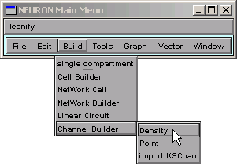
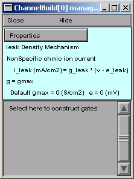

Step 1. Bring up a Channel Builder
===================================

We're setting up a distributed or "density" mechanism, 
so create a Channel Builder by clicking on 

    Build / Channel Builder / Density

in the NEURON Main Menu toolbar.

Release the mouse button and a Channel Builder appears.
This one is called 
ChannelBuild[0] ; we'll refer to it as "CB".

**In the top panel of this tool we see that it starts out specifying a passive leak current described by Ohm's law, and that it is carried by a "nonspecific ion":**
    i_leak = g_leak * (v - e_leak)

**The default values for the conductance density and equilibrium potential of this current are 0 S/cm**\ :sup:`2` **and 0 mV, respectively. Ohm's law is OK, but we have to change the other properties of this channel:**
    its name, its ion, and its default conductance and equilibrium potential.

----

Next we will change the channel's name, ion, default conductance and equilibrium potential.

----

[ `Outline <outline.html>`_ |
`Next <basicprop.html>`_ ]

*Copyright © 2004-2005 by N.T. Carnevale and M.L. Hines, All Rights Reserved.*
