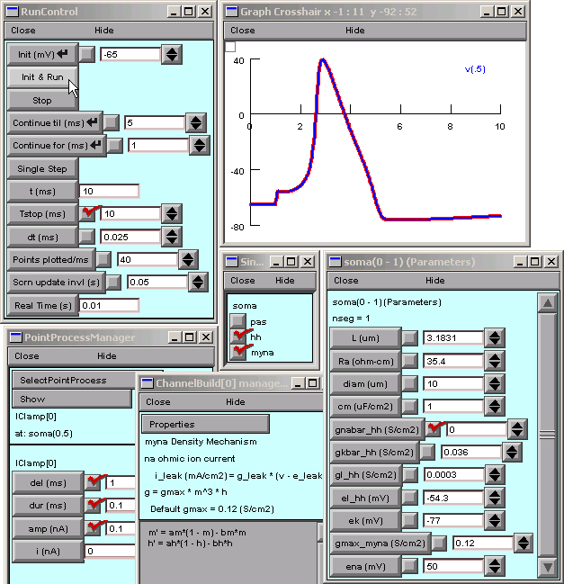

Step 4. Test the channel
==========================

We can test our new channel by doing a "virtual knockout and rescue experiment."

Experimental design
-------------------

Apply a brief suprathreshold stimulus to a model cell under two "control" and two "test" conditions.

* Control 1 -- The model has only the hh mechanism.
  
  Prediction: This should trigger a normal spike.

* Control 2 -- The model has both hh and myna, but gmax_myna is 0 
  (analogous to inserting the "myna gene" but not expressing it).
  
  Prediction: This should trigger a spike identical to what was seen in Control 1.

* Test 1 -- The model has both hh and myna, but both gnabar_hh and gmax_myna are 0
  (analogous to a knockout mutation affecting hh sodium channels).
  
  Prediction: There should be no spike.

* Test 2 -- The model has both hh and myna, but gnabar_hh is 0 and gmax_myna is 0.12 S/cm²
  (hh sodium channels are still "knocked out," but myna is now expressed).
  
  Prediction: This should "rescue" the spike.
  Furthermore, if myna is properly implemented, 
  the response of this model to injected current 
  should be identical to what happened in the two Control experiments.

**Control 1 -- The model has only the hh mechanism.**

1. Make a single compartment model that has hh.
   
   Give the model a surface area of 100 μm².
   
   NEURON Main Menu / Build / single compartment
   
   SingleCompartment / hh

2. Bring up a RunControl.
   
   NEURON Main Menu / Tools / RunControl
   
   Set Tstop = 10 ms

3. Attach a current stimulus to deliver a 0.1 nA x 0.1 ms pulse starting at 1 ms.
   
   NEURON Main Menu / Tools / Point Processes / Managers / Point Manager
   
   PointProcessManager / SelectPointProcess / IClamp
   
   PointProcessManager / Show / Parameters
   
   Set del = 1 ms, dur = 0.1 ms, amp = 0.1 nA

4. Create a plot of membrane potential vs. time.
   
   NEURON Main Menu / Graph / Voltage axis

5. Click on Init & Run in the RunControl panel.
   
   The current pulse should trigger a normal action potential.

Before doing the next experiment, save everything to a session file called control1.ses

**Control 2 -- The model has both hh and myna, but gmax_myna is 0 
(analogous to inserting the "myna gene" but not expressing it).**

Start with the model you used for Control 1.

1. Add the myna mechanism.
   
   SingleCompartment / myna

2. "Block the expression of myna."
   
   Reduce gmax_mna to 0.
   
   This can be done from hoc, but it is easier to keep track of what's happening 
   if you control the model's parameters with a Parameters panel.
   To bring up a Parameters panel:
   
   * NEURON Main Menu / Tools / Distributed Mechanisms / Viewers / Shape Name
     brings up a Section Parameters window.
     This shows a stick figure of the cell in its left panel, 
     and a list of section names in its right panel.
   
   * In the right panel of the Section Parameters window, double click on "soma".
     The soma's Parameters panel will appear.
     (You can now close the Section Parameters window)
   
   In the Parameters panel, change gmax_myna to 0.
   Leave gnabar_hh equal to 0.12 S/cm2.

3. Run a simulation.
   
   Does this result confirm or contradict the prediction?

Save everything to a session file called control2.ses

**Test 1 -- The model has both hh and myna, but both gnabar_hh and gmax_myna are 0 
(analogous to a knockout mutation affecting hh sodium channels).**

Start with the model you used for Control 2.

1. "Knock out hh sodium channels."
   
   Use the soma's Parameters panel to change gnabar_hh to 0.
   Leave gmax_myna equal to 0.

2. Run a simulation.
   
   Is this the predicted outcome?

Save everything to a session file called test1.ses

**Test 2 -- The model has both hh and myna, 
but gnabar_hh is 0 and gmax_myna is 0.12 S/cm² 
(hh sodium channels are still "knocked out," but myna is now expressed).**

Start with the model you used for Test 1.

1. "Express myna."
   
   Use the soma's Parameters panel to change gmax_myna to 0.12 S/cm2.
   Leave gnabar_hh equal to 0.

2. Run a simulation.
   
   Is this voltage trace identical to the control traces?

Don't let this be "the simulation that got away."
Save everything to a session file called test2.ses.

Here's an example of a complete GUI that constructs the model, 
controls the simulation, and displays results.
The thick red trace was produced by Control 1 and 2,
and the thin blue trace that overlies it was generated by Test 2.

:download:`This is a link to hhchnltest.hoc <hhchnltest.hoc>`,
which you can use to recreate this figure (it's actually a session 
file, but its extension was changed to "hoc" to make it runnable from the WWW).
Both this file and the fully configured :download:`hhchannel.ses <hhchannel.ses>`
are packaged with the zipped archive of this tutorial.

----

| :doc:`outline` |
| :doc:`vdepend` |

.. note::
   Copyright © 2004-2006 by N.T. Carnevale and M.L. Hines, All Rights Reserved.
