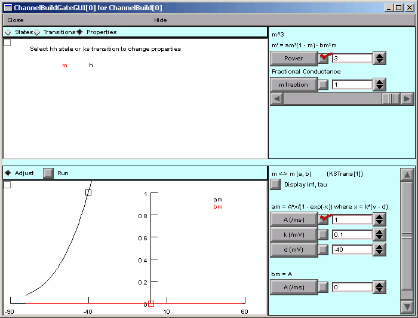

Step 3. Specify channel gating *continued*
==========================================

C. Specify the equations that describe the voltage sensitivity of states.
--------------------------------------------------------------------------

First make sure that the Properties radio button is ON.

.. figure:: ./figs/gateproperties0.gif
   :alt: Gate Properties dialog

Now let's deal with m.

Clicking on m causes many changes in the appearance of the GateGUI.

.. figure:: ./figs/selectm.gif
   :alt: Selecting m gate

Look at the area to the right of the canvas.
This contains controls for specifying the "Power" for m 
and its associated "fractional conductance".

"Power" is the exponent of m in the right hand side of the equation
   g\ :sub:`Na` = gbar\ :sub:`Na` m³ h

Change it to 3.

"Fractional conductance" is useful for kinetic scheme channel descriptions, 
in which different states may have different levels of conductance.
For HH-style states, the "fractional conductance" is a constant multiplier 
that is applied to every instance of the state in the equation for 
channel conductance.

Example: if you change the "m fraction" to 0.7, the equation
in the top panel of the Channel Builder will be
   g = gmax * (0.7*m)^3 * h

instead of the desired
   g = gmax * m^3 * h

So just make sure that the "fractional conductance" of every HH-style state is 1.

Now we need to specify the voltage dependence of the rate constants am and bm.

Recall that
   a\ :sub:`m` = 0.1 (V + 40) / [1 - e\ :sup:`-(V + 40) / 10`]

Specifying a functional form is easy--we only have to select from 
the GateGUI's EquationType menu. 
Click on

   EquationType

then down to

   am

and over to

   A*x / (1 - exp(-x)) where x = k*(v - d)

.. figure:: ./figs/amform.gif
   :alt: Selecting am equation form

.. note::
   An aside: the other functional forms in the menu are constant, single exponential, logistic, and KSChanTable.

Now the GateGUI looks like this

The parameters A, k, and d are all initially 0.
A little rearranging of the equation for a\ :sub:`m` shows us that 
A = 1, k = 0.1, and d = -40.
Entering these values into the corresponding numeric fields gives us

Notice that the graph in the bottom half of the GateGUI shows 
the voltage dependence of am and bm.
am increases nicely as membrane potential depolarizes, 
but bm remains 0 at all voltages.

Obviously we have to specify the voltage dependence of bm, 
but it seems that the EquationType button has disappeared...
until we realize that it 
was just pushed out of sight by the appearance of am's buttons for A, k, and d.
There is a scroll bar on the right edge of this panel, and dragging this down

unmasks the EquationType button.

The equation for bm is just 
   b\ :sub:`m` = 4 e\ :sup:`-(V + 65) / 18`

so we select the exponential functional form

The new parameters for bm are all 0 but should be A = 4, k = -1/18, and d = -65.
Making these changes, we now see this:

You may have to resize the window to see the full extent of the bottom half 
of the GateGUI tool.
You also may want to use "View = plot" to rescale the display of am and bm.

.. note::
   Some interesting asides--

   1. Clicking on the "Display inf,tau" checkbox toggles the graph 
      between plots of am and bm
      and plots of the voltage dependence of infm (steady state of m) and taum.

   2. The GateGUI's EquationType menu also allows gating properties 
      to be specified in terms of steady state and time constant.
      The functional forms offered for inf,tau (constant, logistic, exponential) 
      are the only ones 
      necessary for a model in which the energy difference between
      states is linear with voltage and the energy barrier is also
      linear with voltage.

   3. The little squares on the am and bm graphs are "control points" that you 
      can click on and drag to quickly change their A and d parameters.
      If the Adjust radio button is ON, vertical movement changes A, 
      and horizontal movement changes d.

   4. If you click near a curve, the k parameter will be adjusted so
      that the little square control point does not move but the curve
      passes through the mouse location.

   5. If the Run checkbox is checked, 
      NEURON automatically executes a new simulation every time you change a parameter.
      This can give quick insights 
      into how parameter changes affect excitability.
      We'll return to this later.

***Doesn't this seem like a good time to save to a session file?***

Now we have to deal with h.

Click on h in the canvas.
Specify its "power" and "fractional conductance" (hint: both 1).

Then specify the voltage dependence of its rate constants ah and bh, 
which are described by
   a\ :sub:`h` = 0.07 e\ :sup:`-(V + 65) / 20`
   
   Hint: exponential, A = 0.07, k = -0.05, d = -65
   
   b\ :sub:`h` = 1 / [e\ :sup:`-(V + 35) / 10` + 1]
   
   Hint: logistic, A = 1, k = -0.1, d = -35

You should end up with something like this:

Bring up the inf,tau plots for h.
Check these plots to make sure they look like they should.

----

Before moving on to the next step, save the Channel Builder to a session file!

Next we will test our new channel in a model cell.

----

| :doc:`outline` |
| :doc:`startchnlbld` |
| :doc:`testhh` |

.. note::
   Copyright © 2004-2008 by N.T. Carnevale and M.L. Hines, All Rights Reserved.
