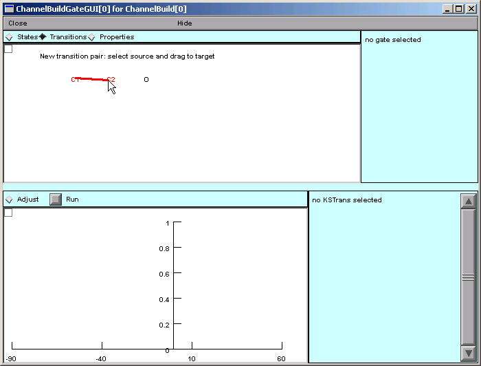
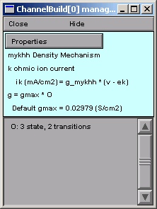

Step 3. Specify channel gating
===============================

Here's a "big picture" reminder of what we have to do.

1. Specify the states that control channel gating.
2. Specify transitions between kinetic scheme states.
3. Specify the equations that describe the voltage sensitivity of HH-style states
   
   or
   
   specify voltage and ligand effects on transitions between kinetic scheme states.

So let's get started.

----

**A. Specify the states that control channel gating.**

First make sure the States button is selected.

* Click on the prompt
  
  "Select here to construct gates"
  
  in the bottom panel of the Channel Builder.

* Use the GateGUI tool to create two closed (C) and one open (O) state.

* For notational consistency with the conceptual model that we outlined, 
  make sure the closed states are called C1 and C2, 
  and arrange the three states as shown here:

.. figure:: ./figs/gates.gif
   :alt: Three-state kinetic scheme with C1, C2, and O states

----

.. _transitions:

**B. Specify transitions between kinetic scheme states.**

Start by clicking on the Transitions radio button at the top of the GateGUI.

Notice the new prompt at the top of the canvas.
Do what it says, i.e. click on C1 and drag to C2.

As you drag away from C1 you will see a thin red "rubber band" line that follows the mouse pointer.

When you reach C2, this line will become thick.

Now release the mouse button, and the line will be replaced by a double-headed arrow.
The "v" next to this arrow means that the reaction rates are voltage-dependent.

Now create a transition from C2 to O.
The GateGUI should end up looking like this

and the Channel Builder will look like this:

Note that the conductance is the product of channel density and O, the open state.
This is exactly what we want.
All that remains is to specify the voltage dependence of the state transitions.

----

We're almost ready to specify how voltage affects the transitions.

But first, save everything to a session file!

----

| :doc:`outline` |
| :doc:`vdepend` |

.. note::
   Copyright © 2004 by N.T. Carnevale and M.L. Hines, All Rights Reserved.
