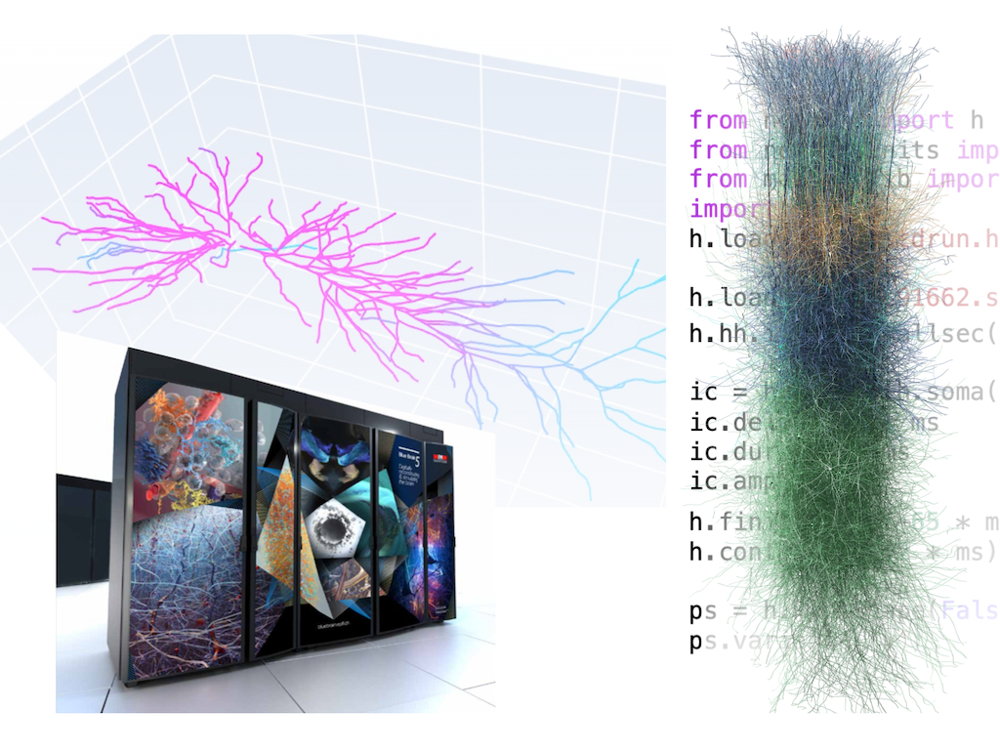

.. NEURON documentation master file, created by
   sphinx-quickstart on Fri Nov 15 09:46:09 2019.

The NEURON Simulator
====================

NEURON is a simulator for neurons and networks of neurons that runs efficiently on your local machine, in the cloud, or on an HPC.
Build and simulate models using Python, HOC, and/or NEURON's graphical interface. From this page you can watch :ref:`recorded NEURON classes <training_videos>`, 
read the :ref:`Python <python_prog_ref>` or :ref:`HOC <hoc_prog_ref>` programmer's references,
explore the `source code for over 750 NEURON models on ModelDB <https://senselab.med.yale.edu/ModelDB/ModelList?id=1882&allsimu=true>`_, and more (use the links on the side or search).

.. toctree::
   :maxdepth: 1
   :caption: Building:
   :hidden:

   install/install
   cmake_doc/index
   install/developer

.. toctree::
   :maxdepth: 2
   :caption: User documentation:
   :hidden:

   videos/index
   guide/index
   publications
   

.. toctree::
   :maxdepth: 2
   :caption: NEURON scripting:
   :hidden:

   python/index
   hoc/index
   otherscripting.rst
   tutorials/index
   rxd-tutorials/index
   coreneuron/index

.. toctree::
   :maxdepth: 2
   :caption: Developer documentation:
   :hidden:

   scm/index
   dev/index
   doxygen

.. toctree::
   :maxdepth: 1
   :caption: Removed Features
   :hidden:

   removed_features.rst

.. toctree::
   :maxdepth: 1
   :caption: Changelog
   :hidden:

   changelog.md

Installation
------------

.. raw:: html

   

      

         On macOS, install via:
         <code>pip3 install neuron</code>
      

      

         Alternatively, 
         <a href="https://github.com/neuronsimulator/nrn/releases/download/8.1.0/nrn-8.1.0-macosx-10.9-universal2-py-38-39-310.pkg">download macOS installer</a>
      

   

   

      <a class="button" href="https://github.com/neuronsimulator/nrn/releases/download/8.1.0/nrn-8.1.0.w64-mingw-py-36-37-38-39-310-setup.exe">Download Windows installer (64 bit)</a>
   

   

      On Linux, install via:
      <code>pip3 install neuron</code>
   

   

      <a href="https://github.com/neuronsimulator/nrn/releases/tag/8.1.0">All standard versions</a> 
      <a href="http://github.com/neuronsimulator/nrn">Source on github</a> 

   For troubleshooting, see the <a href="install/install_instructions.html">detailed installation instructions</a>.

   

----

See also the NEURON documentation `index <genindex.html>`_.
