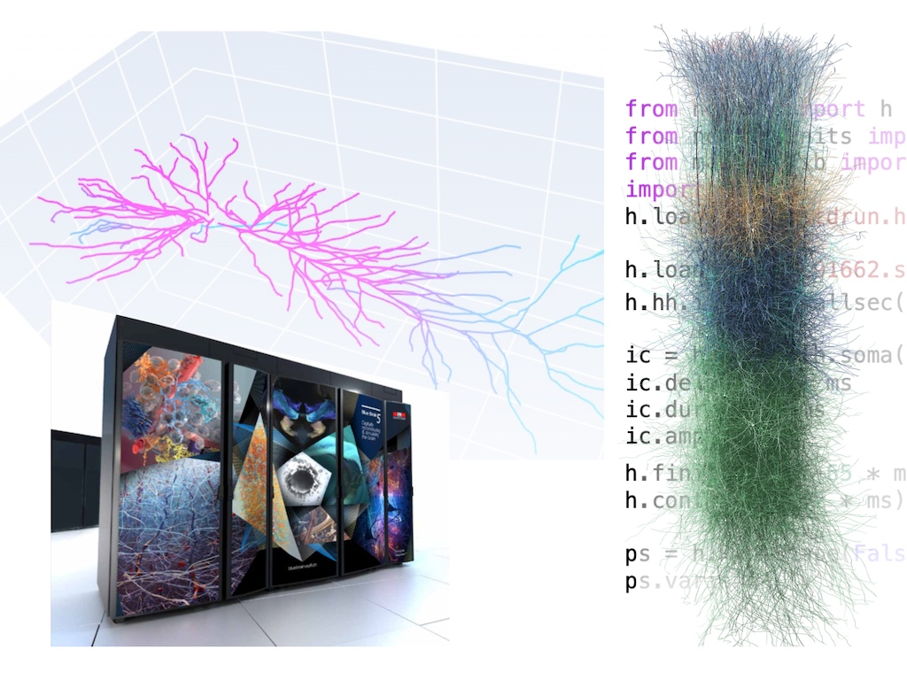

.. NEURON documentation master file, created by
   sphinx-quickstart on Fri Nov 15 09:46:09 2019.

The NEURON Simulator
====================

NEURON is a simulator for neurons and networks of neurons that runs efficiently on your local machine, in the cloud, or on an HPC.
Build and simulate models using Python, HOC, and/or NEURON's graphical interface. From this page you can watch :ref:`recorded NEURON classes <training_videos>`, 
read the :ref:`Python <python_prog_ref>` or :ref:`HOC <hoc_prog_ref>` programmer's references,
`browse the NEURON forum <https://www.neuron.yale.edu/phpBB/>`_,
explore the `source code for over 800 NEURON models on ModelDB <https://modeldb.science/modellist/1882?all_simu=true>`_, 
and more (use the links on the side or search).

.. toctree::
   :maxdepth: 1
   :caption: Building:
   :hidden:

   install/install
   cmake_doc/index
   install/developer

.. toctree::
   :maxdepth: 2
   :caption: User documentation:
   :hidden:

   videos/index
   guide/index
   courses/exercises2018
   The NEURON forum <https://neuron.yale.edu/phpBB>
   publications
   publications-using-neuron
   

.. toctree::
   :maxdepth: 2
   :caption: NEURON scripting:
   :hidden:

   scripting.rst
   python/index
   hoc/index
   otherscripting.rst
   tutorials/index
   rxd-tutorials/index
   coreneuron/index

.. toctree::
   :maxdepth: 2
   :caption: NMODLanguage:
   :hidden:

   nmodl/index

.. toctree::
   :maxdepth: 2
   :caption: Developer documentation:
   :hidden:

   scm/index
   dev/index
   doxygen

.. toctree::
   :maxdepth: 1
   :caption: Removed Features
   :hidden:

   removed_features.rst

.. toctree::
   :maxdepth: 1
   :caption: Changelog
   :hidden:

   changelog.md

Installation
------------

.. tab-set::

   .. tab-item:: macOS

      The recommended installation is to open a Terminal (Press `⌘` + `Space` and type "terminal")
      and type:

      .. code::

         pip3 install neuron
      
      Alternatively, you can use the `PKG installer <https://github.com/neuronsimulator/nrn/releases/download/8.2.3/nrn-8.2.3-macosx-10.9-universal2-py-38-39-310-311.pkg>`_.

      For troubleshooting, see the `detailed installation instructions <install/install_instructions.md>`_.

   .. tab-item:: Linux

      The recommended installation is to open a terminal and type:

      .. code::

         pip3 install neuron
      
      For troubleshooting, see the `detailed installation instructions <install/install_instructions.md>`_.

   .. tab-item:: Windows

      `Download the Windows Installer <https://github.com/neuronsimulator/nrn/releases/download/8.2.3/nrn-8.2.3.w64-mingw-py-37-38-39-310-311-setup.exe>`_.

      You can also install the Linux wheel via the Windows Subsystem for Linux (WSL). See `instructions <install/install_instructions.html#windows-subsystem-for-linux-wsl-python-wheel>`_.

      For troubleshooting, see the `detailed installation instructions <install/install_instructions.md>`_.

   
   .. tab-item:: Cloud

      On `Google Colab <https://colab.research.google.com>`_ and many other cloud Jupyter providers, you can install
      NEURON via

      .. code::

         !pip install neuron
      
      NEURON is already installed on `The Neuroscience Gateway <https://www.nsgportal.org>`_
      and on `EBRAINS <https://ebrains.eu>`_.
   
   .. tab-item:: Source code

      View and suggest changes to the source code at:
      `github.com/neuronsimulator/nrn <https://github.com/neuronsimulator/nrn>`_

      For instructions on how to build from source,
      `go here <install/install_instructions.html#installing-source-distributions>`_.

.. raw:: html

   

|

See also the NEURON documentation `index <genindex.html>`_ and the `NEURON forum <https://www.neuron.yale.edu/phpbb/>`_.
