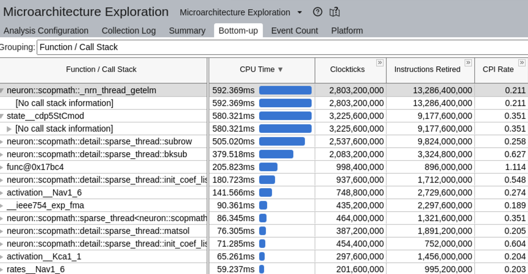
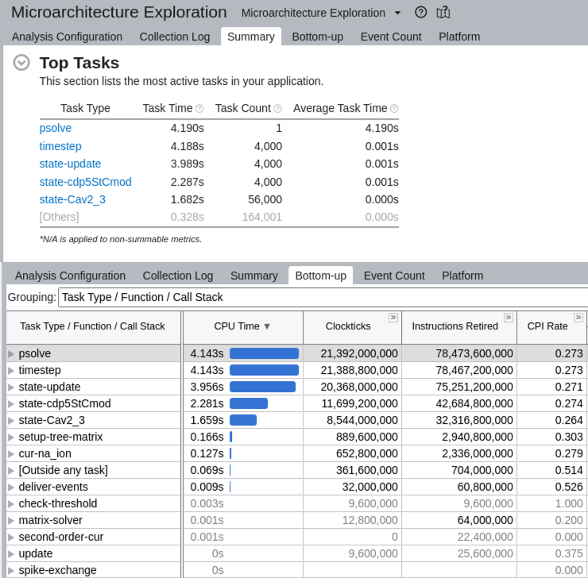
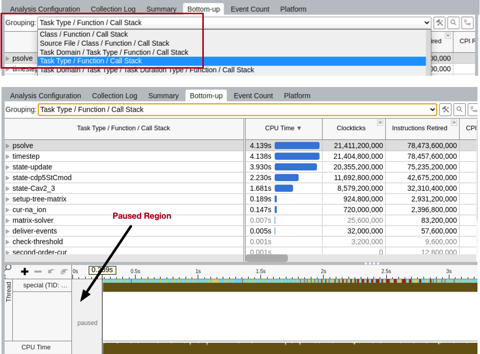
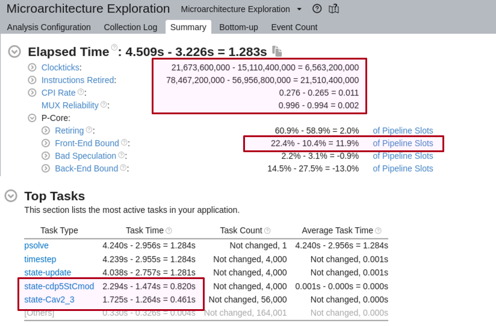
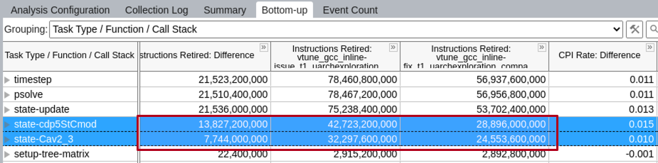
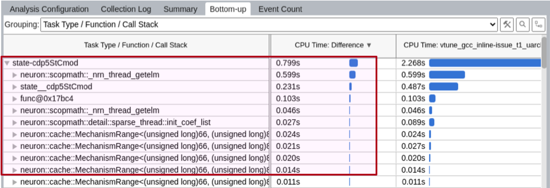
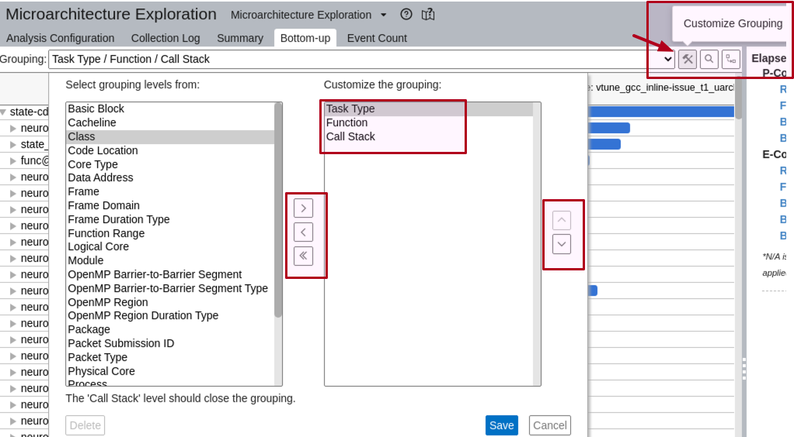
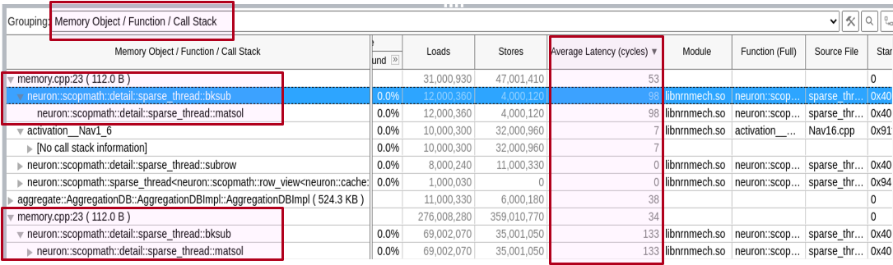
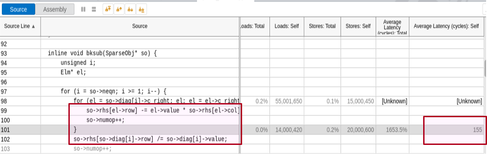

Diagnosis and Debugging
-----------------------

Disorganized and incomplete but here is a place to put some sometimes
hard-won hints for Diagnosis

Debugging is as close as I get to application of the scientific method.
From reality not corresponding to expectation, a hypothesis,
or wild guess based on what is already known about the lack of correspondence,
is used to generate a computational experiment such that result vs
prediction inspires generation of a more detailed hypothesis with a now
more obvious experiment that focuses attention more on the underlying problem.

#### Segfault and crash.

Begin with [GDB](#GDB) to quickly find where the segfault or crash occurred.
If the underlying cause is resistent to variable inspection, e.g. corrupted
memory by unknown other program statements having nothing to do with
what is going on the location of the crash, [Valgrind](#Valgrind) is an
extremely powerful tool, but at the cost of one or two orders of
magnitude slowdown in running the program.
If valgrind is too slow and you cannot reduce the size or simulation time
while continuing to experience the error, it may be worthwhile to look into
[LLVM address sanitizer](https://github.com/neuronsimulator/nrn/issues/1213).

#### NaN or Inf values
Use [h.nrn_feenableexcept(1)](../python/programming/errors.rst#nrn_feenableexcept)
to generate floating point exception for
DIVBYZERO, INVALID, OVERFLOW, exp(700). [GDB](#GDB) can then be used to show
where the SIGFPE occurred.

#### Different results with different nhost or nthread.
What is the gid and spiketime of the earliest difference?
Use [ParallelContext.prcellstate](../python/modelspec/programmatic/network/parcon.rst#ParallelContext.prcellstate)
for that gid at various times
before spiketime to see why and when the prcellstate files become different.
Time 0 after initialization is often a good place to start.

#### GDB
If you normally run with ```python args``` and get a segfault...
Build NEURON with ```-DCMAKE_BUILD_TYPE=Debug```. This avoids
optimization so that all local variables are available for inspection.
```
gdb `pyenv which python`
run args
bt # backtrace
```
There are many gdb tutorials and reference materials. For mac, lldb is
available. See <https://lldb.llvm.org/use/map.html>

Particularly useful commands are bt (backtrace), p (print), b (break), watch,
c (continue), run, n (next)
E.g ```watch -l ps->osrc_``` to watch a variable outside the local scope where
the PreSyn is locally declared.

#### GDB and MPI
If working on a personal computer (not a cluster) and a small number of ranks,
using mpirun to launch a small number of terminals that run serial gdb
has proven effective.
```
mpirun -np 4 xterm -e gdb `pyenv which python`
```

#### Valgrind
Extremely useful in debugging memory errors and memory leaks.

With recent versions of Valgrind (e.g. 3.17) and Python (e.g. 3.9) the
large number of `Invalid read...` errors which obscure the substantive errors,
can be eliminated with `export PYTHONMALLOC=malloc`

```
export PYTHONMALLOC=malloc
valgrind `pyenv which python` -c 'from neuron import h'
    ==47683== Memcheck, a memory error detector
    ==47683== Copyright (C) 2002-2017, and GNU GPL'd, by Julian Seward et al.
    ==47683== Using Valgrind-3.17.0 and LibVEX; rerun with -h for copyright info
    ==47683== Command: /home/hines/.pyenv/versions/3.9.0/bin/python -c from\ neuron\ import\ h
    ==47683== 
    ==47683== 
    ==47683== HEAP SUMMARY:
    ==47683==     in use at exit: 4,988,809 bytes in 25,971 blocks
    ==47683==   total heap usage: 344,512 allocs, 318,541 frees, 52,095,055 bytes allocated
    ==47683== 
    ==47683== LEAK SUMMARY:
    ==47683==    definitely lost: 1,991 bytes in 20 blocks
    ==47683==    indirectly lost: 520 bytes in 8 blocks
    ==47683==      possibly lost: 2,971,659 bytes in 19,446 blocks
    ==47683==    still reachable: 2,014,639 bytes in 6,497 blocks
    ==47683==                       of which reachable via heuristic:
    ==47683==                         newarray           : 96,320 bytes in 4 blocks
    ==47683==         suppressed: 0 bytes in 0 blocks
    ==47683== Rerun with --leak-check=full to see details of leaked memory
    ==47683== 
    ==47683== For lists of detected and suppressed errors, rerun with: -s
    ==47683== ERROR SUMMARY: 0 errors from 0 contexts (suppressed: 0 from 0)
```

With respect to memory leaks, we are most interested in keeping the
`definitely lost: 1,991 bytes in 20 blocks` to as low a value as possible
and especially fix memory leaks that increase when code is executed
multiple times. To this end, the useful valgrind args are
`--leak-check=full --show-leak-kinds=definite`
 

#### Valgrind + gdb
```
valgrind --vgdb=yes --vgdb-error=0 `pyenv which python` test.py
```
Valgrind will stop with a message like:
```
==31925== TO DEBUG THIS PROCESS USING GDB: start GDB like this
==31925==   /path/to/gdb /home/hines/.pyenv/versions/3.7.6/bin/python
==31925== and then give GDB the following command
==31925==   target remote | /usr/local/lib/valgrind/../../bin/vgdb --pid=31925
==31925== --pid is optional if only one valgrind process is running
```
In another shell, start GDB:
```
gdb `pyenv which python`
```
Then copy/paste the above 'target remote' command to gdb:
```
target remote | /usr/local/lib/valgrind/../../bin/vgdb --pid=31925
```
Every press of the 'c' key in the gdb shell will move to the location of
the next valgrind error.


#### Sanitizers
The `AddressSanitizer` (ASan), `LeakSanitizer` (LSan), `ThreadSanitizer` (TSan)
and `UndefinedBehaviorSanitizer` (UBSan) are a collection of tools
that rely on compiler instrumentation to catch dangerous behaviour at runtime.
Compiler support is widespread but not ubiquitous, but both Clang and GCC
provide support.

They are all enabled by passing extra compiler options (typically
`-fsanitize=XXX`), and can be steered at runtime using environment variables
(typically `{...}SAN_OPTIONS=...`).
ASan in particular requires that its runtime library is loaded very early during
execution -- this is typically not a problem if you are directly launching an
executable that has been built with ASan enabled, but more care is required if
the launched executable was not built with ASan.
The typical example of this case is loading NEURON from Python, where the
`python` executable is not built with ASan.

As of [#1842](https://github.com/neuronsimulator/nrn/pull/1842), the NEURON
build system is aware of ASan, LSan and UBSan, and it tries to configure the
sanitizers correctly based on the `NRN_SANITIZERS` CMake variable.
In [#2034](https://github.com/neuronsimulator/nrn/pull/2034) this was extended
to TSan via `-DNRN_SANITIZERS=thread`, and support for GCC was added.
For example, `cmake -DNRN_SANITIZERS=address,leak ...` will enable ASan and
LSan, while `-DNRN_SANITIZERS=undefined` will enable UBSan.
Not all combinations of sanitizers are possible, so far ASan, ASan+LSan, TSan
and UBSan have been tested with Clang.
Support for standalone LSan should be possible without major difficulties, but
is not yet implemented.

Depending on your system, you may also need to set the `LLVM_SYMBOLIZER_PATH`
variable to point to the `llvm-symbolizer` executable matching your Clang.
On systems where multiple LLVM versions are installed, such as Ubuntu, this may
need to be the path to the actual executable named `llvm-symbolizer` and not the
path to a versioned symlink such as `llvm-symbolizer-14`.

NEURON should automatically add the relevant compiler flags and configure the
CTest suite with the extra environment variables that are needed; `ctest` should
work as expected.

If `NRN_SANITIZERS` is set then an additional helper script will be written to
`bin/nrn-enable-sanitizer` under the build and installation directories.
This contains the relevant environment variable settings, and if `--preload` is
passed as the first argument then it also sets `LD_PRELOAD` to point to the
relevant sanitizer runtime library.
For example if you have a NEURON installation with sanitizers enabled, you might
use `nrn-enable-sanitizer special -python path/to/script.py` or
`nrn-enable-sanitizer --preload python path/to/script.py` (`--preload` required
because the `python` binary is (presumably) not linked against the sanitizer
runtime library.

If ctest or nrn-enable-sanitizer runs generate a sanitizer error like
`AddressSanitizer: CHECK failed: asan_interceptors.cpp`
it might be that the automatically determined `LD_PRELOAD` is insufficient.
(It happened to me with ubuntu 24.04 + gcc 13.2.0). In this case you
can temporarily set the `NRN_OVERRIDE_LD_PRELOAD` environment variable before
running cmake. In my case,
`NRN_OVERRIDE_LD_PRELOAD="$(realpath "$(gcc -print-file-name=libasan.so)"):$realpath
"$(gcc -print-file-name=libstdc++.so)")" cmake ...` sufficed.

LSan, TSan and UBSan support suppression files, which can be used to prevent
tests failing due to known issues.
NEURON includes a suppression file for TSan under `.sanitizers/thread.supp` and
one for UBSan under `.sanitizers/undefined.supp` in the GitHub repository, no
LSan equivalent exists for the moment.

Note that LSan and MPI implementations typically do not play nicely together, so
if you want to use LSan with NEURON, you may need to disable MPI or add a
suppression file that is tuned to your MPI implementation.

Similarly, TSan does not work very well with MPI and (especially) OpenMP
implementations that were not compiled with TSan instrumentation (which they
are typically not).

The GitHub Actions CI for NEURON at the time of writing includes three jobs
using Ubuntu 22.04: ASan (but not LSan) using Clang 14, UBSan using Clang 14,
and TSan using GCC 12.
In addition, there is a macOS-based ASan build using AppleClang, which has the
advantage that it uses `libc++` instead of `libstdc++`.

NMODL supports the sanitizers in a similar way, but this has to be enabled
explicitly: `-DNRN_SANITIZERS=undefined` will not compile NMODL code with UBSan
enabled, you must additionally pass `-DNMODL_SANITIZERS=undefined` to enable
instrumentation of NMODL code.

Profiling and performance benchmarking
--------------------------------------

NEURON has recently gained built-in support for performance profilers. Many modern profilers provide APIs for instrumenting code. This allows the profiler to enable timers or performance counters and store results into appropriate data structures. For implementation details of the generic profiler interface check `src/utils/profile/profiler_interface.h` NEURON now supports following profilers:

* [Caliper](https://software.llnl.gov/Caliper/)
* [likwid](https://github.com/RRZE-HPC/likwid)
* [tau](https://www.paratools.com/tau)*
* [craypat](https://docs.nersc.gov/tools/performance/craypat/)*

*to use this profiler some additional changes to the CMake files might be needed.

#### Instrumentation

Many performance-critical regions of the NEURON codebase have been instrumented
for profiling.
The existing regions have been given the same names as in CoreNEURON to allow
side-by-side comparision when running simulations with and without CoreNEURON
enabled.
More regions can easily be added into the code in one of two ways:

1. using calls to `phase_begin()`, `phase_end()`

```c++
void some_function() {
    nrn::Instrumentor::phase_begin("some_function");
    // code to be benchmarked
    nrn::Instrumentor::phase_end("some_function");
}
```

2. using scoped automatic variables

```c++
void some_function() {
    // unrelated code
    {
        nrn::Instrumentor::phase p("critical_region");
        // code to be benchmarked
    }
    // more unrelated code
}
```
Note: Don't forget to include the profiler header in the respective source files.

#### Running benchmarks

To enable a profiler, one needs to rebuild NEURON with the appropriate flags set. Here is how one would build NEURON with Caliper enabled:

```bash
mkdir build && cd build
cmake .. -DNRN_ENABLE_PROFILING=ON -DNRN_PROFILER=caliper -DCMAKE_PREFIX_PATH=/path/to/caliper/install/prefix -DNRN_ENABLE_TESTS=ON
cmake --build . --parallel
```
or if you are building CoreNEURON standalone:
```bash
mkdir build && cd build
cmake .. -DCORENRN_ENABLE_CALIPER_PROFILING=ON -DCORENRN_ENABLE_UNIT_TESTS=ON
cmake --build . --parallel
```
in both cases you might need to add something like `/path/to/caliper/share/cmake/caliper` to the `CMAKE_PREFIX_PATH` variable to help CMake find your installed version of Caliper.

Now, one can easily benchmark the default ringtest by prepending the proper Caliper environment variable, as described [here](https://software.llnl.gov/Caliper/CaliperBasics.html#region-profiling).

```bash
$ CALI_CONFIG=runtime-report,calc.inclusive nrniv ring.hoc
NEURON -- VERSION 8.0a-693-gabe0abaac+ magkanar/instrumentation (abe0abaac+) 2021-10-12
Duke, Yale, and the BlueBrain Project -- Copyright 1984-2021
See http://neuron.yale.edu/neuron/credits

Path                     Min time/rank Max time/rank Avg time/rank Time %    
psolve                        0.145432      0.145432      0.145432 99.648498 
  spike-exchange              0.000002      0.000002      0.000002  0.001370 
  timestep                    0.142800      0.142800      0.142800 97.845079 
    state-update              0.030670      0.030670      0.030670 21.014766 
      state-IClamp            0.001479      0.001479      0.001479  1.013395 
      state-hh                0.002913      0.002913      0.002913  1.995957 
      state-ExpSyn            0.002908      0.002908      0.002908  1.992531 
      state-pas               0.003067      0.003067      0.003067  2.101477 
    update                    0.003941      0.003941      0.003941  2.700332 
    second-order-cur          0.002994      0.002994      0.002994  2.051458 
    matrix-solver             0.006994      0.006994      0.006994  4.792216 
    setup-tree-matrix         0.062940      0.062940      0.062940 43.125835 
      cur-IClamp              0.003172      0.003172      0.003172  2.173421 
      cur-hh                  0.007137      0.007137      0.007137  4.890198 
      cur-ExpSyn              0.007100      0.007100      0.007100  4.864846 
      cur-k_ion               0.003138      0.003138      0.003138  2.150125 
      cur-na_ion              0.003269      0.003269      0.003269  2.239885 
      cur-pas                 0.007921      0.007921      0.007921  5.427387 
    deliver-events            0.013076      0.013076      0.013076  8.959540 
      net-receive-ExpSyn      0.000021      0.000021      0.000021  0.014389 
      spike-exchange          0.000037      0.000037      0.000037  0.025352 
      check-threshold         0.003804      0.003804      0.003804  2.606461 
finitialize                   0.000235      0.000235      0.000235  0.161020 
  spike-exchange              0.000002      0.000002      0.000002  0.001370 
  setup-tree-matrix           0.000022      0.000022      0.000022  0.015074 
    cur-hh                    0.000003      0.000003      0.000003  0.002056 
    cur-ExpSyn                0.000001      0.000001      0.000001  0.000685 
    cur-IClamp                0.000001      0.000001      0.000001  0.000685 
    cur-k_ion                 0.000001      0.000001      0.000001  0.000685 
    cur-na_ion                0.000002      0.000002      0.000002  0.001370 
    cur-pas                   0.000002      0.000002      0.000002  0.001370 
  gap-v-transfer              0.000003      0.000003      0.000003  0.002056
```

#### Running GPU benchmarks

Caliper can also be configured to generate [NVTX](https://nvtx.readthedocs.io/en/latest/) annotations for instrumented code regions, which is useful for profiling GPU execution using NVIDIA's tools.
In a GPU build with Caliper support (`-DCORENRN_ENABLE_GPU=ON -DNRN_ENABLE_PROFILING=ON -DNRN_PROFILER=caliper`), you can enable NVTX annotations at runtime by adding `nvtx` to the `CALI_CONFIG` environment variable.

A complete prefix to profile a CoreNEURON process with NVIDIA Nsight Systems could be:

```bash
 nsys profile --env-var NSYS_NVTX_PROFILER_REGISTER_ONLY=0,CALI_CONFIG=nvtx,OMP_NUM_THREADS=1 --stats=true --cuda-um-gpu-page-faults=true --cuda-um-cpu-page-faults=true --trace=cuda,nvtx,openacc,openmp,osrt --capture-range=nvtx --nvtx-capture=simulation <exe>
```
where `NSYS_NVTX_PROFILER_REGISTER_ONLY=0` is required because Caliper does not use NVTX registered string APIs. The `<exe>` command is likely to be something similar to

```bash
# with python
path/to/x86_64/special -python your_sim.py
# or, with hoc
path/to/x86_64/special your_sim.hoc
# or, if you are executing coreneuron directly
path/to/x86_64/special-core --datpath path/to/input/data --gpu --tstop 1
```

You may like to experiment with setting `OMP_NUM_THREADS` to a value larger than
1, but the profiling tools can struggle if there are too many CPU threads
launching GPU kernels in parallel.

For a more detailed analysis of a certain kernel you can use [NVIDIA Nsight
Compute](https://developer.nvidia.com/nsight-compute). This is a kernel profiler
for applications executed on NVIDIA GPUs and supports the OpenACC and OpenMP
backends of CoreNEURON.
This tool provides more detailed information in a nice graphical environment
about the kernel execution on the GPU including metrics like SM throughput, memory
bandwidth utilization, automatic roofline model generation, etc.
To provide all this information the tool needs to rerun the kernel you're interested in
multiple times, which makes execution ~20-30 times slower.
For this reason we recommend running first Caliper with Nsight Systems to find
the name of the kernel you're interested in and then select on this kernel for
analysis with Nsight Compute.
In case you're interested in multiple kernels you can relaunch Nsight Compute with the other
kernels separately.

To launch Nsight Compute you can use the following command:
```bash
ncu -k <kernel_name> --profile-from-start=off --target-processes all --set <section_set> <exe>
```

where
* `kernel_name`: The name of the kernel you want to profile. You may also provide a regex with `regex:<name>`.
* `section_set`: Provides set of sections of the kernel you want to be analyzed. To get the list of sections you can run `ncu --list-sets`.

The most commonly used is `detailed` which provides most information about the kernel execution and `full` which provides all the details
about the kernel execution and memory utilization in the GPU but takes more time to run.
For more information about Nsight Compute options you can consult the [Nsight Compute Documentation](https://docs.nvidia.com/nsight-compute/2021.3/NsightComputeCli/index.html).

Notes:
- CoreNEURON allocates a large number of small objects separately in CUDA
  managed memory to record the state of the Random123 pseudorandom number
  generator. This makes the Nsight Compute profiler very slow, and makes it
  impractical to use Nsight Systems during the initialization phase. If the
  Boost library is available then CoreNEURON will use a memory pool for these
  small objects to dramatically reduce the number of calls to the CUDA runtime
  API to allocate managed memory. It is, therefore, highly recommended to make
  Boost available when using GPU profiling tools.


#### Profiling With Intel Vtune

Intel VTune is a powerful performance analysis tool and the preferred choice for debugging on node performance issues
on Intel platforms. VTune is especially handy when the exact issue and type of analysis needed
are unclear. For example, should we focus on hotspots, examine thread imbalance, analyze memory accesses, or
collect some hardware counters? Intel VTune offers a variety of such detailed analysis types, making it easy to
switch between them as needed. Additionally, VTune has a performance profile comparison feature, simplifying
the analysis of different runs.

There is no one recipe for using Intel VTune, as different projects have different needs. Depending on the
issue to analyze, one might need to configure the experiment in a specific way. However, here are some general
instructions and tips to get started with using Intel VTune with NEURON.


###### Using Caliper VTune Service

If we have installed NEURON with the standard build configuration (e.g. `-DCMAKE_BUILD_TYPE=RelWithDebInfo`) and run
Vtune with a standard analysis like:

```bash
vtune -collect uarch-exploration --no-summary -result-dir=nrn_vtune_result x86_64/special -python model.py
```

and then visualize the results using:

```bash
vtune-gui nrn_vtune_result &
```

In the `Bottom-up` analysis, we should see output like this:



This is the expected output, but there are some issues or inconveniences with using the profile in this way:

- The profile will include information from both the model building phase and the simulation phase.
  While one can `Zoom and Filter by Selection`, the UI is not fluid or user-friendly for such selections.
- As Vtune is sampling-based, we have functions from the entire execution, making it inconvenient to find
   the context in which they are called. Importantly, as we have seen in the Caliper profile, we would
   like to have them grouped in NEURON's terminology and according to hierarchy they are called e.g.
   "psolve", "timestep", "spike-exchange", "state-update", "hh-state", etc.

This is where Caliper can help us! It uses the Instrumentation and Tracing Technology API, i.e., `ittnotify.h`,
which we typically use to pause/resume profiling but additionally uses the [Task API](https://github.com/LLNL/Caliper/blob/releases/v2.11.0/src/services/vtune/VTuneBindings.cpp)
to mark all our Caliper instrumentation regions with `__itt_task_begin()` and `__itt_task_end()`.
Because of this, all our Caliper instrumentations now nicely appear in Intel Vtune in the views like `Summary`, `Bottom-up`, etc.



So let's look at how to build NEURON for Vtune Analysis with Caliper and how to profile execution with various analysis.


###### Building NEURON for Vtune Analysis with Caliper

The first step is to install Caliper with Intel VTune support. You can install [Caliper](https://github.com/LLNL/Caliper)
without Spack, but if you are a Spack user, note that the `vtune` variant in Caliper was added in May 2024. Therefore,
ensure you are using a newer version of Spack and have the `+vtune` variant activated.

Once Caliper is available with Vtune support, we can build NEURON in a regular way:

```bash
cmake .. \
        -DNRN_ENABLE_PROFILING=ON \
        -DNRN_PROFILER=caliper \
        -DCMAKE_PREFIX_PATH=/path/to/caliper/install/prefix \
        -DCMAKE_BUILD_TYPE=RelWithDebInfo \
        -DCMAKE_CXX_FLAGS="-fno-omit-frame-pointer" \
        -DCMAKE_INSTALL_PREFIX=/path/to/install
make -j && make install
```
We have additionally specified `-fno-omit-frame-pointer` CXX flag which helps profiler to to accurately track function calls and execution paths.

###### Running NEURON With Vtune And Caliper

Once NEURON is installed, we can now run profiling with [Caliper's Vtune service](https://software.llnl.gov/Caliper/ThirdPartyTools.html#intel-vtune)
by setting `CALI_SERVICES_ENABLE=vtune` environmental variable:

```bash
export CALI_SERVICES_ENABLE=vtune
```

and then launch Vtune profiling as:


```bash
vtune -start-paused -collect uarch-exploration --no-summary -result-dir=nrn_vtune_result x86_64/special -python model.py
vtune-gui nrn_vtune_result &
```

Note that we have used `-start-paused` CLI option so that VTune profiling will be disabled until our Caliper instrumentation
activates the recording for the simulation phase (i.e., ignoring the model building part). The highlighted `pause`
region should indicate such time rane. When you open the analysis view, such as `Bottom-up`, make sure to change `Grouping` to
`Task Type / Function / Call Stack` as shown below:




###### Typical Vtune Analysis

From the available analysis, we might be inetrested in `performance-snapshot`, `hotspots`, `uarch-exploration`, `memory-access`,
`threading` and  `hpc-performance`. We can get information about specific specific collenction type using:

```bash
vtune -help collect

or

vtune -help collect uarch-exploration
```

**Identifying Hotspots In A Model**

Hotspots analysis is one of the most basic and essential types of analysis in Intel VTune. It helps pinpoint performance bottlenecks
by highlighting sections of the code where the application spends a significant amount of time.
Although Caliper's output already aids in identifying hotspots, there are instances where we might encounter unknown performance issues.
In such cases, hotspot analysis is invaluable. By employing sampling-based mechanisms, it provides insights into what else might be
contributing to the application's runtime.

In order to run this analysis, we use the same CLI syntax as before:

```bash
vtune -start-paused -collect hotspots --no-summary -result-dir=nrn_vtune_result x86_64/special -python model.py
```

**Comparing Runtime of Two Different Executions**

In certain situations, we want to compare two changesets/commits/versions or just two different builds to find out what is causing
the difference in execution time. See the performance regression discussed in [#2787](https://github.com/neuronsimulator/nrn/issues/2787).

In such situations, we first need to select the analysis type that is relevant for comparison. For example, if we need to
find out which functions are causing the difference in execution time, then hotspot analysis will be sufficient. But,
if we want to determine why a particular function in one build or commit is slower than in another commit or build, then we
might need to deep dive into hardware counter analysis (e.g., to compare cache misses, instructions retired, etc). In this
case, we might need to select the `uarch-exploration` analysis type.

To perform such a comparison, we do two runs with two different executions and generate profiles in two different directories:

```bash
vtune -start-paused -collect uarch-exploration --no-summary -result-dir=nrn_vtune_result_build1 build1/x86_64/special -python model.py
vtune -start-paused -collect uarch-exploration --no-summary -result-dir=nrn_vtune_result_build2 build2/x86_64/special -python model.py
```

Once we have profile results, we can open them in comparison view using `vtune-gui`:

```bash
vtune-gui nrn_vtune_result_build1 nrn_vtune_result_build2
```

As we have NEURON code regions and mechanisms functions annotated, they will appear as tasks, and the comparison will already be helpful
to give a first impression of the differences between the two executions:



In this example, we can see the differences in execution time, and observing the difference in instruction count is already helpful. The Top Tasks
region shows which tasks/functions are contributing to the biggest difference.

We can then dive deeper into the `Bottom-up` analysis view and look into various hardware counter details. We can do the same in `Event Count`
view. Note that VTune comes with hundreds of counters, which can be a bit overwhelming! What you want to look at depends on the problem you
are trying to investigate. In the example below, we are simply comparing the instructions retired. Notice the `Grouping` that we mentioned earlier:



We can further expand a specific `task`. As our grouping includes `Call Stack` context, we should be able to see everything that is happening inside that task:



Importantly, note that we can change the `Grouping` as per the view we would like to see! In the screenshot below, you can see how we can do that:



**Identifying False Sharing**

False sharing is the situation where multiple threads update distinct elements that reside on the same cache line, causing performance
degradation due to repeated cache invalidations.

For a quite some time, Intel VTune has documented how to identify such situations. You can see the Cookbook example 
[here](https://www.intel.com/content/www/us/en/docs/vtune-profiler/cookbook/2023-0/false-sharing.html) or older tutorials like 
[this one](https://cdrdv2-public.intel.com/671363/vtune-tutorial-linux-identifying-false-sharing.pdf). In short, we need to find out memory
objects where access latencies are significantly higher. To facilitate such investigations, VTune provides an analysis type `memory-access`. 
We can configure this analysis using the CLI as follows:

```bash
taskset -c 0-7 vtune -collect memory-access \
                     -knob analyze-mem-objects=true -knob mem-object-size-min-thres=1 -knob dram-bandwidth-limits=true \
                     -start-paused -result-dir=nrn_vtune_result x86_64/special -python model.py
```

Here we specify additional parameters `analyze-mem-objects=true` and `mem-object-size-min-thres=1` 
to track and analyze memory objects larger than 1 byte. Additionally, we use `taskset -c 0-7` 
to assign threads to specific cores for consistent performance profiling results.

Once we have profile data, we can examine access latencies for different memory objects. In the 
example below, we view the `Bottom-up` pane with `Grouping` set to `Memory Object / Function / Call Stack`:



Here, we observe significantly higher access latencies in the `bksub()` function from `sparse_thread.hpp`.
In order to understand the exact code location, we can double click the function name and it will takes us to the corresponding code section:



The high latencies are attributed to `SparseObj` objects. This suggests a need to revisit how 
`SparseObj` objects are allocated, stored and updated during runtime.

It's important to note that higher latencies do not necessarily indicate false sharing. For 
instance, indirect-memory accesses with a strided pattern could lead to increased latencies. 
One should examine how the memory object is used within a function to determine if false sharing 
is a potential issue. Additionally, comparing access latencies with scenarios like single-threaded 
execution or versions without such issues can provide further insights.

#### Using LIKWID With NEURON

As described in the previous section, Intel VTune is a powerful tool for node-level performance analysis.
However, we might need alternative options like LIKWID profiling tools in scenarios such as:
1) VTune is not available due to non-Intel CPUs or lack of necessary permissions.
2) We prefer to precisely mark the code regions of interest rather than using a sampling-based approach.
3) The raw events/performance counters shown by VTune are overwhelming, and we want high-level metrics that typically used in HPC/Scientific Computing.
4) Or simply we want to cross-check VTune's results with another tool like LIKWID to ensure there are no false positives.

LIKWID offers a comprehensive set of tools for performance measurement on HPC platforms. It supports Intel, AMD, and ARM CPUs.
However, as it is not vendor-specific, it may lack support for specific CPUs (e.g., Intel Alder Lake). Despite this, LIKWID is still a valuable tool.
Let’s quickly see how we can use LIKWID with NEURON.

We assume LIKWID is installed with the necessary permissions (via `accessDaemon` or Linux `perf` mode).
Usage of LIKWID is covered in multiple other tutorials like [this](https://github.com/RRZE-HPC/likwid/wiki/TutorialStart) and [this](https://hpc.fau.de/research/tools/likwid/).
Here, we focus on its usage with NEURON.

LIKWID can measure performance counters on any binary like NEURON. For example, in the execution below,
we measure metrics from `FLOPS_DP` LIKWID group, i.e., double precision floating point related metrics:

```console
$ likwid-perfctr -C 0 -g FLOPS_DP ./x86_64/special -python test.py
--------------------------------------------------------------------------------
CPU name:	Intel(R) Xeon(R) Gold 6140 CPU @ 2.30GHz
...
--------------------------------------------------------------------------------
Group 1: FLOPS_DP
+------------------------------------------+---------+------------+
|                   Event                  | Counter | HWThread 0 |
+------------------------------------------+---------+------------+
|             INSTR_RETIRED_ANY            |  FIXC0  | 8229299612 |
|           CPU_CLK_UNHALTED_CORE          |  FIXC1  | 3491693048 |
|           CPU_CLK_UNHALTED_REF           |  FIXC2  | 2690601456 |
| FP_ARITH_INST_RETIRED_128B_PACKED_DOUBLE |   PMC0  |    1663849 |
|    FP_ARITH_INST_RETIRED_SCALAR_DOUBLE   |   PMC1  |  740794589 |
| FP_ARITH_INST_RETIRED_256B_PACKED_DOUBLE |   PMC2  |          0 |
| FP_ARITH_INST_RETIRED_512B_PACKED_DOUBLE |   PMC3  |      -     |
+------------------------------------------+---------+------------+

+----------------------+------------+
|        Metric        | HWThread 0 |
+----------------------+------------+
|  Runtime (RDTSC) [s] |     1.4446 |
| Runtime unhalted [s] |     1.5181 |
|      Clock [MHz]     |  2984.7862 |
|          CPI         |     0.4243 |
|     DP [MFLOP/s]     |   515.0941 |
|   AVX DP [MFLOP/s]   |          0 |
|  AVX512 DP [MFLOP/s] |          0 |
|   Packed [MUOPS/s]   |     1.1517 |
|   Scalar [MUOPS/s]   |   512.7906 |
|  Vectorization ratio |     0.2241 |
+----------------------+------------+
```

In this execution, we see information like the total number of instructions executed and contributions from SSE, AVX2, and AVX-512 instructions.

But, in the context of NEURON model execution, this is not sufficient because the above measurements summarize the full execution,
including model building and simulation phases. For detailed performance analysis, we need granular information. For example:
1) We want to compare hardware counters for phases like current update (`BREAKPOINT`) vs. state update (`DERIVATIVE`) due to their different properties (memory-bound vs. compute-bound).
2) We might want to analyze the performance of a specific MOD file and it's kernels.

This is where [LIKWID's Marker API](https://github.com/RRZE-HPC/likwid/wiki/TutorialMarkerC) comes into play.
Currently, Caliper doesn't integrate LIKWID as a service, but NEURON's profiler interface supports enabling LIKWID markers via the same
[Instrumentor API](https://github.com/neuronsimulator/nrn/blob/master/src/coreneuron/utils/profile/profiler_interface.h).

###### Building NEURON With LIKWID Support

If LIKWID is already installed correctly with the necessary permissions, enabling LIKWID support into NEURON is not difficult:

```console
cmake .. \
    -DNRN_ENABLE_PROFILING=ON \
    -DNRN_PROFILER=likwid \
    -DCMAKE_PREFIX_PATH=<likwid-install-prefix>/share/likwid \
    -DCMAKE_INSTALL_PREFIX=$(pwd)/install \
    -DCMAKE_BUILD_TYPE=RelWithDebInfo
make -j && make install
```

Once built this way, LIKWID markers are added for the various simulation phases similar to those shown in Caliper and Vtune section.

###### Measurement with LIKWID

Measuring different metrics with LIKWID is easy, as seen earlier. By building LIKWID support via CMake, we now have enabled LIKWID markers 
that help us see the performance counters for different phases of simulations. In the example below, we added the `-m` CLI option to enable markers:

```console
$ likwid-perfctr -C 0 -m -g FLOPS_DP ./x86_64/special -python test.py
...
...
Region psolve, Group 1: FLOPS_DP
+-------------------+------------+
|    Region Info    | HWThread 0 |
+-------------------+------------+
| RDTSC Runtime [s] |  10.688310 |
|     call count    |          1 |
+-------------------+------------+

+------------------------------------------+---------+------------+
|                   Event                  | Counter | HWThread 0 |
+------------------------------------------+---------+------------+
|             INSTR_RETIRED_ANY            |  FIXC0  | 5496569000 |
|           CPU_CLK_UNHALTED_CORE          |  FIXC1  | 2753500000 |
|           CPU_CLK_UNHALTED_REF           |  FIXC2  | 2111229000 |
| FP_ARITH_INST_RETIRED_128B_PACKED_DOUBLE |   PMC0  |     489202 |
|    FP_ARITH_INST_RETIRED_SCALAR_DOUBLE   |   PMC1  |  730000000 |
| FP_ARITH_INST_RETIRED_256B_PACKED_DOUBLE |   PMC2  |          0 |
| FP_ARITH_INST_RETIRED_512B_PACKED_DOUBLE |   PMC3  |      -     |
+------------------------------------------+---------+------------+
...
...
Region state-cdp5StCmod, Group 1: FLOPS_DP
+-------------------+------------+
|    Region Info    | HWThread 0 |
+-------------------+------------+
| RDTSC Runtime [s] |   0.353965 |
|     call count    |        400 |
+-------------------+------------+

+------------------------------------------+---------+------------+
|                   Event                  | Counter | HWThread 0 |
+------------------------------------------+---------+------------+
|             INSTR_RETIRED_ANY            |  FIXC0  | 2875111000 |
|           CPU_CLK_UNHALTED_CORE          |  FIXC1  | 1057608000 |
|           CPU_CLK_UNHALTED_REF           |  FIXC2  |  810826000 |
| FP_ARITH_INST_RETIRED_128B_PACKED_DOUBLE |   PMC0  |     380402 |
|    FP_ARITH_INST_RETIRED_SCALAR_DOUBLE   |   PMC1  |  358722700 |
| FP_ARITH_INST_RETIRED_256B_PACKED_DOUBLE |   PMC2  |          0 |
| FP_ARITH_INST_RETIRED_512B_PACKED_DOUBLE |   PMC3  |      -     |
+------------------------------------------+---------+------------+
...
Region state-Cav2_3, Group 1: FLOPS_DP
+-------------------+------------+
|    Region Info    | HWThread 0 |
+-------------------+------------+
| RDTSC Runtime [s] |   0.002266 |
|     call count    |        400 |
+-------------------+------------+
...
...
```

Here, we see performance counters for the `psolve` region, which includes the full simulation loop,
and a breakdown into channel-specific kernels like `state-cdp5StCmod` and `state-Cav2_3`.

###### Avoiding Measurement Overhead with `NRN_PROFILE_REGIONS`

When profiling with Caliper, careful instrumentation can ensure that measuring execution does not incur significant overhead.
It's important to avoid instrumenting very small code regions to minimize performance impact.
However, with LIKWID, starting and stopping measurement using high-level API like `LIKWID_MARKER_START()` and
`LIKWID_MARKER_STOP()` can introduce relatively high overhead, especially when instrumentation covers small code regions.
This is the case in NEURON as we instrument all simulation phases and individual mechanisms' state and current update kernels.
In small models, such overhead could slow down execution by 10x.

To avoid this, NEURON provides an environment variable `NRN_PROFILE_REGIONS` to enable profiling for specific code regions.
For example, let's assume we want to understand hardware performance counters for two phases:
- `psolve`: entire simulation phase
- `state-hh`: one specific state update phase where we call `DERIVATIVE` block of the `hh.mod` file

These names are the same as those instrumented in the code using `Instrumentor::phase` API (see previous step).
We can specify these regions to profile as a *comma-separated list* via the `NRN_PROFILE_REGIONS` environment variable:

```console
$ export NRN_PROFILE_REGIONS=psolve,state-hh
$ likwid-perfctr -C 0 -m -g FLOPS_DP ./x86_64/special -python test.py
```

Now, we should get the performance counter report only for these two regions with relatively small execution overhead:

```console
Region psolve, Group 1: FLOPS_DP
+-------------------+------------+
|    Region Info    | HWThread 0 |
+-------------------+------------+
| RDTSC Runtime [s] |  10.688310 |
|     call count    |          1 |
+-------------------+------------+

+------------------------------------------+---------+------------+
|                   Event                  | Counter | HWThread 0 |
+------------------------------------------+---------+------------+
|             INSTR_RETIRED_ANY            |  FIXC0  | 5496569000 |
|           CPU_CLK_UNHALTED_CORE          |  FIXC1  | 2753500000 |
...
...
Region state-hh, Group 1: FLOPS_DP
+-------------------+------------+
|    Region Info    | HWThread 0 |
+-------------------+------------+
| RDTSC Runtime [s] |   0.180081 |
|     call count    |        400 |
+-------------------+------------+

+------------------------------------------+---------+------------+
|                   Event                  | Counter | HWThread 0 |
+------------------------------------------+---------+------------+
|             INSTR_RETIRED_ANY            |  FIXC0  | 1341553000 |
|           CPU_CLK_UNHALTED_CORE          |  FIXC1  |  540962900 |
...
```

> NOTE: Currently, NEURON uses marker APIs `LIKWID_MARKER_START()` and `LIKWID_MARKER_STOP()` from LIKWID.
> We should consider using `LIKWID_MARKER_REGISTER()` API to reduce overhead and prevent incorrect report counts for tiny code regions.

### Comparing LIKWID Profiles

Unlike VTune, LIKWID doesn't support direct comparison of profile data. However, the powerful CLI allows us to select specific metrics
for code regions, and since the profile results are provided as text output, comparing results from two runs is straightforward.
For instance, the screenshot below shows FLOPS instructions side by side between two runs:

