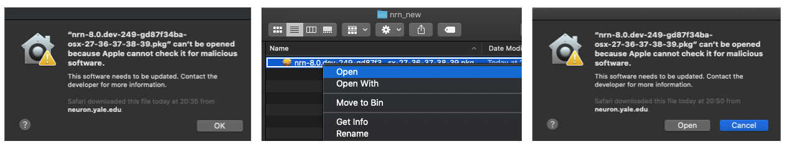

NEURON can be installed on a wide variety of hardware platforms. Based on your system and software
environment you can choose one of the installation method described below.

## Installing Binary Distribution

If you want to quickly get started with NEURON, we provide binary installers for Linux, Mac and
Windows platforms.

#### Mac OS

Since version 7.8.1 we are providing Python wheels and NEURON can be installed using `pip` by opening a Terminal (Press `⌘` + `Space` and type "terminal") and typing:

```
pip3 install neuron
```

Python wheels are provided via [pypi.org](https://pypi.org/project/NEURON/). Note that Python2
wheels are provided for the 8.0.x release series exclusively.

Like Windows, you can also use a binary installer to install NEURON.
Recent releases are at

* [Recent Releases](https://github.com/neuronsimulator/nrn/releases)

You can download legacy versions from:

* [Legacy Versions](https://neuron.yale.edu/ftp/neuron/versions/)

Earlier Mac OS pkg installers have name in the format of
`nrn-<version-id>-osx-38-39-310-311.pkg`.
Like windows installers,
the, `py-38-39-310-311` string in the installer name indicates that the given installer is
compatible with Python versions  3.8, 3.9, 3.10 and 3.11. Note that if you double-click the installer
then you might see warning like below. In this case you have to right-click on the installer and then
click `Open`. You can then see an option to `Open` installer: 

The latest Mac OS pkg installers (as of 2022-01-01) are universal2 installers
(for arm64 and x86_64) and extend the name convention to specify which
architectures they run on and the minimum macosx version using the same
style as the python `sysconfig.get_platform()`
`nrn-<version-id>-macosx-<target>-<archs>-py-<pythonversions>.pkg`
e.g.
`nrn-8.0a-726-gb9a811a32-macosx-11-universal2-py-38-39-310.pkg`



The latest pkg installers will install NEURON under the directory `/Applications/NEURON/` directory.
Uninstallng consists of dragging that folder to the trash. For GUI support you
have to install [XQuartz](https://www.xquartz.org/) separately. Once you start Terminal application, NEURON
binaries (`nrniv`, `neurondemo` etc.) should be available to start.

* Universal2 installers generally "just work" on either an x86_64 or arm64
architecture.

  ```
  python
  from neuron import h
  ```
  and ```nrnivmodl``` will by default create an nmodl mechanism library
  specifically for the architecture you run on.

  But it may be the case on Apple M1 that you install a python that can
  only run as an x86_64 program under Rosetta2.
  E.g. The latest Anaconda Python3.9 (though it seems likely that the next
  distribution will be universal2).
  In this case, if you wish to launch nrniv, force nrniv to launch as an x86_64
  program. E.g.
  ```
  arch -arch x86_64 nrniv -python
  from neuron import h
  ```
  Furthermore, be sure to run nrnivmodl in such a way that it compiles as an
  x86_64 library. e.g.
  ```
  arch -arch x86_64 nrnivmodl
  ```
  although this constructs an arm64 folder, it will compile and link as x86_64.
  ```
  % lipo -archs arm64/libnrnmech.dylib
  x86_64
  ```
  Alternatively, one can get a universal2 result with
  ```
  nrnivmodl -incflags '-arch x86_64 -arch arm64' -loadflags '-arch x86_64 -arch arm64'
  ```

  If, at runtime there is architecture mismatch between python, MPI,
  libnrnmech.so, or libnrniv.dylib, you will see an error message similar
  to
  ```
  Could not dlopen NRN_PYLIB: /Users/hines/opt/anaconda3/lib/libpython3.9.dylib
  libnrniv.dylib running as arm64
  but /Users/hines/opt/anaconda3/lib/libpython3.9.dylib can only run as x86_64
  ```

  Note: there is an environment variable called `ARCHPREFERENCE`. See 
  `man arch`.

  It may be the case on an x86_64 that if you have an older x86_64
  version of python3.8 or 3.9 installed that those versions of python
  are for macos earlier than 11. In that case, you may get a warning of
  the form `warning: ... built for newer macOS version (11.0) than being linked (10.9)`
  One work around is to install a more recent python or a python with a
  more recent build. For example, the package installers at [python.org](http://python.org)
  contain the "macos11" string within the package name for the universal2
  installers for python 3.8, 3.9, and 3.10.

#### Linux

Like Mac OS, since 7.8.1 release python wheels are provided and you can use `pip` to install NEURON by opening a terminal and typing:

```
pip3 install neuron
```

Note that Python2 wheels are provided for the 8.0.x release series exclusively. Also, we are not providing .rpm or .deb
installers for recent releases.

#### Windows

On Windows, the only recommended way to install NEURON is using the binary installer. You can download alpha
or recent releases from:

* [Alpha releases](https://neuron.yale.edu/ftp/neuron/versions/alpha/)
* [Recent Releases](https://neuron.yale.edu/ftp/neuron/versions/)

The naming convention for Windows installers is `nrn-<version-id>-mingw-py-38-39-310-311-setup.exe`.
The `py-38-39-310-311` string in the installer name indicates that the given installer is compatible
with Python versions 3.8, 3.9, 3.10 and 3.11. Once the installer is downloaded, you can install it
by double clicking like any other Windows application. Note that you have to install python separately
if python support is required. You can find detailed step-by-step instructions in
[this presentation](https://neuron.yale.edu/ftp/neuron/nrn_mswin_install.pdf).

#### Windows Subsystem for Linux (WSL) Python Wheel

Alternatively, if you are using Windows Subsystem for Linux, you can install the available Linux Python wheel.
Note that the default Linux distro installed by WSL is Ubuntu, and the following instructions are tailored accordingly.

Steps:

1. Follow official Microsoft WSL installation guide: https://docs.microsoft.com/en-us/windows/wsl/install

```
Notes:
      * WSL requires virtualization capabilities, please ensure they are enabled on your system (i.e. BIOS).
      * If you are using VirtualBox, WSL2 is not supported (https://forums.virtualbox.org/viewtopic.php?t=95302)
        To enable WSL1 from command prompt or powershell: 
          wsl --set-default-version 1
          wsl --install -d Ubuntu
```

2. Install `pip3`

Open `Ubuntu` from programs and run the following:

```bash
sudo apt-get update
sudo apt install python3-pip python3-numpy
```

3. Install NEURON
   
In the same terminal run:

```bash
pip3 install neuron
```
Close and open another terminal. You can do some sanity testing:
```
python3 -c "import neuron; neuron.test(); quit()"
```

4.  (Optional: NEURON GUI) Install `VcXsrv`, a Windows X-server
* Download and install `VcXsrv` from  [SourceForge](https://sourceforge.net/projects/vcxsrv/).
* Open `XLaunch` from the Start Menu. In the setup wizard accept the default options until `Extra settings` where you have to tick `Disable access control`. Additionally on the last page, click on the `Save configuration` button and save the configuration file in `%APPDATA%\Microsoft\Windows\Start Menu\Programs\Startup` in order to automatically launch `VcXsrv`at startup without re-doing the wizard. If prompted via Windows Defender Firewall, click on `Allow access`.
* In an Ubuntu terminal run:
```bash
export DISPLAY=:0
```
and then you can just launch `nrngui`. In order to have this setting automatically when you open an Ubuntu terminal:
```bash
echo "export DISPLAY=:0" >> ~/.bashrc
```
In order to perform sanity checks of the NEURON GUI, from the Ubuntu terminal you can call: 
```bash
neurondemo
```

## Installing Source Distributions

If you are running NEURON in cluster/HPC environment where you would like to have better performance
(e.g. using vendor compilers like Intel, Cray, AMD, NVIDIA etc.), we advise you to build the NEURON
from source. Note that to use CoreNEURON with optimised CPU/GPU support, you have to install NEURON
from source.

### Install Build Dependencies

In order to build NEURON from source, the following packages must be available:

- Bison
- Flex >= 2.6
- C/C++ compiler suite supporting C++17 (e.g. GCC >=9.3.1, Clang >= 11.0.0)
  - Note that some C++17 features require a newer compiler version.
  - C++17 features must be available without linking extra libraries. This notably excludes some older versions of GCC where `std::filesystem` required `libstdc++fs.so`.
- CMake >= 3.15 (>= 3.18 if ``-DNRN_ENABLE_PYTHON_DYNAMIC=ON``)

The following packages are optional (see build options):

- Python >=3.8 (for Python interface)
- Cython < 3 (for RXD)
- MPI (for parallel)
- X11 (Linux) or XQuartz (MacOS) (for GUI)

Note that you may have to force Cython version:
```bash
pip install "cython<3"
```

Depending on platform you can install these dependencies as follows:

<a name="Mac-OS-Depend"></a>
#### Mac OS - x86_64

The easiest way to install dependencies on Mac OS is to use [brew](https://brew.sh/) or
[conda](https://docs.conda.io/projects/conda/en/latest/index.html) package manager. For example,
once [brew is installed](https://docs.brew.sh/Installation) you can do:

```bash
brew install coreutils openmpi cmake
brew install --cask xquartz
```

Once these packages are installed, setup PATH as:

```bash
export PATH=/usr/local/bin/:$PATH
```

If the desired python version is not installed, you can install it using
[official distribution](https://www.python.org/downloads/macos/). Also, note that
[Xcode Command Line Tools](https://stackoverflow.com/questions/9329243/how-to-install-xcode-command-line-tools)
needs to be installed for development.

<a name="Apple-M1-Build-Dependencies"></a>
#### Mac OS - Apple M1

- Install command line tools as

    ```bash
    xcode-select --install
    ```

- If desire classical NEURON GUI : from [xquartz.org](https://www.xquartz.org/), click "Releases", click XQuartz-2.8.0 (or newer version), and follow instructions. After installing, logout and log back in.

    If you desire single click button action for X11 when entering a window then execute below command:

    ```bash
    defaults write org.xquartz.X11 wm_ffm -bool true
    ```
   For the new default to take effect, logout then log back in.

- Install dependencies with HomeBrew and pip as:

  ```bash
  # install brew and initialize shell
  /bin/bash -c "$(curl -fsSL https://raw.githubusercontent.com/Homebrew/install/HEAD/install.sh)"
  echo 'eval $(/opt/homebrew/bin/brew shellenv)' >> $HOME/.zprofile
  eval $(/opt/homebrew/bin/brew shellenv)

  brew install cmake
  brew install open-mpi

  pip3 install --user --upgrade pip
  export PATH="$HOME/Library/Python/3.8/bin":$PATH
  pip3 install --user cython
  ```

Once these packages are installed, setup PATH as:

```bash
export PATH=/opt/homebrew/opt/bison/bin/:/opt/homebrew/opt/flex/bin/:/opt/homebrew/bin/:$PATH
```


#### Linux

Depending on the platform (Ubuntu, CentOS, Fedora, Debian, Red Hat etc.), there are different ways to
install dependencies. For example, on Ubuntu:

```bash
sudo apt-get update
sudo apt-get install -y bison cmake flex git \
     libncurses-dev libopenmpi-dev libx11-dev \
     libxcomposite-dev openmpi-bin python3-dev
# for python dependencies
pip install scipy numpy cython
```

We recommend using platform specific instructions provided in [nrn-build-ci](https://github.com/neuronsimulator/nrn-build-ci#scheduled-ci-builds-for-neuron) repository.

<a name="build-cmake"></a>
### Install NEURON using CMake

Starting with the 7.8.1 release, NEURON can be installed using the [CMake build system](https://cmake.org/).
One of the primary advantages of a CMake-based build system is cross-platform support and integration with
other projects like [Interviews](https://github.com/neuronsimulator/iv), [CoreNEURON](https://github.com/neuronsimulator/nrn/tree/master/src/coreneuron),
[NMODL](https://github.com/BlueBrain/nmodl/) etc. These projects are now integrated into single a CMake-based
build system.

Please refer to [the CMake build system
options](../cmake_doc/options.rst) for more information on how to
install the project using ``CMake``.

#### Optimized CPU and GPU Support using CoreNEURON

NEURON now integrates [CoreNEURON library](https://github.com/neuronsimulator/nrn/blob/master/src/coreneuron) for improved simulation
performance on modern CPU and GPU architectures. CoreNEURON is designed as a library within the NEURON simulator
and can transparently handle all spiking network simulations including gap junction coupling with the fixed time
step method. You can find detailed instructions [here](../coreneuron/index.rst) and [here](../cmake_doc/options.rst).

#### Run integrated tests

**NEURON** includes also some unit and integration tests. To enable you need to set the `CMake` flag **-DNRN\_ENABLE\_TESTS=ON**.
The tests lie in the `test` directory and cover various aspects of **NEURON**:
* **CoreNEURON** integration (if enabled in build step)
* Functionality and result regression test for [ringtest](https://github.com/neuronsimulator/ringtest) and [testcorenrn](https://github.com/neuronsimulator/testcorenrn)
* HOC interpreter tests
* Python interpreter tests
* Parallel Context tests
* Rx3d tests
* Unit tests
* GapJunction tests

To run the tests it's needed to:
  ```bash
  cd nrn/build
  cmake .. \
   -DNRN_ENABLE_INTERVIEWS=OFF \
   -DNRN_ENABLE_MPI=OFF \
   -DNRN_ENABLE_RX3D=OFF \
   -DCMAKE_INSTALL_PREFIX=/path/to/install/directory
  cmake --build . --parallel 8
  ctest # use --parallel for speed, -R to run specific tests
  ```

### FAQs

* **I am getting link errors "undefined reference to 'tgoto, tgetent, tputs'".**

This is often an issue due to missing ncurses library linking. In this case, we recommend passing your ncurses installation via CMake.
For example on Mac OS with a homebrew installation:
`-DCMAKE_PREFIX_PATH="/usr/local/opt/ncurses"` CMake option.

* **I installed NEURON via pip but while using MPI I get "could not dynamically load libmpi.so or libmpich.so".**

NEURON will try to find MPI library in the standard library paths (e.g. /usr/lib). But on some systems MPI
libraries may not be in standard path. In that case you can try setting `LD_LIBRARY_PATH` (on linux) or `DYLD_LIBRARY_PATH` (on Mac OS):

```bash
export LD_LIBRARY_PATH=/path/of/mpi/installation/lib:$LD_LIBRARY_PATH
```

In some scenarios this may not be enough (e.g. with Anaconda installed MPI) in which case you can explicitly
provide the path of MPI library using:

```bash
export MPI_LIB_NRN_PATH=/Applications/anaconda3/lib/libmpi.12.dylib
```

* **Can I move installation directory?**

As with any other UNIX package, it is not a good idea to move NEURON around once you've installed it,
because the directory names are coded into the files themselves. If you need to move it, put a soft link
in its original location that points to the new location (so the old filenames will still work).
Better yet, simply recompile neuron specifying the new installation directory.

* **How can I compile my mod files?**

	* cd to the directory that contains your .mod files.
	* type "/install/dir/bin/nrnivmodl" (or, if you have set install directory in your PATH env variable, just type "nrnivmodl")

This will create a subdirectory of the current directory which is your CPU name (e.g. `x86_64`). Inside this
directory is created the program "special", which is the neuron binary that you want to run instead of nrniv.

* **NEURON fails to launch because shared libraries cannot be found.**

Make sure to LD_LIBRARY_PATH or DYLD_LIBRARY_PATH environmental variables. For example, using bash shell:

```bash
export LD_LIBRARY_PATH=/install/path/lib:$LD_LIBRARY_PATH. # on linux
export DYLD_LIBRARY_PATH=/install/path/lib:$DYLD_LIBRARY_PATH. # on Mac OS
```

* **NEURON is not able to find correct Python or NEURON Python library. What can I do?**

NEURON tries to find correct Python based on user's environment. If you are using NEURON via python interpreter then,
as mentioned previously, setting `PYTHONPATH` would be sufficient. For `nrniv` or `special` binaries, you can also use
`-pyexe` option to specify which Python should be used by NEURON:

```bash
nrniv -pyexe /python/install/path/python-3.8.3/bin/python3
```

If you have enabled dynamic python support using `NRN_ENABLE_PYTHON_DYNAMIC` CMake option or installed NEURON via pip
and see error like below:

```bash
Could not load libnrnpython3
```

then NEURON is not able to find appropriate Python and corresponding Python library. You can verify which Python is
being used by running following command:

```bash
$ nrnpyenv.sh
...
export NRN_PYLIB="/python/install/path/python-3.8.3/lib/libpython3.8.so.1.0"
```
If `NRN_PYLIB` is inappropriate then you can set it explicitly or use `-pyexe` option mentioned above.

* **How to build NEURON in cluster environment where build node architecture is different than compute node?**

In cluster environment, sometime we have different architecture of login/build nodes than compute nodes (similar to
cross-compile environment). NEURON has tools like `nocmodl`, `modlunit` which are executed on login/build
nodes. If these tools are compiled with compute node architecture then we might see error like:

```bash
[ 10%] Generating ../../../src/nrnoc/syn.c
Please verify that both the operating system and the processor support Intel(R) AVX512ER and AVX512PF instructions.
```
or even `segmentation fault` when MOD files are translated to C files.

To avoid this, we have to build nocmodl, modlunit with login/build node architecture. NEURON by default set `-O0` compile flag for these tools to avoid compiler generating architecture specific instructions. But if this is not sufficient, you can set `NRN_NMODL_CXX_FLAGS` CMake option specifying which compiler flags should be used. For example:

```bash
cmake .. [other options] \
    -DCMAKE_CXX_FLAGS="-O3 -xMIC-AVX512" \
    -DCMAKE_BUILD_TYPE=Custom \
    -DNRN_NMODL_CXX_FLAGS="-xHost"
```

In the above example, we used custom build type with Intel compiler's `-xMIC-AVX512` flag for KNL architecture but used `-xHost` flag so that `nocmodl` and `modlunit` are compiled compatible with host architecture (i.e. node where NEURON is being built).


* **I'm getting "unrecognized command-line option" build errors on macos as python extensions are
  being built.**

  Certain combinations of Python environment and C/C++ compiler on macos may lead to build errors of
  this kind:

```
running build_ext
building 'neuron.rxd.geometry3d.graphicsPrimitives' extension
creating build
creating build/temp.macosx-10.15-x86_64-2.7
/usr/local/bin/gcc-10 -fno-strict-aliasing -fno-common -dynamic -g -Os -pipe -fno-common -fno-strict-aliasing -fwrapv -DENABLE_DTRACE -DMACOSX -DNDEBUG -Wall -Wstrict-prototypes -Wshorten-64-to-32 -iwithsysroot /usr/local/libressl/include -DNDEBUG -g -fwrapv -Os -Wall -Wstrict-prototypes -DENABLE_DTRACE -arch x86_64 -pipe -I/Users/user/nrn/share/lib/python/neuron/rxd/geometry3d -I. -I/System/Library/Frameworks/Python.framework/Versions/2.7/Extras/lib/python/numpy/core/include -I/Applications/Xcode.app/Contents/Developer/Platforms/MacOSX.platform/Developer/SDKs/MacOSX11.1.sdk/System/Library/Frameworks/Python.framework/Versions/2.7/include/python2.7 -c graphicsPrimitives.cpp -o build/temp.macosx-10.15-x86_64-2.7/graphicsPrimitives.o -O0
gcc-10: error: /usr/local/libressl/include: No such file or directory
gcc-10: error: unrecognized command-line option '-Wshorten-64-to-32'
gcc-10: error: unrecognized command-line option '-iwithsysroot'; did you mean '-isysroot'?
error: command '/usr/local/bin/gcc-10' failed with exit status 1
```

  The reason for this type of failure is that Python will provide build command-arguments for
  extension building based on its own build. If the compiler used to build NEURON expects different
  commands (eg. gcc vs. clang) then above error will be encountered.

  A workaround for this issue is to set the `CFLAGS` environment variable providing build arguments
  compatible with your compiler. Here is an example for gcc/clang:

```
export CFLAGS="-fno-strict-aliasing -fno-common -dynamic -g -Os -pipe -DMACOSX -DNDEBUG -Wall -Wstrict-prototypes"
```

If you see any other issues, please open [an issue here](https://github.com/neuronsimulator/nrn/issues/new/choose).
