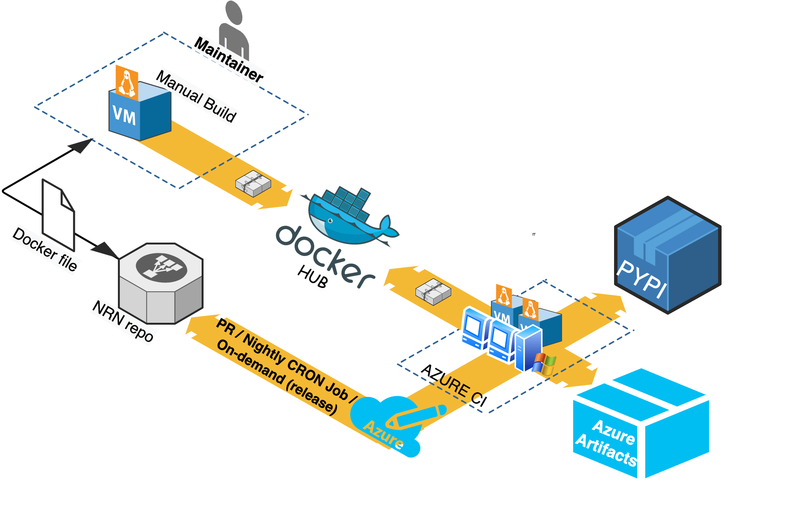
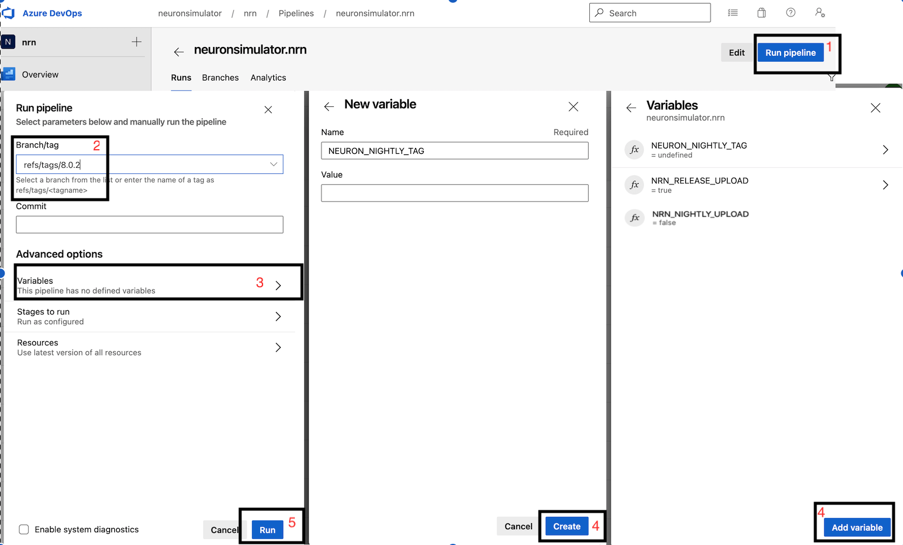

# Building Python Wheels

## Linux wheels

In order to have NEURON binaries run on most Linux distros, we rely on the [manylinux project](https://github.com/pypa/manylinux).
Current NEURON Linux image is based on `manylinux2014`.

### Setting up Docker

[Docker](https://en.wikipedia.org/wiki/Docker_(software)) is required for building Linux wheels.
You can find instructions on how to setup Docker on Linux [here](https://docs.docker.com/engine/install/). 


### NEURON Docker Image Workflow

When required (i.e. update packages, add new software), `NEURON maintainers` are in charge of updating the NEURON docker
images published on Docker Hub under: 
* [neuronsimulator/neuron_wheel](https://hub.docker.com/r/neuronsimulator/neuron_wheel)
* [neuronsimulator/neuron_wheel_gpu](https://hub.docker.com/r/neuronsimulator/neuron_wheel_gpu)

Azure pipelines pull this image off DockerHub for Linux wheels building.

Updating and publishing the public images are done by a manual process that relies on a `Docker file` 
(see [packaging/python/Dockerfile](../../packaging/python/Dockerfile) and [packaging/python/Dockerfile_gpu](../../packaging/python/Dockerfile_gpu)).
Any official update of these files shall imply a PR reviewed and merged before `DockerHub` publishing.

All wheels built on Azure are:

* Published to `Pypi.org` as
  * `neuron-nightly` -> when the pipeline is launched in CRON mode
  * `neuron-x.y.z` -> when the pipeline is manually triggered for release `x.y.z`
  * additionally, for Linux only: `neuron-gpu-nightly` and `neuron-gpu-x.y.z`
* Stored as `Azure artifacts` in the Azure pipeline for every run.

Refer to the following image for the NEURON Docker Image workflow: 



### Building the docker image
After making updates to any of the docker files, you can build the image with:
```
cd nrn/packaging/python
# update Dockerfile
docker build -t neuronsimulator/neuron_wheel[_gpu]:<tag> .
```
where `<tag>` is:
* `latest-x86_64` or `latest-aarch64` for official publishing on respective platforms. For `master`, we are using `latest-gcc9-x86_64` and `latest-gcc9-aarch64` (see [Use GCC9 for building wheels #1971](https://github.com/neuronsimulator/nrn/pull/1971)). 
* `nvhpc-X.Y-cuda-A.B` for the GPU wheels where `X.Y` is the NVHPC version and `A.B` is the CUDA one. I.e `nvhpc-22.1-cuda-11.5`. For `master` we are using `nvhpc-22.1-cuda-11.5-gcc9`(see [Use GCC9 for building wheels #1971](https://github.com/neuronsimulator/nrn/pull/1971)).
* `feature-name` for updates (for local testing or for PR testing purposes where you can temporarily publish the tag on DockerHub and tweak Azure CI pipelines to use it - refer to
  `Job: 'ManyLinuxWheels'` or `Job: 'ManyLinuxGPUWheels'` in [azure-pipelines.yml](../../azure-pipelines.yml) )

If you are building an image for AArch64 i.e. with `latest-aarch64` tag then you additionally pass `--build-arg` argument to docker build command in order to use compatible manylinux image for ARM64 platform (e.g. while building on Apple M1 or QEMU emulation):

```
docker build -t neuronsimulator/neuron_wheel:latest-aarch64 --build-arg MANYLINUX_IMAGE=manylinux2014_aarch64 -f Dockerfile .
```


### Pushing to DockerHub

In order to push the image and its tag:
```
docker login --username=<username>
docker push neuronsimulator/neuron_wheel[_gpu]:<tag>
```

### Using the docker image

You can either build the neuron images locally or pull them from DockerHub:
```
$ docker pull neuronsimulator/neuron_wheel
Using default tag: latest
latest: Pulling from neuronsimulator/neuron_wheel
....
Status: Downloaded newer image for neuronsimulator/neuron_wheel:latest
docker.io/neuronsimulator/neuron_wheel:latest
```

We can conveniently mount the local NEURON repository inside docker, by using the `-v` option:

```
docker run -v $PWD/nrn:/root/nrn -w /root/nrn -it neuronsimulator/neuron_wheel bash
```
where `$PWD/nrn` is a NEURON repository on the host machine that ends up mounted at `/root/nrn`.
This is how you can test your NEURON updates inside the NEURON Docker image. 
Note that `-w` sets the working directory inside the container.

If you want to build wheels with `GPU support` via CoreNEURON, then you have to use the `neuronsimulator/neuron_wheel_gpu` image:

```
docker run -v $PWD/nrn:/root/nrn -w /root/nrn -it neuronsimulator/neuron_wheel_gpu bash
```

### MPI support

The `neuronsimulator/neuron_wheel` provides out-of-the-box support for `mpich` and `openmpi`.
For `HPE-MPT MPI`, since it's not open source, you need to acquire the headers and mount them in the docker image:

```
docker run -v $PWD/nrn:/root/nrn -w /root/nrn -v $PWD/mpt-headers/2.21/include:/nrnwheel/mpt/include -it neuronsimulator/neuron_wheel bash
```
where `$PWD/mpt-headers` is the path to the HPE-MPT MPI headers on the host machine that end up mounted at `/nrnwheel/mpt/include`.
You can download the headers with:

```
git clone ssh://bbpcode.epfl.ch/user/kumbhar/mpt-headers
```

## macOS wheels

Note that for macOS there is no docker image needed, but all required dependencies must exist.
In order to have the wheels working on multiple macOS target versions, special consideration must be made for `MACOSX_DEPLOYMENT_TARGET`.


Taking Azure macOS `x86_64` wheels for example, `readline` was built with `MACOSX_DEPLOYMENT_TARGET=10.9` and stored as secure file on Azure.
For `arm64` we need to set `MACOSX_DEPLOYMENT_TARGET=11.0`. The wheels currently need to be built manually, using `universal2` Python installers. 
For upcoming `universal2` wheels (targeting both `x86_64` and `arm64`) we will consider leveling everything to `MACOSX_DEPLOYMENT_TARGET=11.0`.


You can use [packaging/python/build_static_readline_osx.bash](../../packaging/python/build_static_readline_osx.bash) to build a static readline library.
You can have a look at the script for requirements and usage. 

## Launch the wheel building

### Linux
Once we've cloned and mounted NEURON inside Docker(c.f. `-v` option described previously), we can proceed with wheels building. 
There is a build script which loops over available pythons in the Docker image under `/opt/python`, and then builds and audits the generated wheels.
Wheels are generated under `/root/nrn/wheelhouse` and also accessible in the mounted NEURON folder from outside the Docker image.

```
# Working directory is /root/nrn
bash packaging/python/build_wheels.bash linux 
ls -la wheelhouse
```

You can build the wheel for a specific python version: 
```
bash packaging/python/build_wheels.bash linux 38    # 38 for Python v3.8
```

To build wheels with GPU support you have to pass an additional argument:
* `coreneuron` : build wheel with `CoreNEURON` support
* `coreneuron-gpu` : build wheel with `CoreNEURON` and `GPU` support

```
bash packaging/python/build_wheels.bash linux 38 coreneuron-gpu

# or

bash packaging/python/build_wheels.bash linux 3* coreneuron
```
In the last example we are passing `3*` to build the wheels with `CoreNEURON` support for all python 3 versions.

### macOS
As mentioned above, for macOS all dependencies have to be available on a system. You have to then clone NEURON repository and execute:

```
cd nrn
bash packaging/python/build_wheels.bash osx
```

## Testing the wheels

To test the generated wheels, you can do:

```
# first arg is a python exe and second arg is the corresponding wheel
bash packaging/python/test_wheels.sh python3.8 wheelhouse/NEURON-7.8.0.236-cp38-cp38-macosx_10_9_x86_64.whl

# Or, you can provide the pypi url
bash packaging/python/test_wheels.sh python3.8 "-i https://test.pypi.org/simple/NEURON==7.8.11.2"
```

### MacOS considerations

On MacOS, launching `nrniv -python` or `special -python` can fail to load `neuron` module due to security restrictions. 
For this specific purpose, please `export SKIP_EMBEDED_PYTHON_TEST=true` before launching the tests.

### Testing on BB5
On BB5, we can test CPU wheels with:

```
salloc -A proj16  -N 1 --ntasks-per-node=4 -C "cpu" --time=1:00:00 -p interactive
module load unstable python
bash packaging/python/test_wheels.sh python3.7 wheelhouse/NEURON-7.8.0.236-cp37-cp37m-manylinux1_x86_64.whl
```

The GPU wheels can be also tested in same way on the CPU partition. In this case only pre-compiled binaries
like `nrniv` and `nrniv-core` are tested on  the CPU. In order to test full functionality of GPU wheels we need to
do the following:
* Allocate GPU node
* Load NVHPC compiler
* Launch `test_wheels.sh`

```
salloc -A proj16 -N 1 --ntasks-per-node=4 -C "volta" --time=1:00:00 -p prod --partition=prod --exclusive
module load unstable python nvhpc

bash packaging/python/test_wheels.sh python3 NEURON_gpu_nightly-8.0a709-cp38-cp38-manylinux_2_17_x86_64.manylinux2014_x86_64.whl
```

The `test_wheels.sh` will check if `nvc/nvc++` compilers are available and run tests for `hpe-mpi`, `intel-mpi` and `mvapich2` MPI modules.
Also, it checks if GPU is available (using `pgaccelinfo -nvidia` command) and then runs a few tests on the GPU as well.

Similar to BB5, the wheel can be tested on any desktop system provided that NVHPC compiler module is loaded or appropriate PATH environment variable is setup.


## Publishing the wheels on Pypi via Azure

Head over to the [neuronsimulator.nrn](https://dev.azure.com/neuronsimulator/nrn/_build?definitionId=1) pipeline on Azure.

After creating the tag on the `release/x.y` or on the `master` branch, perform the following steps:

1) Click on `Run pipeline`
2) Input the release tag ref `refs/tags/x.y.z`
3) Click on `Variables`
4) We need to define three variables:
   * `NRN_NIGHTLY_UPLOAD` : `false`
   * `NRN_RELEASE_UPLOAD` : `false`
   * `NEURON_NIGHTLY_TAG` : undefined (leave empty)

   Do so by clicking `Add variable`, input the variable name and optionally the value and then click `Create`.
5) Click on `Run`


With above, wheel will be created like release from the provided tag but they won't be uploaded to the pypi.org ( as we have set  `NRN_RELEASE_UPLOAD=false`). These wheels now you can download from artifacts section and perform thorough testing. Once you are happy with the testing result, set `NRN_RELEASE_UPLOAD` to `true` and trigger the pipeline same way:
   * `NRN_NIGHTLY_UPLOAD` : `false`
   * `NRN_RELEASE_UPLOAD` : `true`
   * `NEURON_NIGHTLY_TAG` : undefined (leave empty)




## Publishing the wheels on Pypi via CircleCI

Currently CircleCI doesn't have automated pipeline for uploading `release` wheels to pypi.org (nightly wheels are uploaded automatically though). Currently we are using a **hacky**, semi-automated approach described below:

* Checkout your tag as a new branch
* Update `.circleci/config.yml` as shown below
* Trigger CI pipeline manually for [the nrn project](https://app.circleci.com/pipelines/github/neuronsimulator/nrn)
* Upload wheels from artifacts manually

```
# checkout release tag as a new branch
$ git checkout 8.1a -b release/8.1a-aarch64

# manually updated `.circleci/config.yml`
$ git diff

@@ -15,6 +15,10 @@ jobs:
     machine:
       image: ubuntu-2004:202101-01
+    environment:
+      NEURON_WHEEL_VERSION: 8.1a
+      NEURON_NIGHTLY_TAG: ""
+      NRN_NIGHTLY_UPLOAD: false
+      NRN_RELEASE_UPLOAD: false

@@ -89,7 +95,7 @@ workflows:
       - manylinux2014-aarch64:
           matrix:
             parameters:
-              NRN_PYTHON_VERSION: ["310"]
+              NRN_PYTHON_VERSION: ["37", "38", "39", "310"]
```

The reason we are setting `NEURON_WHEEL_VERSION` to a desired version `8.1a` because `setup.py` uses `git describe` and it will give different version name as we are now on a new branch!


## Nightly wheels

Nightly wheels get automatically published from `master` in CRON mode.

