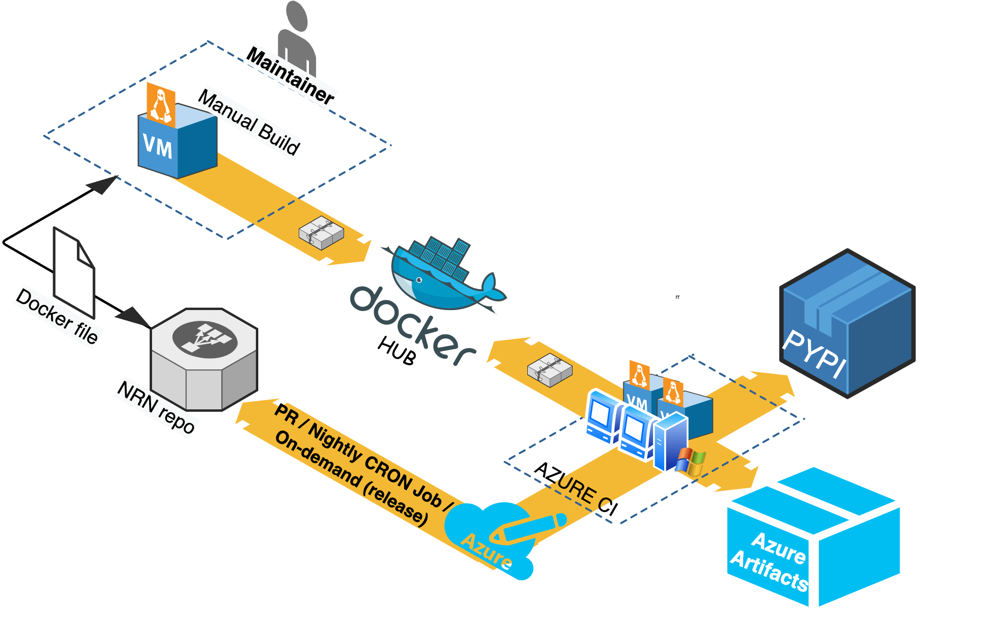
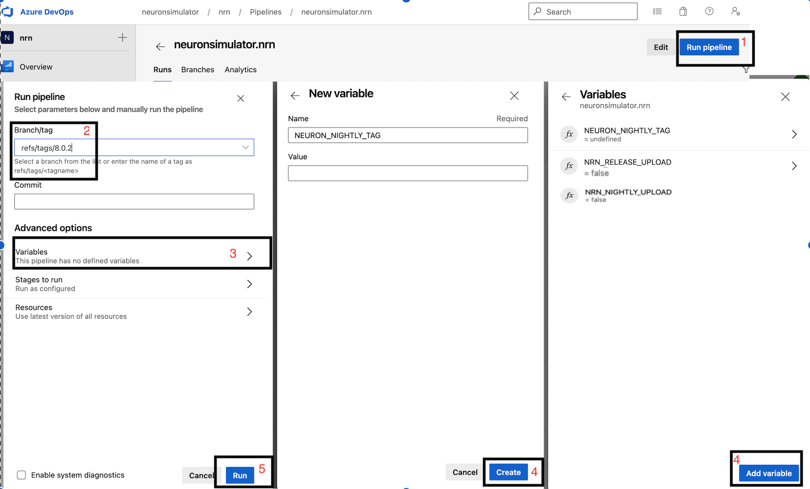

# Building Python Wheels

See also [this document](../dev/python/wheels).

## Linux wheels

In order to have NEURON binaries run on most Linux distros, we rely on the [manylinux project](https://github.com/pypa/manylinux).
Current NEURON Linux image is based on `manylinux_2_28`.

### Setting up Docker

[Docker](https://en.wikipedia.org/wiki/Docker_(software)) is required for building Linux wheels.
You can find instructions on how to setup Docker on Linux [here](https://docs.docker.com/engine/install/).


### NEURON Docker Image Workflow

When required (i.e. update packages, add new software), `NEURON maintainers` are in charge of
updating the NEURON docker images published on Docker Hub under
[neuronsimulator/neuron_wheel](https://hub.docker.com/r/neuronsimulator/neuron_wheel).

Azure pipelines pull this image off DockerHub for Linux wheels building.

Updating and publishing the public images are done by a manual process that relies on a
`Docker file`  (see [packaging/python/Dockerfile](../../packaging/python/Dockerfile)).
Any official update of these files shall imply a PR reviewed and merged before `DockerHub` publishing.

All wheels built on Azure are:

* Published to `pypi.org` as
  * `neuron-nightly` -> when the pipeline is launched in CRON mode
  * `neuron-x.y.z` -> when the pipeline is manually triggered for release `x.y.z`
* Stored as `Azure artifacts` in the Azure pipeline for every run.

Refer to the following image for the NEURON Docker Image workflow:



### Building the docker image manually

After making updates to any of the docker files, you can build the image with:
```
cd nrn/packaging/python
# update Dockerfile
docker build -t neuronsimulator/neuron_wheel:<tag> .
```
where `<tag>` is:
* `latest-x86_64` or `latest-aarch64` for official publishing on respective platforms. For `master`, we are using `latest-gcc9-x86_64` and `latest-gcc9-aarch64` (see [Use GCC9 for building wheels #1971](https://github.com/neuronsimulator/nrn/pull/1971)).
* `feature-name` for updates (for local testing or for PR testing purposes where you can temporarily publish the tag on DockerHub and tweak Azure CI pipelines to use it - refer to
  `Job: 'ManyLinuxWheels'` in [azure-pipelines.yml](../../azure-pipelines.yml) )

If you are building an image for AArch64 i.e. with `latest-aarch64` tag then you additionally pass `--build-arg` argument to docker build command in order to use compatible manylinux image for ARM64 platform (e.g. while building on Apple M1 or QEMU emulation):

```
docker build -t neuronsimulator/neuron_wheel:latest-aarch64 --build-arg MANYLINUX_IMAGE=manylinux2014_aarch64 -f Dockerfile .
```


### Pushing to DockerHub

In order to push the image and its tag:
```
docker login --username=<username>
docker push neuronsimulator/neuron_wheel:<tag>
```

### Using the docker image

You can either build the neuron images locally or pull them from DockerHub:
```
$ docker pull neuronsimulator/neuron_wheel:latest-x86_64
Using default tag: latest-x86_64
latest: Pulling from neuronsimulator/neuron_wheel
....
Status: Downloaded newer image for neuronsimulator/neuron_wheel:latest
docker.io/neuronsimulator/neuron_wheel:latest-x86_64
```

### MPI support

The `neuronsimulator/neuron_wheel` provides out-of-the-box support for `mpich` and `openmpi`.
For `HPE-MPT MPI`, since it's not open source, they are provided automatically as part of Azure Pipelines and are not locally downloadable.

### CI dependency archive (pinned downloads)

Wheel **test** jobs install both MPICH and OpenMPI so
[packaging/python/test_wheels.sh](../../packaging/python/test_wheels.sh) can
exercise dynamic MPI. On Ubuntu 24.04, stock MPICH was broken
([LP#2072338](https://bugs.launchpad.net/ubuntu/+source/mpich/+bug/2072338));
CI therefore installs a **pinned** pair of `.deb` files from the dedicated
CI-deps archive
[nrn-ci-deps / ci-deps-v1](https://github.com/neuronsimulator/nrn-ci-deps/releases/tag/ci-deps-v1)
instead of downloading them from Launchpad on every run (and instead of mixing
pins into NEURON product Releases on `nrn`).

See **[CI dependency archive](ci_deps.md)** and
[ci/deps/README.md](../../ci/deps/README.md) for:

* the catalog (`MANIFEST.yml`) and `managed: true|false`
* hosting on [neuronsimulator/nrn-ci-deps](https://github.com/neuronsimulator/nrn-ci-deps)
* `fetch.sh` / `install_mpich_noble.sh` / `publish.sh` / `check-upstream.sh`
* how to add the next flaky third-party download

Azure macOS wheels still obtain a prebuilt static **readline** via an Azure
*secure file* (see macOS section below). Migrating that class of blob into
`ci/deps` is tracked as `managed: false` in the MANIFEST until promoted.

## macOS wheels

Note that for macOS there is no docker image needed, but all required dependencies must exist.
In order to have the wheels working on multiple macOS target versions, special consideration must be made for `MACOSX_DEPLOYMENT_TARGET`.

Taking Azure macOS `x86_64` wheels for example, `readline` was built with `MACOSX_DEPLOYMENT_TARGET=10.9` and stored as secure file on Azure (under `Pipelines > Library > Secure files`).
For `arm64` we need to set `MACOSX_DEPLOYMENT_TARGET=11.0`.

You can use [packaging/python/build_static_readline_osx.bash](../../packaging/python/build_static_readline_osx.bash) to build a static readline library.
You can have a look at the script for requirements and usage.

### Installing macOS prerequisites

Install the necessary Python versions by downloading the universal2 installers from https://www.python.org/downloads/macos/
You'll need several other packages installed as well (brew is fine):

```
brew install --cask xquartz
brew install flex bison mpich cmake
brew unlink mpich && brew install openmpi
brew uninstall --ignore-dependencies libomp || echo "libomp doesn't exist"
```

Bison and flex installed through brew will not be symlinked into /opt/homebrew (installing it next to the version provided by OSX can cause problems). To ensure the installed versions will actually be picked up:

```
export BREW_PREFIX=$(brew --prefix)
export PATH=/opt/homebrew/opt/bison/bin:/opt/homebrew/opt/flex/bin:$PATH
```

## Launch the wheel building

### Linux

You can build the wheel for a specific Python version using:
```
bash packaging/python/build_wheels.bash linux 39    # 39 for Python v3.9
```

To build wheels with CoreNEURON support you have to set the environmental variable `NRN_ENABLE_CORENEURON=ON`:
```
NRN_ENABLE_CORENEURON=ON bash packaging/python/build_wheels.bash linux '3*'
```
where we are passing `'3*'` (note the quotes!) to build the wheels with `CoreNEURON` support for all python 3 versions.

By default, the build system uses all of the processing units available on a machine; this can be customized using the `CMAKE_BUILD_PARALLEL_LEVEL` environmental variable.

Note that using [podman](https://podman.io/) is supported, however, you must set the environmental variable `CIBW_CONTAINER_ENGINE=podman` before launching the `build_wheels.bash` script.

### macOS
As mentioned above, for macOS all dependencies have to be available on a system. You have to then clone NEURON repository and execute:

```
cd nrn
bash packaging/python/build_wheels.bash osx 39  # 39 for Python v3.9
```

In some cases, setuptools-scm will see extra commits and consider your build as "dirty," resulting in filenames such as `NEURON-9.0a1.dev0+g9a96a3a4d.d20230717-cp310-cp310-macosx_11_0_arm64.whl` (which should have been `NEURON-9.0a0-cp310-cp310-macosx_11_0_arm64.whl`). If this happens, you can set an environment variable to correct this behavior:

```
export SETUPTOOLS_SCM_PRETEND_VERSION=9.0a
```

Change the pretend version to whatever is relevant for your case.

## Testing the wheels

There are two complementary approaches: a **smoke script** that ships with
the packaging tree, and the **foreign CTest harness** that reuses a large
portable subset of the developer suite against an installed wheel.

### Smoke tests (`test_wheels.sh`)

Quick health check after building a wheel (or against TestPyPI):

```
# first arg is a python exe and second arg is the corresponding wheel
bash packaging/python/test_wheels.sh python3.9 wheelhouse/NEURON-7.8.0.236-cp39-cp39-macosx_10_9_x86_64.whl

# Or, you can provide the pypi url
bash packaging/python/test_wheels.sh python3.9 "-i https://test.pypi.org/simple/NEURON==7.8.11.2"
```

This covers import/`neuron.test()`, basic `nrnivmodl`, and a few MPI /
CoreNEURON paths when available. It is intentionally smaller than a full
developer `ctest` run.

### Foreign CTest against a wheel (portable suite)

For broader coverage without rebuilding NEURON, configure the standalone
project under `test/foreign` against a venv that has the wheel installed:

```bash
python3 -m venv .venv && source .venv/bin/activate
pip install -U pip pytest
# local wheel, or e.g. neuron-nightly from PyPI:
pip install path/to/NEURON-*.whl
# pip install neuron-nightly

# From the NEURON source tree (same revision as the wheel when possible):
cmake -S test/foreign -B build-ctest \
  -DNRN_FOREIGN_PYTHON="$(which python)" \
  -DNRN_FOREIGN_ALLOW_SKEW=ON   # only if source tip ≠ wheel revision

cmake --build build-ctest --target test-install -j
# default: build mechanisms + ctest -L serial

# Full ctest control against the foreign binary dir:
ctest --test-dir build-ctest -L mpi --output-on-failure -j2
ctest --test-dir build-ctest -L coreneuron --output-on-failure -j2
```

Notes:

* Version policy defaults to a hard match between the wheel’s git identity
  and this source tree; use `-DNRN_FOREIGN_ALLOW_SKEW=ON` for exploratory
  runs (for example `neuron-nightly` vs a feature branch).
* MPI tests register only if the wheel was built with MPI **and** `mpiexec`
  is on `PATH` at foreign configure time.
* See `test/foreign/README.md` and `test/foreign/INVENTORY.md` for
  labels, dependencies (e.g. RxD plot packages), and what remains
  build-only (Catch2 unit tests, NMODL unit binaries, …).

The same foreign harness is used after a **prefix install** via the main
build target `test-install` when `NRN_ENABLE_TESTS=ON` (see the CMake
option documentation for `NRN_ENABLE_TESTS`).

### MacOS considerations

On MacOS, launching `nrniv -python` or `special -python` can fail to load `neuron` module due to security restrictions.
For this specific purpose, please `export SKIP_EMBEDED_PYTHON_TEST=true` before launching the tests
(for `test_wheels.sh`).
## Publishing the wheels on Pypi via Azure

### Variables that drive PyPI upload

We need to manipulate the following three predefined variables, listed hereafter with their default values:
   * `NRN_NIGHTLY_UPLOAD` : `true`
   * `NRN_RELEASE_UPLOAD` : `false`
   * `NEURON_NIGHTLY_TAG` : `-nightly`

### Release wheels

Head over to the [neuronsimulator.nrn](https://dev.azure.com/neuronsimulator/nrn/_build?definitionId=1) pipeline on Azure.

After creating the tag on the `release/x.y` or on the `master` branch, perform the following steps:

1) Click on `Run pipeline`
2) Input the release tag ref `refs/tags/x.y.z`
3) Click on `Advanced options` then select `Variables`
4) Update driving variables to:
   * `NRN_NIGHTLY_UPLOAD` : `false`
   * `NRN_RELEASE_UPLOAD` : `false`
   * `NEURON_NIGHTLY_TAG` : undefined (leave empty)

   Do so by clicking `Variables` in `Advanced options` and update/clear the variable values.
5) Click on `Run`



With above, wheel will be created like release from the provided tag but they won't be uploaded to the pypi.org ( as we have set  `NRN_RELEASE_UPLOAD=false`). These wheels now you can download from artifacts section and perform thorough testing. Once you are happy with the testing result, set `NRN_RELEASE_UPLOAD` to `true` and trigger the pipeline same way:
   * `NRN_NIGHTLY_UPLOAD` : `false`
   * `NRN_RELEASE_UPLOAD` : `true`
   * `NEURON_NIGHTLY_TAG` : undefined (leave empty)


## Publishing the wheels on Pypi via CircleCI

Currently CircleCI doesn't have automated pipeline for uploading `release` wheels to pypi.org (nightly wheels are uploaded automatically though). Currently we are using a **hacky**, semi-automated approach described below:

* Checkout your tag as a new branch
* Update `.circleci/config.yml` as shown below
* Trigger CI pipeline manually for [the nrn project](https://app.circleci.com/pipelines/github/neuronsimulator/nrn)
* Upload wheels from artifacts manually

```
# checkout release tag as a new branch
$ git checkout 8.1a -b release/8.1a-aarch64

# manually updated `.circleci/config.yml`
$ git diff

@@ -14,6 +14,11 @@ jobs:

     machine:
       image: ubuntu-2004:202101-01
+    environment:
+      SETUPTOOLS_SCM_PRETEND_VERSION: 8.2.6
+      NEURON_NIGHTLY_TAG: ""
+      NRN_NIGHTLY_UPLOAD: false
+      NRN_RELEASE_UPLOAD: false

     resource_class: arm.medium

@@ -54,6 +59,7 @@ jobs:
               310) pyenv_py_ver="3.10.1" ;;
               311) pyenv_py_ver="3.11.0" ;;
+              312) pyenv_py_ver="3.12.2" ;;
               *) echo "Error: pyenv python version not specified!" && exit 1;;
             esac

@@ -95,7 +101,7 @@ workflows:
                 - /circleci\/.*/
           matrix:
             parameters:
-              NRN_PYTHON_VERSION: ["311"]
+              NRN_PYTHON_VERSION: ["310", "311", "312"]
               NRN_NIGHTLY_UPLOAD: ["false"]

   nightly:
```

The reason we are setting `SETUPTOOLS_SCM_PRETEND_VERSION` to a desired version `8.1a` because `pyproject.toml` uses `setuptools-scm` and it will give different version name as we are now on a new branch!
`SETUPTOOLS_SCM_PRETEND_VERSION` will also stop your wheels from getting extra numbers on the version.


## Nightly wheels

Nightly wheels get automatically published from `master` in CRON mode.


## How to test Azure wheels locally

After retrieving the Azure drop URL (i.e. from the GitHub PR comment, or by going to Azure for a specific build):

```bash
python3 -m pip wheel neuron-gpu-nightly --wheel-dir tmp --find-links 'https://dev.azure.com/neuronsimulator/aa1fb98d-a914-45c3-a215-5e5ef1bd7687/_apis/build/builds/7600/artifacts?artifactName=drop&api-version=7.0&%24format=zip'
```
will download the wheel and its dependencies to `tmp/` and then you can test it with:

```bash
./packaging/python/test_wheels.sh python3 ./tmp/NEURON_gpu_nightly-...whl true
```
