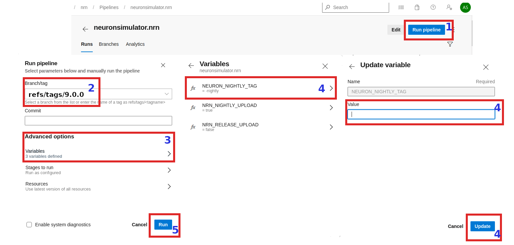

# Building Python Wheels

## Linux wheels

In order to have NEURON binaries run on most Linux distros, we rely on the [manylinux project](https://github.com/pypa/manylinux).
Current NEURON Linux image is based on `manylinux_2_28`.

### Setting up Docker

[Docker](https://en.wikipedia.org/wiki/Docker_(software)) is required for building Linux wheels.
You can find instructions on how to setup Docker on Linux [here](https://docs.docker.com/engine/install/).


### NEURON Docker Image Workflow

When required (i.e. update packages, add new software), `NEURON maintainers` are in charge of
updating the NEURON docker images published on Docker Hub under
[neuronsimulator/neuron_wheel](https://hub.docker.com/r/neuronsimulator/neuron_wheel).

GitHub Actions pull this image off DockerHub for Linux wheels building.

Updating and publishing the public images are done by a manual process that relies on a
`Docker file` (see [packaging/python/Dockerfile](../../packaging/python/Dockerfile)).
Any official update of these files shall imply a PR reviewed and merged before publishing to `DockerHub`.

All wheels built on GitHub Actions are:

* Published to `Pypi.org` as
  * `neuron-nightly` -> when the pipeline is launched on a schedule
  * `neuron-x.y.z` -> when the pipeline is manually triggered for release `x.y.z`
* Stored as artifacts for every run.

Refer to the following image for the NEURON Docker Image workflow:


### Building the docker image manually

After making updates to any of the docker files, you can build the image with:
```
cd nrn/packaging/python
# update Dockerfile
docker build -t neuronsimulator/neuron_wheel:<tag> .
```
where `<tag>` is:
* `manylinux_2_28_x86_64` or `manylinux_2_28_aarch64` for official publishing on respective platforms. For `master`, we are using `manylinux_2_28_x86_64` and `manylinux_2_28_aarch64`.
* `feature-name` for updates (for local testing or for PR testing purposes where you can temporarily publish the tag on DockerHub and tweak GitHub Actions pipelines to use it - refer to
  `Job: 'Build Manylinux wheel'` in [wheels.yml](../../.github/workflows/wheels.yml) )

If you are building an image for AArch64 i.e. with `manylinux_2_28_aarch64` tag then you additionally pass `--build-arg` argument to docker build command in order to use compatible manylinux image for ARM64 platform (e.g. while building on Apple M1 or QEMU emulation):

```
docker build -t neuronsimulator/neuron_wheel:manylinux_2_28_aarch64 --build-arg MANYLINUX_IMAGE=manylinux_2_28_aarch64 -f Dockerfile .
```


### Pushing to DockerHub

In order to push the image and its tag:
```
docker login --username=<username>
docker push docker.io/neuronsimulator/neuron_wheel:<tag>
```

### Using the docker image

You can either build the neuron images locally or pull them from DockerHub (below is the image for `x86_64`):
```
docker pull docker.io/neuronsimulator/neuron_wheel:manylinux_2_28_x86_64
```

We can conveniently mount the local NEURON repository inside docker, by using the `-v` option:

```
docker run -v $PWD/nrn:/root/nrn -w /root/nrn -it neuronsimulator/neuron_wheel:manylinux_2_28_x86_64 bash
```
where `$PWD/nrn` is a NEURON repository on the host machine that ends up mounted at `/root/nrn`.
This is how you can test your NEURON updates inside the NEURON Docker image.
Note that `-w` sets the working directory inside the container.

### MPI support

The `neuronsimulator/neuron_wheel` provides out-of-the-box support for `mpich` and `openmpi`.
For `HPE-MPT MPI`, since it's not open source, you need to acquire the headers and mount them in the docker image:

```
docker run -v $PWD/nrn:/root/nrn -w /root/nrn -v $PWD/mpt-headers/2.21/include:/nrnwheel/mpt/include -it neuronsimulator/neuron_wheel:manylinux_2_28_x86_64 bash
```
where `$PWD/mpt-headers` is the path to the HPE-MPT MPI headers on the host machine that end up mounted at `/nrnwheel/mpt/include`.

## macOS wheels

Note that for macOS there is no docker image needed, but all required dependencies must exist.
In order to have the wheels working on multiple macOS target versions, special consideration must be made for `MACOSX_DEPLOYMENT_TARGET`.

Taking macOS `x86_64` wheels built by GitHub Actions for example, `readline` was built with `MACOSX_DEPLOYMENT_TARGET=10.15`.
For `arm64` we need to set `MACOSX_DEPLOYMENT_TARGET=11.0`.

You can use [packaging/python/build_static_readline_osx.bash](../../packaging/python/build_static_readline_osx.bash) to build a static readline library.
You can have a look at the script for requirements and usage.

### Installing macOS prerequisites

Install the necessary Python versions by downloading the universal2 installers from [python.org](https://www.python.org/downloads/macos/).
You'll need several other packages installed as well (homebrew-built packages are fine):

```
brew install --cask xquartz
brew install flex bison mpich cmake
brew unlink mpich && brew install openmpi
brew uninstall --ignore-dependencies libomp || echo "libomp doesn't exist"
```

Note that bison and flex installed through brew will not be symlinked into `/opt/homebrew` or `/usr/local` (installing it next to the version provided by OSX can cause problems). To ensure the installed versions will actually be picked up by the NEURON installer:

```
export BREW_PREFIX="$(brew --prefix)"
export PATH="${BREW_PREFIX}/opt/bison/bin:${BREW_PREFIX}/opt/flex/bin:$PATH"
```

## Launch the wheel building

### Linux
Once we've cloned and mounted NEURON inside Docker(c.f. `-v` option described previously), we can proceed with wheels building.
There is a build script which loops over available pythons in the Docker image under `/opt/python`, and then builds and audits the generated wheels.
Wheels are generated under `/root/nrn/wheelhouse` and also accessible in the mounted NEURON folder from outside the Docker image.

```
# Working directory is /root/nrn
bash packaging/python/build_wheels.bash linux
ls -la wheelhouse
```

You can build the wheel for a specific python version:
```
bash packaging/python/build_wheels.bash linux 39    # 39 for Python v3.9
```

To build wheels with CoreNEURON support you have to pass an additional argument: `coreneuron`.
```
bash packaging/python/build_wheels.bash linux 3* coreneuron
```
Where we are passing `3*` to build the wheels with `CoreNEURON` support for all python 3 versions.

You can also control the level of parallelization used for the build using the `NRN_PARALLEL_BUILDS` env variable (default: 4).

### macOS
As mentioned above, for macOS all dependencies have to be available on a system. You have to then clone the NEURON repository and execute:

```
cd nrn
bash packaging/python/build_wheels.bash osx
```

In some cases, setuptools-scm will see extra commits and consider your build as "dirty," resulting in filenames such as `NEURON-9.0a1.dev0+g9a96a3a4d.d20230717-cp310-cp310-macosx_11_0_arm64.whl` (which should have been `NEURON-9.0a0-cp310-cp310-macosx_11_0_arm64.whl`). If this happens, you can set an environment variable to correct this behavior:

```
export SETUPTOOLS_SCM_PRETEND_VERSION=9.0a
```

Change the pretend version to whatever is relevant for your case.

## Testing the wheels

To test the generated wheels, you can do:

```
# first arg is a python exe and second arg is the corresponding wheel
bash packaging/python/test_wheels.sh python3.9 wheelhouse/NEURON-7.8.0.236-cp39-cp39-macosx_10_9_x86_64.whl

# Or, you can provide the pypi url
bash packaging/python/test_wheels.sh python3.9 "-i https://test.pypi.org/simple/NEURON==7.8.11.2"
```

### MacOS considerations

On MacOS, launching `nrniv -python` or `special -python` can fail to load `neuron` module due to security restrictions.
For this specific purpose, please `export SKIP_EMBEDED_PYTHON_TEST=true` before launching the tests.

## Publishing the wheels on Pypi via GitHub Actions

### Variables that drive PyPI upload

We need to manipulate the following two predefined variables, listed hereafter with their default values:
   * `type` : `nightly`
   * `upload` : `false`

### Release wheels

Head over to the [Build NEURON Python wheels](https://github.com/neuronsimulator/nrn/actions/workflows/wheels.yml) workflow on GitHub Actions.

After creating the tag on the `release/x.y` or on the `master` branch, perform the following steps:

1) Click on "Run workflow"
2) Input the release branch `release/x.y` in the field "Release branch/commit"
3) Update the following driving variables to:
   * `type` : `release`
   * `upload` : `false`
4) Click on the green `Run workflow` button.

TODO replace this image with one that uses GitHub Actions (or a generic artifacts cache).


With the above, wheels will be created like a release from the provided tag, but they won't be uploaded to PyPI (as we have set `upload=false`). These wheels can now be downloaded from the artifacts section and perform thorough testing. Once you are happy with the testing result, set `upload=true` and trigger the workflow the same way:
   * `type` : `release`
   * `upload` : `true`

## Nightly wheels

Nightly wheels get automatically published on a schedule from the `master` branch.

## How to test GitHub Actions wheels locally

After download the wheel as an artifact, extract the archive to some directory:

```bash
unzip -d tmp wheels.zip
```

You can then test a given wheel with:

```bash
./packaging/python/test_wheels.sh python3 ./tmp/NEURON_nightly-...whl true
```
