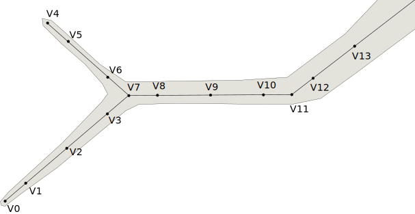
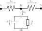

Cable Equation
==============

.. note::

   NEURON has a sophisticated system for allowing users to describe the
   geometry of neurons. Here we'll try to derive the equations in a manner that
   hides those details whenever they're not relevant to NMODL. Please consult
   its geometry related documentation or one of its publications, e.g. `The
   NEURON Simulation Environment`_.

.. _The NEURON Simulation Environment: https://doi.org/10.1162/neco.1997.9.6.1179

In order to derive the `cable equations` we model a neuron as an electrical
circuit. We first pick points along the neuron at which we model the voltage.
We'll call them nodes and connect the nodes to form a graph. At every branch
point we place a node, see Figure 1.

   Figure 1: Illustration of the placement of node along a neurite.

Two adjacent nodes are connected by a resistor. The interesting behaviour comes
from a difference in ion concentrations across the membrane. This difference is
upheld by three processes: a) the membrane which is largely impermeable to
ions, effectively creating a barrier for ions; b) (voltage-gated) ion channels
that conditionally allow ions to quickly cross the membrane; and c) ion pumps
which continuously pump ions across the membrane to restore a resting state.

The fact that the membrane is (mostly) impermeable to ions means that it
behaves like a dielectric material and can therefore be modeled by a capacitor.
The ion pumps and channels we simply model by a current :math:`I`.

This model gives rise to the circuit shown in Figure 2.

   Figure 2: Illustration of the circuit near one node. The total trans-membrane
   current is :math:`I_M`, the current due to the dielectric property of the
   membrane is :math:`I_C`, and all mechanism specific currents are represented
   by :math:`I`.

We can start writing down equations. Let's recall the formula for a capacitor
and Ohm's Law:

.. math::

   I = C \frac{dV}{dt}, \qquad
   \Delta V = R I

Using Kirchoff's Law we can write down two equations for the trans-membrane
current:

.. math::

   I_M &= I_C + I(V_1) \\
   I_{0,1} &= I_{1, 2} + I_M

which leads to

.. math::

   I_C + I = I_{0,1} - I_{1, 2} \\
   I_C + I_{1,2} - I_{0, 1} = -I

which can be rewritten in terms of the voltage as follows:

.. math::

   C \frac{dV_1}{dt} + R_{1,2}^{-1} (V_{2} - V{1}) - R_{0,1}^{-1} (V_{1} - V_{0}) = - I(V_1)  

This can be discretized by implicit Euler:

.. math::

   C \frac{V_1^{n+1} - V_1^{n}}{\Delta t} + R_{1,2}^{-1} \left(V_{2}^{n+1} - V_{1}^{n+1}\right) - R_{0,1}^{-1} \left(V_{1}^{n+1} - V_{0}^{n+1}\right) = - I(V_1^{n+1})

We collect terms as follows:

.. math::

   R_{0,1}^{-1} V_{0}^{n+1}
   + \left(\frac{C}{\Delta t} + R_{0,1}^{-1} - R_{1,2}^{-1}\right) V_1^{n+1}
   + R_{1,2}^{-1} V_{2}^{n+1}
   = \frac{C}{\Delta t} V_1^{n} - I(V_1^{n+1})

The unpleasant term is :math:`I(V_1^{n+1})` since it makes the system non-linear.
Therefore, it's linearized as follows:

.. math::

   I(V_1^{n+1})
   &\approx I_1^{n} + \left(V^{n+1} - V^{n}\right) \frac{dI_1}{dV_1} \\
   &=: I_1^{n} + \left(V^{n+1} - V^{n}\right) g_i^{n}

where :math:`g_i^{n}` is the mechanism dependent (differential) conductance.

