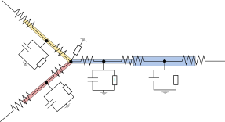
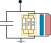

Currents
========

Current refer to the part of the membrane currents due to mechanisms. Meaning
the represent the rate at which charge crosses the membrane, e.g. due to ions
passing through ion channels. In Figure 1 we show the electrical circuit for a
couple of segments near a branch point. The effect of the capacitor (when
present) is handled by NEURON internally. In MOD files we compute the current
represented by the white box, labeled ``I``. This total current is the sum of
one current per mechanism. The current per mechanism in turn is the sum of
non-specific currents and ion currents, see Figure 2.

   Figure 1: Wiring diagram of four segments near a branch point. The circuit for computing the total trans-membrane current. For nodes representing a segment with non-zero aread the circuit for total trans-membrane current consists of a capacitor and currents due to mechanisms (labelled ``I``). The nodes with zero-area, the there's no capacitor, but point-processes, can still introduce current at that point.

   Figure 2: A detailed view of the the current ``I`` due to mechanisms. The current ``I`` is the sum of one total current per mechanism, illustrated as boxes of different colors. For each mechanism the total current consists of nonspecific currents (``i1``) and ion currents (``ina`` and ``ica``), illustrated only in the light yellow box.

There's a total current, required by the cable equation, which is discussed
here. The rate at which ions cross the membrane, called ion currents, can be
computed for individual ions, separately. Please check the documentation on
Ions.

NMODL Keywords
--------------

NONSPECIFIC_CURRENT
~~~~~~~~~~~~~~~~~~~

A nonspecific current is how an additive current contribution is expressed that's not accociated with any specific ion. It has the following syntax

.. code-block::

   NEURON {
       NONSPECIFIC_CURRENT <name>
   }

We'll assume the name is ``i1``.

Since it needs to be assigned a value in the MOD file, it needs to also be listed in the ``ASSIGNED`` block, e.g. as follows (units show are for a density mechanism).

.. code-block::

   ASSIGNED {
       <name> (mA/cm2)
   }

The nonspecific current is local to the mechanism and can be stored as a
regular range variable.

The generated code must ensure the following:

1. The total current contribution is updated by ``i1``.
2. Continue with the remaining current related computations, such as the finite
   difference for computing ``dI/dv``.
