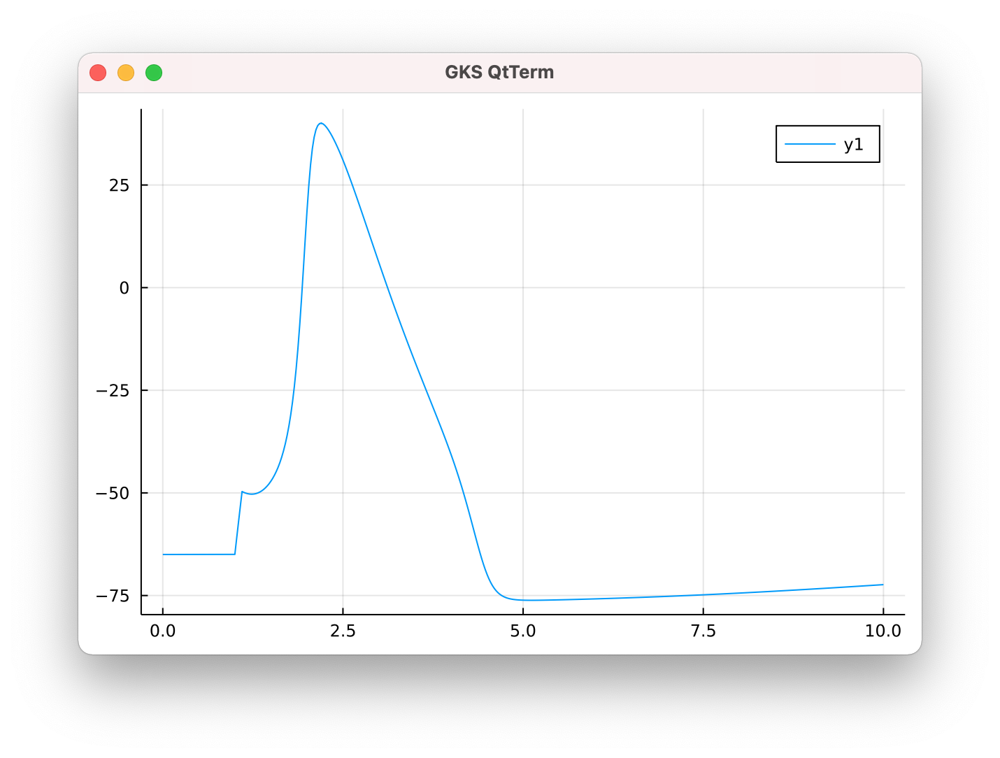

Other scripting languages
=========================

While NEURON currently only officially supports Python and HOC scripting, many other
programming environments can be used with NEURON through a Python compatibility layer.

Bringing data recorded in NEURON (e.g. via :meth:`Vector.record`) into the other programming
language is sometimes problematic as it may not know how to interpret :class:`Vector` objects;
one way to work-around this is to copy them into Python lists using :meth:`Vector.to_python`.

We demonstrate with `Julia <http://julialang.org>`_.

Setting up Julia for use with NEURON
------------------------------------

By default, Julia uses its own version of Python instead of the system Python.
As such, you'll need to either change Julia to use the system Python or install
NEURON within Julia itself using ``pip``. (Currently ``pip`` for NEURON only works
in Linux and macOS.)

To setup Julia to use NEURON on Linux or macOS, open an interactive Julia session by typing ``julia`` and then enter:

.. code::
    julia

    import Pkg
    Pkg.add("PyCall")
    Pkg.add("Plots")
    using PyCall
    subprocess = pyimport("subprocess")
    ENV["PYTHONHOME"] = ""
    subprocess.check_call([sys.executable, "-m", "pip", "install", "neuron"])

This additionally installs two Julia packages: ``PyCall``, the Python-compatibility API, and ``Plots`` which provides graphics functions.

This setup only needs to be performed once.

A simple Julia example
----------------------

Within any script that is to use NEURON, we begin by getting NEURON's ``h`` object, which is the primary way of interacting with NEURON in Python as well. To do so, we write:

.. code::
    julia

    using PyCall
    neuron = pyimport("neuron")
    h = neuron.h

We can then use the ``h`` object as described in the `Python programmer's reference <python/index.html>`_.

The following code simulates and plots an action potential in a Hodgkin-Huxley point cell:

.. code::
    julia

    using PyCall
    using Plots

    println("setting up model...")

    neuron = pyimport("neuron")

    h = neuron.h
    h.load_file("stdrun.hoc")

    soma = h.Section("soma")
    soma.insert(h.hh)
    soma.L = 10
    soma.diam = 10

    ic = h.IClamp(soma(0.5))
    ic.amp = 0.5
    ic.dur = 0.1
    ic.delay = 1

    t = h.Vector().record(h._ref_t)
    v = h.Vector().record(soma(0.5)._ref_v)

    println("simulating...")
    h.finitialize(-65)
    h.continuerun(10)

    println("plotting...")
    display(plot(t.to_python(), v.to_python()))

    print("Press enter to close...")
    readline()

Here the ``plot`` function (from the ``Plots`` library) required us to invoke the :meth:`Vector.to_python` which copies it into a list, which Julia interprets as a ``Vector{Float64}``.

Such conversion is not always necessary; Julia correctly handles NEURON :class:`Vector` manipulations like ``length(v)``, ``v[4]``, and vector arithmetic ``v + 2 * v``.

.. note::

    When used inside Julia, NEURON :class:`Vector` objects are 1-indexed, as is the Julia convention.
    (Python and HOC are 0-indexed.)
    That is, ``vec[1]`` returns the first item in ``vec`` not the second item.

    .. code::
        julia
        
        julia> vec = h.Vector([5, 72, 16])
        PyObject Vector[1]

        julia> vec[1]
        5.0

.. warning::

    Due to Julia's auto-type-conversion rules,
    invoking :meth:`Vector.as_numpy` directly in Julia will cause a ``numpy`` array to be created on the
    Python side but then be immediately *copied* to a ``Vector{Float64}``; as such, changes to the returned
    object would *not* affect the original :class:`Vector`; that is, a direct call to :meth:`Vector.as_numpy`
    in Julia behaves functionally equivalent to calling :meth:`Vector.to_python`.
    
    To avoid copying the Vector values, explicitly invoke ``pycall`` and specify ``PyArray`` as the return
    type, e.g.
    
    .. code::
        julia
        
        jvec = pycall(vec.as_numpy, PyArray)
    
    Such a ``jvec`` can then be used with e.g. the ``plot`` function.
