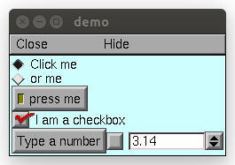

.. _panel:

         
GUI Widgets
-----------

The functions below are used to create 
panels of buttons, menus, and field editors. 

It is often convenient to encapsulate GUI elements and their state variables in
a class. This allows multiple independent instances to be created. For example, in Python:

.. code-block::
    python

    from neuron import n, gui

    class MyWindow:
        def __init__(self):
            self.mystate = 0
            self.myval = 3.14
            self.checkbox = 1
            n.xpanel('demo')
            n.xradiobutton('Click me', (self.clicked, 0), 1)
            n.xradiobutton('or me', (self.clicked, 1), 0)
            n.xstatebutton('press me', (self, 'mystate'), self.statepressed)
            n.xcheckbox('I am a checkbox', (self, 'checkbox'), self.checkboxpressed)
            n.xvalue('Type a number', (self, 'myval'), 1, self.numberset)
            n.xpanel()
        def clicked(self, choice):
            print(f'you switched the radio button! choice = {choice}')
        def statepressed(self):
            print(f'you pressed the state button. Value = {self.mystate}')
        def checkboxpressed(self):
            print(f'you clicked the checkbox. state = {self.checkbox}')
        def numberset(self):
            print(f'you set the number to: {self.myval}')

    window = MyWindow()

            
.. note::
    
    Top-level variables can be accessed through ``this_module`` where that is defined via ``import sys; this_module = sys.modules[__name__]``; see examples below.

----

.. function:: xpanel

    .. tab:: Python
    
    
        Syntax:
            .. code-block::
                python
            
                n.xpanel('name')
                n.xpanel('name', [0-1])
                n.xpanel()
                n.xpanel(x, y)
                n.xpanel(scroll)
                n.xpanel(scroll, x, y)

        Description:
         
            ``n.xpanel("name")`` 

            ``n.xpanel("name", [0-1])`` 
                Title of a new panel. Every 
                button, menu, and value between this and a closing ``xpanel()`` command 
                with no arguments (or placement args) belongs to this panel. 
                If the form is used with a second argument equal to 1, then 
                the panel is laid out horizontally. Otherwise the default is vertically. 

            ``n.xpanel()`` 

            ``n.xpanel(x, y)`` 
                done constructing the panel. so map it to the screen with position 
                optionally specified. 

            ``n.xpanel(scroll)`` 

            ``n.xpanel(scroll, x, y)`` 
                as above but if the first arg is a number, then the value determines 
                whether the panel will be inside a scrollbox. Scroll = 0 means a scrollbox 
                will NOT be used. Scroll = 1 means the panel will be inside a scrollbox. 
                Scroll = -1 is the default value and whether or not a scrollbox is used 
                is determined by the number of panel items in comparison with the 
                value of the panel_scroll property in the nrn.defaults file. 

         
         

    .. tab:: HOC

        Syntax:
            ``xpanel("name")``
        
        
            ``xpanel("name", [0-1])``
        
        
            ``xpanel()``
        
        
            ``xpanel(x, y)``
        
        
            ``xpanel(scroll)``
        
        
            ``xpanel(scroll, x, y)``
        
        
        Description:
        
        
            ``xpanel("name")`` 
        
        
            ``xpanel("name", [0-1])`` 
                Title of a new panel. Every 
                button, menu, and value between this and a closing ``xpanel()`` command 
                with no arguments (or placement args) belongs to this panel. 
                If the form is used with a second argument equal to 1, then 
                the panel is laid out horizontally. Otherwise the default is vertically. 
        
        
            ``xpanel()`` 
        
        
            ``xpanel(x, y)`` 
                done constructing the panel. so map it to the screen with position 
                optionally specified. 
        
        
            ``xpanel(slider)`` 
        
        
            ``xpanel(slider, x, y)`` 
                as above but if the first arg is a number, then the value determines 
                whether the panel will be inside a scrollbox. Scroll = 0 means a scrollbox 
                will NOT be used. Scroll = 1 means the panel will be inside a scrollbox. 
                Scroll = -1 is the default value and whether or not a scrollbox is used 
                is determined by the number of panel items in comparison with the 
                value of the panel_scroll property in the nrn.defaults file. 
        
----

.. function:: xbutton

    .. tab:: Python
    
    
        Syntax:
        
            ``n.xbutton('prompt', py_callable)``

            ``n.xbutton('prompt', (py_callable, arg))``

            ``n.xbutton('prompt', (py_callable, (arg1, arg2, ...))``

        Description:

            Adds a button to the currently open :func:`xpanel`. The label on the
            button is *prompt*, and when the button is clicked, it calls the
            *py_callable*. If instead of just ``py_callable`` a tuple containing
            ``py_callable`` and either an arg or tuple of args is passed, then
            those are passed to the function when the button is clicked; this can
            be used to allow one function to handle mutliple buttons, or buttons
            created in unknown situations.
    
        Example:

            .. code-block::
                python

                from neuron import n, gui

                def on_press():
                    print('You pressed the button.')

                n.xpanel('Button demo')
                n.xbutton('Press me', on_press)
                n.xpanel()

            .. image:: ../../images/xbutton.png
                :align: center         

        Example:

            .. code-block::
                python

                from neuron import n, gui

                def on_press(button_id):
                    print(f'You clicked button: {button_id}')

                def on_press3(a, b):
                    print(f'Button args: {a}, {b}')

                n.xpanel('Button demo 2')
                n.xbutton('Button 1', (on_press, 1))
                n.xbutton('Button 2', (on_press, 2))
                n.xbutton('Button 3', (on_press3, ('arg1', 'arg2')))
                n.xpanel()

            .. image:: ../../images/xbutton2.png
                :align: center         

    .. tab:: HOC

        Syntax:
            ``xbutton("command")``
        
        
            ``xbutton("prompt", "command")``
        
        
        Description:
        
        
            ``xbutton("command")`` 
                new button with command to execute when pressed. The label 
                on the button is "*command*". 
        
        
            ``xbutton("prompt", "command")`` 
                the label ont the button is "*prompt*", the action 
                to execute is "*command*". 
        
----

.. function:: xstatebutton

    .. tab:: Python
    
    
        Syntax:
            .. code-block::
                python
            
                n.xstatebutton('prompt', (obj_or_module, 'varname') [, action_fn])
                n.xstatebutton('prompt', hoc_reference [, action_fn])

        Description:
            like :func:`xbutton`, but when pressed var is set to 0 or 1 so that it matches the 
            telltale state of the button. If the var is set by another way the 
            telltale state is updated to reflect the correct value. 
            An example of a statement that constructs a hoc_reference is
            `self.x = n.ref(1.0)` and then the arg would be `self.x`.
            The action_fn may be either a python callable or a hoc
            executable string.
    
        Example:
            .. code-block::
                python

                from neuron import n, gui
                import sys; this_module = sys.modules[__name__]

                button_state = 0

                def on_press():
                    print(f'You pressed the button. The state is now: {button_state}')

                n.xpanel('StateButton demo')
                n.xstatebutton('Press me', (this_module, 'button_state'), on_press)
                n.xpanel()
         
            .. image:: ../../images/xstatebutton.png
                :align: center       

    .. tab:: HOC

        Syntax:
            ``xstatebutton("prompt",&var [,"action"])``
        
        
        Description:
            like :func:`xbutton`, but when pressed var is set to 0 or 1 so that it matches the
            telltale state of the button. If the var is set by another way the 
            telltale state is updated to reflect the correct value. 
        
----

.. function:: xcheckbox

    .. tab:: Python
    
    
        Syntax:
            .. code-block::
                python
            
                n.xcheckbox('prompt', (obj_or_module, 'varname') [, action_fn])
                n.xcheckbox('prompt', hoc_reference [, action_fn])

        Description:
            like :func:`xstatebutton`, but checkbox appearance. 

         

    .. tab:: HOC

        Syntax:
            ``xcheckbox("prompt",&var [,"action"])``
        
        
        Description:
            like :func:`xstatebutton`, but checkbox appearance.
        
----

.. function:: xradiobutton

    .. tab:: Python
    
    
        Syntax:
            .. code-block::
                python
            
                n.xradiobutton('name', action_fn [, 0 or 1])

        Description:
            Like an :func:`xbutton` but highlights the most recently selected 
            button of a contiguous group (like a car radio, mutually exclusive 
            selection). 
            If the third argument is 1, then the button will be selected when the 
            panel is mapped onto the screen. However, in 
            this case the action should also be explicitly executed by the programmer. 
            That is not done automatically since it is often the case that the action 
            is invalid when the radio button is created. As with ``n.xbutton``, ``action_fn`` may
            be a Python function handle, a tuple containing a function handle and an argument, or
            a tuple containing a function handle and a tuple of arguments.

        Example:

            .. code-block::
                python
            
                from neuron import n, gui

                def a(n):
                    """function to be called when a radio button is toggled"""
                    print(n)

                n.xpanel('panel')
                n.xmenu('menu')
                for i in range(1, 11):
                    n.xradiobutton(f'item {i}', (a, i))

                n.xmenu()
                n.xpanel()

         
            .. image:: ../../images/xradiobutton.png
                :align: center  
         

    .. tab:: HOC

        Syntax:
            ``xradiobutton("name", "action")``
        
        
            ``xradiobutton("name", "action", 0or1)``
        
        
        Description:
            Like an ``xbutton`` but highlights the most recently selected 
            button of a contiguous group (like a car radio, mutually exclusive 
            selection). 
            If the third argument is 1, then the button will be selected when the 
            panel is mapped onto the screen. However, in 
            this case the action should also be explicitly executed by the programmer. 
            That is not done automatically since it is often the case that the action 
            is invalid when the radio button is created. 
        
        
        Example:
        
        
            .. code-block::
                none
        
        
                proc a() { 
                    print $1 
                } 
        
        
                strdef label, cmd 
        
        
                xpanel("panel") 
                    xmenu("menu") 
                    for i =1, 10 { 
                        sprint(label, "item %d", i) 
                        sprint(cmd, "a(%d)", i) 
                        xradiobutton(label, cmd) 
                    } 
                    xmenu() 
                xpanel() 
        
----

.. function:: xmenu

    .. tab:: Python
    
    
        Syntax:
            .. code-block::
                python
            
                n.xmenu('title')
                n.xmenu()
                n.xmenu('title', 1)
                n.xmenu(title, py_callable)
                n.xmenu(title, py_callable, 1)

        Description:

            ``n.xmenu("title")`` 
                create a button in the panel with label "title" which, when 
                pressed, pops up a menu containing buttons and other menus. Every 
                :func:`xbutton` and :func:`xmenu` command between this and the closing ``xmenu()`` 
                command with no arguments becomes the menu. 
                Don't put values into menus. 

            ``n.xmenu()`` 
                done defining the menu. Menus can be nested as in 

                .. code-block::
                    python
                
                    from neuron import n, gui

                    def selected1():
                        print('you selected option 1')

                    def selected2():
                        print('you selected option 2')

                    n.xpanel('xmenu demo')
                    n.xmenu('one')
                    n.xmenu('two')
                    n.xbutton('option 1', selected1)
                    n.xbutton('option 2', selected2)
                    n.xmenu()
                    n.xmenu()
                    n.xpanel()

                .. image:: ../../images/xmenu1.png
                    :align: center 
            
            ``n.xmenu("title", 1)`` 
                adds the menu to the menubar. Note that a top level menu with no 
                second argument starts a new menubar. Normally these menubars have only 
                one top level item. 

                .. code-block::
                    python

                    from neuron import n, gui
                    import sys

                    def item_selected(n):
                        print(f'selected value {n}')

                    n.xpanel("menubar") 
                    n.xmenu("first") 
                    n.xbutton("one", (item_selected, 1))
                    n.xbutton("two", (item_selected, 2))
                    n.xbutton("Exit", sys.exit)
                    n.xmenu() 
                    n.xmenu("second", 1) 
                    n.xbutton("three", (item_selected, 3))
                    n.xbutton("four", (item_selected, 4))
                    n.xmenu("submenu") 
                    n.xbutton("PI", (item_selected, n.PI))
                    n.xmenu() 
                    n.xmenu() 
                    n.xmenu("third", 1) 
                    n.xbutton("five", (item_selected, 5)) 
                    n.xbutton("six", (item_selected, 6))
                    n.xmenu() 
                    n.xmenu("nextline") 
                    n.xbutton("seven", (item_selected, 7))
                    n.xbutton("eight", (item_selected, 8))
                    n.xmenu() 
                    n.xpanel() 

                .. image:: ../../images/xmenu2.png
                    :align: center 

            ``n.xmenu("title", py_callable)`` and ``n.xmenu("title", py_callable, 1)`` 
                Dynamic menu added as item in panel or menu or (when third argument 
                is 1) to a menubar. An example of the first type is the 
                NEURONMainMenu/File/RecentDir and an example of the last type is the 
                NEURONMainMenu/Window 
             
                When the menu title button is selected, the stmt is executed in a context 
                like: 

                .. code-block::
                    python

                    n.xmenu("title") 
                    py_callable()
                    n.xmenu() 

                which should normally build a menu list and then this list is mapped to 
                the screen as a normal walking menu. 
             

                .. code-block::
                    python
                
                    from neuron import n, gui

                    def select(i):
                        print(f'you selected {i}')

                    def make():
                        make.n += 1
                        for i in range(1, make.n + 1):
                            n.xbutton(f'label {i}', (select, i))

                    make.n = 0

                    n.xpanel("test") 
                    n.xmenu("dynamic", make) 
                    xpanel() 
            
                .. warning::
                
                    The dynamic menu syntax is currently unsupported in Python, but
                    the equivalent (passing a HOC command string) works in HOC.
                 

         

    .. tab:: HOC

        Syntax:
            ``xmenu("title")``
        
        
            ``xmenu()``
        
        
            ``xmenu("title", 1)``
        
        
            ``xmenu("title", "stmt")``
        
        
            ``xmenu("title", "stmt", 1)``
        
        
        Description:
        
        
            ``xmenu("title")`` 
                create a button in the panel with label "title" which, when 
                pressed, pops up a menu containing buttons and other menus. Every 
                ``xbutton`` and ``xmenu`` command between this and the closing ``xmenu()`` 
                command with no arguments becomes the menu. 
                Don't put values into menus. 
        
        
            ``xmenu()`` 
                done defining the menu. Menus can be nested as in 
        
        
                .. code-block::
                    none
        
        
                            xmenu("one") 
                              xmenu("two") 
                              xmenu() 
                            xmenu() 
        
        
            ``xmenu("title", 1)`` 
                adds the menu to the menubar. Note that a top level menu with no 
                second argument starts a new menubar. Normally these menubars have only 
                one top level item. 
        
        
                .. code-block::
                    none
        
        
                    xpanel("menubar") 
                            xmenu("first") 
                                    xbutton("one","print 1") 
                                    xbutton("two","print 2") 
                            xmenu() 
                            xmenu("second", 1) 
                                    xbutton("three","print 3") 
                                    xbutton("four","print 4") 
                                    xmenu("submenu") 
                                            xbutton("PI", "print PI") 
                                    xmenu() 
                            xmenu() 
                            xmenu("third", 1) 
                                    xbutton("five","print 5") 
                                    xbutton("six","print 6") 
                            xmenu() 
                            xmenu("nextline") 
                                    xbutton("seven","print 7") 
                                    xbutton("eight","print 8") 
                            xmenu() 
                    xpanel() 
        
        
            ``xmenu("title", "stmt")`` and ``xmenu("title", "stmt", 1)`` 
                Dynamic menu added as item in panel or menu or (when third argument 
                is 1) to a menubar. An example of the first type is the 
                NEURONMainMenu/File/RecentDir and an example of the last type is the 
                NEURONMainMenu/Window 
        
        
                When the menu title button is selected, the stmt is executed in a context 
                like: 
        
        
                .. code-block::
                    none
        
        
                            xmenu("title") 
                            stmt 
                            xmenu() 
        
        
                which should normally build a menu list and then this list is mapped to 
                the screen as a normal walking menu. 
        
        
                .. code-block::
                    none
        
        
                    load_file("nrngui.hoc") 
                    xpanel("test") 
                    xmenu("dynamic", "make()") 
                    xpanel() 
        
        
                    strdef s1, s2 
                    n = 0 
        
        
                    proc make() {local i 
                       n += 1 
                       for i=1, n { 
                          sprint(s1, "label %d", i) 
                          sprint(s2, "print %d", i) 
                          xbutton(s1, s2) 
                       } 
                    } 
        
----

.. function:: xlabel

    .. tab:: Python
    
    
        Syntax:
            .. code-block::
                python
            
                n.xlabel('string')

        Description:
            Show the string as a fixed label. 

         

    .. tab:: HOC

        Syntax:
            ``xlabel("string")``
        
        
        Description:
            Show the string as a fixed label. 
        
----

.. function:: xvarlabel

    .. tab:: Python
    
    
        Syntax:
            .. code-block::
                python
            
                n.xvarlabel(strref)

        Description:
            Show the string as its current value. 
    
        Example:
    
            .. code-block::
                python
            
                from neuron import n, gui

                mystr = n.ref('')
                n.xpanel('xvarlabel demo')
                n.xlabel('Dynamic text will appear below:')
                n.xvarlabel(mystr)
                n.xpanel()

                # change the text displayed by changing mystr
                mystr[0] = 'Hello world!'

            .. image:: ../../images/xvarlabel.png
                :align: center 
            
        .. warning::
    
            Python strings are immutable. Thus the text displayed will only automatically
            change if a strref is used, as in the example.
         

    .. tab:: HOC

        Syntax:
            ``xvarlabel(strdef)``
        
        
        Description:
            Show the string as its current value. 
        
----

.. function:: xvalue

    .. tab:: Python
    
    
        Syntax:
    
            .. code-block::
                python

                n.xvalue("prompt", (obj_or_module, "varname") [, boolean_deflt, "action" [, boolean_canrun]])
                n.xvalue("prompt", ref_var, [, boolean_deflt, "action" [, boolean_canrun]])
                n.xvalue("prompt", "variable", 2)

        Description:

            ``n.xvalue("prompt", (obj_or_module, "varname") [, boolean_deflt, "action" [, boolean_canrun]])`` 
                create field editor for variable with the button labeled with "*prompt*". 
                If *boolean_deflt* == True (or 1) then add a checkbox which is checked when the 
                value of the field editor is different that when the editor was 
                created. Execute "action" when user enters a new value. If 
                *boolean_canrun* == True (or 1) then use a default_button widget kit appearance 
                instead     of a push_button widget kit appearance. 

            ``n.xvalue("prompt", (obj_or_module, "varname"), 2)`` 
                a field editor that keeps getting updated every 10th :func:`doNotify`. 

            .. The domain of values that can be entered by the user into a field editor 
            .. may be limited to the domain specified by the 
            .. :func:`variable_domain` function , the domain specified for the variable in 
            .. a model description file, or a default domain that exists 
            .. for some special NEURON variables such as diam, Ra, L, etc. 
            .. For a field editor to check the domain, domain limits must be in effect 
            .. prior to creation of the field editor. 

        Example:
    
            .. code-block::
                python
            
                from neuron import n, gui
                import sys; this_module = sys.modules[__name__]

                val = 42

                n.xpanel('demo')
                n.xvalue('enter value', (this_module, 'val'))
                n.xpanel()

                # changing val in the dialog will change val as seen by the program
        
            .. image:: ../../images/xvalue.png
                :align: center 

        .. seealso::
    
            The example at the top of the file, which uses ``xvalue`` in an object.
         

    .. tab:: HOC

        Syntax:
            ``xvalue("variable")``
        
        
            ``xvalue("prompt", "variable" [, boolean_deflt, "action" [, boolean_canrun, boolean_usepointer]])``
        
        
            ``xvalue("prompt", "variable", 2)``
        
        
        Description:
        
        
            ``xvalue("variable")`` 
                create field editor for variable 
        
        
            ``xvalue("prompt", "variable" [, boolean_deflt, "action" [, boolean_canrun, boolean_usepointer]])`` 
                create field editor for variable with the button labeled with "*prompt*". 
                If *boolean_deflt* == 1 then add a checkbox which is checked when the 
                value of the field editor is different that when the editor was 
                created. Execute "action" when user enters a new value. If 
                *boolean_canrun* == 1 then use a default_button widget kit appearance 
                instead     of a push_button widget kit appearance. 
                If *boolean_usepointer* is true then (for efficiency sake) try to 
                use the address of variable instead of interpreting it all the time. 
                At this time you must use the address form if the button is created 
                within an object, otherwise when the button is pressed, the symbol 
                name won't be parsed within the context of the object but at the 
                top-level context. 
        
        
            ``xvalue("prompt", "variable", 2)`` 
                a field editor that keeps getting updated every 10th ``doNotify()``. 
        
        
            The domain of values that can be entered by the user into a field editor 
            may be limited to the domain specified by the 
            :func:`variable_domain` function , the domain specified for the variable in
            a model description file, or a default domain that exists 
            for some special NEURON variables such as diam, Ra, L, etc. 
            For a field editor to check the domain, domain limits must be in effect 
            prior to creation of the field editor. 
        
----

.. function:: xpvalue

    .. tab:: Python
    
    
        Syntax:
            .. code-block::
                python
            
                n.xpvalue('prompt', ref, ...)
            

        Description:
            like :func:`xvalue` but uses a reference to the variable.
    
        Example:
    
            .. code-block::
                python
            
                from neuron import n, gui

                val = n.ref(42)

                def show_val():
                    print(f'value is: {val[0]}')

                n.xpanel('demo')
                n.xpvalue('enter value', val, 1)
                n.xbutton('show value', show_val)
                n.xpanel()

            .. image:: ../../images/xpvalue.png
                :align: center 
            
        .. seealso::
    
            :func:`units`
         

    .. tab:: HOC

        Syntax:
            ``xpvalue("variable")``
        
        
            ``xpvalue("prompt", &variable, ...)``
        
        
        Description:
            like :func:`xvalue` but definitely uses address of the variable.
        
        
        .. seealso::
        
        
            :func:`units`
        
----

.. function:: xfixedvalue

    .. tab:: Python
    
    
        Syntax:
    
            .. code-block::
                python
            
                n.xfixedvalue("prompt", (obj_or_module, "varname"), boolean_deflt, boolean_usepointer)

        Description:
            like :func:`xvalue` but cannot be changed by the user except under 
            program control and there can be no action associated with it. 
        
        .. warning::
        
            This is not implemented. For now, try to do the same thing 
            with :func:`xvarlabel`. 

         

    .. tab:: HOC

        Syntax:
            ``xfixedvalue("variable")``
        
        
            ``xfixedvalue("prompt", "variable", boolean_deflt, boolean_usepointer)``
        
        
        Description:
            like xvalue but cannot be changed by the user except under 
            program control and there can be no action associated with it. 
            Note: this is not implemented. For now, try to do the same thing 
            with ``xvarlabel()``. 
        
----

.. function:: xslider

    .. tab:: Python
    
    
        Syntax:
            .. code-block::
                python
            
                n.xslider((obj_or_module, "varname"), [low, high], [on_slide], [vert], [slow])
                n.xslider(ref_var, [low, high], [on_slide], [vert], [slow])

        Description:
            Slider which is attached to the variable var. Whenever the slider 
            is moved, the optional *on_slide* is executed. The default range is 
            0 to 100. Steppers increase or decrease the value by 1/10 of the range. 
            Resolution is .01 of the range. vert=True (or 1) makes a vertical slider and 
            if there is no *on_slide* may be the 4th arg. slow=True (or 1) removes the "repeat 
            key" functionality from the slider(and arrow steppers) and also 
            prevents recursive calls to the *on_slide*. This is necessary if 
            a slider action is longer than the timeout delay. Otherwise the 
            slider can get in a state that appears to be an infinite loop. 
            The downside of slow=1 is that the var may not get the last value 
            of the slider if one releases the button during an action.

        Examples:
    
            .. code-block::
                python
            
                from neuron import n, gui
                import sys; this_module = sys.modules[__name__]

                val = 42
                val_str = n.ref('Slider value:         ')
                def show_val():
                    val_str[0] = f'Slider value: {val}'

                n.xpanel('demo')
                n.xvarlabel(val_str)
                n.xslider((this_module, 'val'), 0, 100, show_val)
                n.xpanel()
                show_val()

            .. image:: ../../images/xslider.png                
                :align: center 
    
            It is slightly more efficient to use an ``n.ref`` instead of a tuple.
            The above example is functionally equivalent to:
    
            .. code-block::
                python
            
                from neuron import n, gui

                val = n.ref(42)
                val_str = n.ref('Slider value:         ')
                def show_val():
                    val_str[0] = f'Slider value: {val[0]}'

                n.xpanel('demo')
                n.xvarlabel(val_str)
                n.xslider(val, 0, 100, show_val)
                n.xpanel()
                show_val()

    
            You can also combine xslider with xvalue to report and modify its value (below example):
    
            .. code-block::
                python
            
                from neuron import n, gui

                class ValuePanel:

                    def __init__(self, init_val=42, label='',lower_limit=0,upper_limit=100):
                        self._val = n.ref(init_val)
                        n.xpanel('demo')
                        n.xlabel(label)
                        n.xvalue('enter value', self._val, True, self._bounds_check)
                        self.__lower_limit = lower_limit
                        self.__upper_limit = upper_limit
                        n.xslider(self._val, self.__lower_limit, self.__upper_limit)
                        n.xpanel()

                    def _bounds_check(self):
                        self.val = self.val

                    @property
                    def val(self):
                        return self._val[0]

                    @val.setter
                    def val(self, new_val):
                        new_val = max(self.__lower_limit, new_val)
                        self._val[0] = min(new_val, self.__upper_limit)

                if __name__=="__main__":
                    hbox=n.HBox()  # Horizontal box
                    hbox.intercept(True)
                    length=ValuePanel(label='length.val')
                    diam=ValuePanel(init_val=2,label='diam.val',lower_limit=0, upper_limit=5)
                    hbox.intercept(False)
                    hbox.map()
                    print('can read/change length.val, diam.val')

            .. image:: ../../images/value_panel.png
                :align: center

    .. tab:: HOC

        Syntax:
            ``xslider(&var, [low, high], ["send_cmd"], [vert], [slow])``
        
        
        Description:
            Slider which is attached to the variable var. Whenever the slider 
            is moved, the optional *send_cmd* is executed. The default range is 
            0 to 100. Steppers increase or decrease the value by 1/10 of the range. 
            Resolution is .01 of the range. vert=1 makes a vertical slider and 
            if there is no *send_cmd* may be the 4th arg. slow=1 removes the "repeat 
            key" functionality from the slider(and arrow steppers) and also 
            prevents recursive calls to the *send_cmd*. This is necessary if 
            a slider action is longer than the timeout delay. Otherwise the 
            slider can get in a state that appears to be an infinite loop. 
            The downside of slow=1 is that the var may not get the last value 
            of the slider if one releases the button during an action. 
        
----

.. function:: units

    .. tab:: Python
    
        Syntax:
            .. code-block::
                python
            
                on or off = n.units(1 or 0)
                current_units = n.units("varname" [, "units string"])
        

        Description:
            When units are on (default on) value editor buttons display the units 
            string (if it exists) along with the normal prompt string. Units for 
            L, diam, Ra, t, etc are built-in and units for membrane mechanism variables 
            are declared in the model description file. See modlunit . 
            Note that units are NOT saved in a session. Therefore, any user defined 
            variables must be given units before retrieving a session that shows them 
            in a panel. 
         
            The units display may be turned off with \ ``n.units(0)`` or by setting the 
            \ ``*units_on_flag: off`` in the nrn/lib/nrn.defaults file. 
                 
            If the first arg is a string, it is treated as the name of the variable. 
            This is restricted to hoc variable names of the style, "name", or "classname.name". 
            Apart from the circumstance that the string arg style must be used when 
            executed from Python, a benefit is that it can be used when an instance 
            does not exist (no pointer to a variable of that type). 
            If there are no units specified for the variable name, or the variable 
            name is not defined, the return value is the empty string. 

        Examples:

            .. code-block::
                python
            
                print(n.units('dt'))        # ms
                print(n.units('gna_hh'))    # S/cm2
                print(n.units('Ra'))        # ohm-cm
                print(n.units('L'))         # um
                print(n.units('ExpSyn.g'))  # uS

        .. warning::
    
            When passing a string to ``n.units``, note that the string must be the
            name of a HOC variable. Unfortunately, there is currently no way to declare
            the units of a Python variable.

    .. tab:: HOC

        Syntax:
            ``current_units = units(&variable)``
        
        
            ``current_units = units(&variable, "units string")``
        
        
            ``"on or off" = units(1 or 0)``
        
        
            ``current_units = units("varname", ["units string"])``
        
        
        Description:
            When units are on (default on) value editor buttons display the units 
            string (if it exists) along with the normal prompt string. Units for 
            L, diam, Ra, t, etc are built-in and units for membrane mechanism variables 
            are declared in the model description file. See modlunit . 
            Note that units are NOT saved in a session. Therefore, any user defined 
            variables must be given units before retrieving a session that shows them 
            in a panel. 
        
        
            The units display may be turned off with \ ``units(0)`` or by setting the 
            \ ``*units_on_flag: off`` in the nrn/lib/nrn.defaults file. 
        
        
            \ ``units(&variable)`` returns the units string for any 
            variable for which an address can be taken. 
        
        
            \ ``units(&variable, "units string")`` sets the units for the indicated 
            variable. 
        
        
            If the first arg is a string, it is treated as the name of the variable. 
            This is restricted to hoc variable names of the style, "name", or "classname.name". 
            Apart from the circumstance that the string arg style must be used when 
            executed from Python, a benefit is that it can be used when an instance 
            does not exist (no pointer to a variable of that type). 
            If there are no units specified for the variable name, or the variable 
            name is not defined, the return value is the empty string. 
        
        
        Example:
        
        
            .. code-block::
                none
        
        
                units(&t) // built in as "ms" 
                units("t") 
                units("ExpSyn.g") // built in as "uS" 
                x = 1 
                {units(&x, "mA/cm2")}       // declare units for variable x 
                units(&x)           // prints mA/cm2 
                proc p () { 
                    xpanel("Panel") 
                    xvalue("t") 
                    xvalue("prompt for x", "x", 1) 
                    xpanel() 
                } 
                p()         //shows units in panel 
                units(0)    // turn off units 
                p()         // does not show units in panel 
        
        
        .. warning::
            In the Python world, the first arg must be a string as the pointer style will 
            raise an error. 
        
