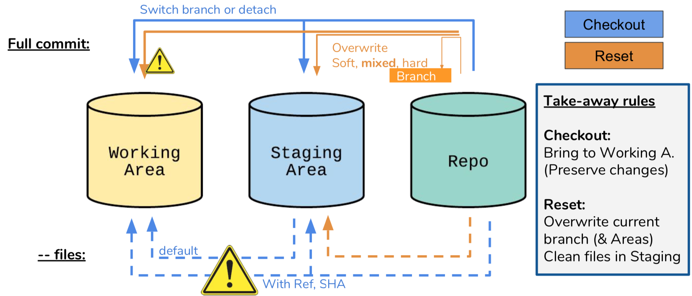
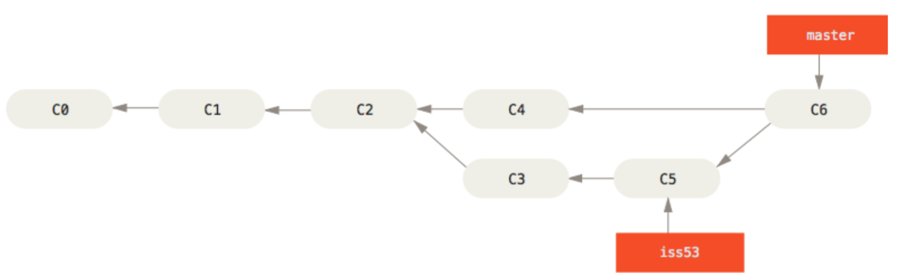
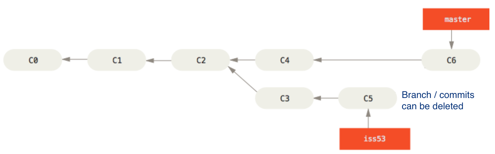
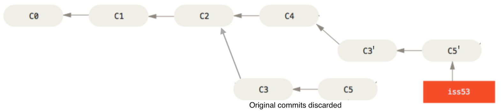
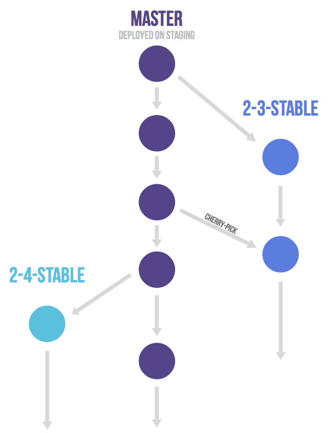
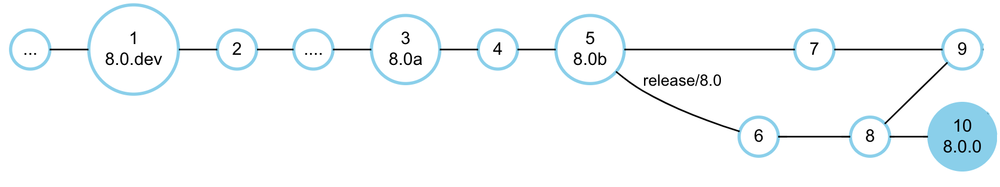
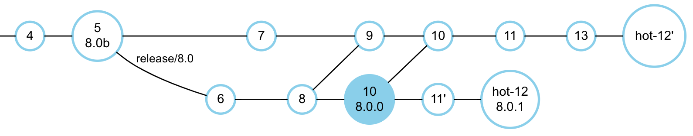

# NEURON Source and Release Management Guide

**A version scheme and release management workflow with Git &amp; GitHub**

@May 2020 - The NEURON core developers team

## INTRODUCTION

NEURON [1] is a simulator for detailed neuronal activity whose implementation started in the 70s as part of the research works of its author, Michael Hines. It has, since then, grown to become an established, perhaps the reference, simulator of its kind. During this period it has undergone major code changes and contributions from various additional authors, as well as been subject to development with diverse technologies and conventions for code management and deployment.

Similarly, over the last years, we have witnessed a profound change in the software development process. Especially thanks to the success of open-source software, a number of professional-grade development technologies have become available to any software project. NEURON, opportunely, adopted some of these technologies, namely _Git_ which became the reference source code version control in open-source software.

Despite the move to git and the continuous adoption of more recent technologies, e.g. for Continuous Integration, there hasn&#39;t been guidelines for a streamlined and integrated development process. Namely, we have not revisited the definition of versions and how they are handled in Git (as tags, branches,...) or GitHub (as Milestones), etc.

Following discussions within the recently formed Neuron Core Developers group, this document aims to compile best-practices and agreed workflows into a set of guidelines. It is split into two main parts: first, it provides a solid technical background on SCM technologies, namely git and its operations; second, it presents specific guidelines for effective release management in NEURON.

### Definitions

With the intent of simplifying the language in this document, bringing the readers to a common understanding and disambiguating terms that might not have a clear definition, we start with a set of definitions (to hold in the scope of Neuron).

- **CI [Continuous Integration]**: The practice of adding (continuously) changes to a software repository, typically on the main development line. To avoid the frequent changes from introducing hard-to-track bugs, before the change is accepted, a test-suite should run. Such &quot;test-before-merge&quot; practice is so common for CI that the term became associated with technologies for test automation (e.g: Jenkins and GitHub Actions).
- **Issue Tracker** - A system to report defects or requests for software changes.
- **SCM, VCS** [Source Code Management, or Version Control System] - A kind of software that tracks all the changes to applications source code and associated metadata e.g.: time and author of the change. Git, and previously SVN, are very popular open source SCMs.
- **Semantic Versioning** - A versioning scheme in which a version identifier, e.g. &quot;1.2.0a&quot;, provides insights about the application compatibility, functionality and stability.

## GIT and GITHUB

Git [2]() is the Source Code Management system used in NEURON. Originally created by Linus Torvalds for the Linux Kernel and released in 2005, it became extremely popular for open-source projects during the 2010s (2018 quota estimate: 87.2%), in part thanks to GitHub.

Having such a demanding use-case at its origin, Git design and feature-set provide excellent support for large projects and large teams working in parallel. Some of the design principles are:

- **Distributed architecture** : Git, unlike e.g. SVN, doesn&#39;t have a centralized remote repository on a server. Instead each &quot;clone&quot; is a fully autonomous repository from which users can query the history or even further clone from.

- **Branching [/merge] model**: Git supports the so-called &quot;branches&quot; representing new development paths. This model enables developers to work in parallel on new features or bug-fixes without compromising other developers&#39; work. Given the traceability to the most common ancestor, two branches may be merged again when the changes are complete, very often without user intervention.
- **Performance:** On large projects, tracking changes and deltas of thousands of files may become computationally heavy. Git was designed with performance as a main goal. It builds on a local fs-like database and state-of-the-art DAG algorithms. Besides it&#39;s C.
- **Flexibility:** Git started off as a set of low-level commands that are still available nowadays: the &quot;Plumbing&quot;. They were mostly meant to be used by high-level applications but can be directly used to make deep (and breaking!) changes in the repository. Later &quot;Porcelain&quot; commands were added for the high-level operations we mostly know git for.
- **History Rewriting** : Git encourages keeping a clean history, even if it requires changing the repository history, and so it provides great (sometimes extreme) tools to do so: `commit --amend, rebase, merge --squash`. However it must be done only in situations it won&#39;t affect other collaborators or create inconsistencies. For instance, long standing branches should never ever have its history rewritten. More on this later.

### Git Branches and Tags

Besides _Branches_ Git also implements _Tags_, i.e. labels to important revisions, otherwise only identifiable by their inherent hash. Although Branches and Tags serve different purposes, they are basically the same thing: they point to a certain revision so that, e.g., the code can be easily checked-out. However, while _Branches_ are supposed to be updated whenever there&#39;s a new commit, _Tags_ are immutable. Once a Tag is created and made public it shall never be deleted or overwritten. As mentioned, rewriting public history can lead to disastrous consequences.

In many projects Tags are used to mark certain revisions as special, maybe because they are ready for public release, or it&#39;s a milestone in the development of some functionality, etc. Despite the flexibility, it is crucial to adhere to a standard scheme for effective collaboration.

### GitHub

GitHub is a development platform and, in some sense, a software collaboration portal based on Git, with a number of features very useful for software development [3] [4], among them :

- **Issues** - An Issue Tracker where users and developers can report and discuss enhancements, bugs and tasks of the project.
- **Milestones** - A Release Planner in which project managers can define which Issues (features + bug fixes) are to be included in each release/milestone.
- **Pull Requests** - A patch integration model adapted to large teams or open-source projects, where any developer may propose a change to be reviewed and eventually merged by a project lead.
- **Forks** - Clones of other GitHub projects so that developers without any permission in the original repository can still create Pull Requests. One of the issues with forks is the risk of branches to become out of sync with the original repo. Therefore for small/core teams it may be preferable to grant main developers the possibility of creating branches.
- **Support for CI** (and third party tools): GitHub integrates with a number of online services for testing, deployment, etc (they have a public API) so that Continuous Integration or other methodologies can be employed.

GitHub provides these great tools on top of a plain Git repository, and therefore it can be thought of as a &quot;GUI-on-steroids&quot; for Git. Clicking to merge a Pull-Request will effectively trigger a &quot;git merge&quot; from the branch associated with that Pull-Request into the target branch, e.g. _master_.

## GIT OPERATIONS

### Checkout, Stage, Commit

Once a repository exists locally (via git clone, or git init) one can start tracking files. However, unlike many SCMs, between the local file system and the repository itself git provides a Staging Area (a.k.a. Index). This area is a basically a temporary place for changes to &quot;commit&quot;.

It is pre-filled with the same contents of the commit being checked-out. The user can then add local files here (git add) and commit them or, eventually bring them back to the local filesystem (also git checkout).

The Staging area is thus a central block for the fundamental git operations. Nevertheless it can be a source of confusion for certain usages with git checkout or reset, discussed next.

### Checkout &amp; Reset

When checking out a revision, git checkout has a straightforward behavior: it brings in a certain revision (fully!) to **both** Working and Staging areas. However sometimes we may want to check-out just a few files. Git allows that as well: the user can provide file names after a double-dash, e.g.: git checkout &lt;rev&gt; -- &lt;file1&gt; &lt;file2&gt;... (be sure to provide **&lt;rev&gt;** ).

Git reset can similarly bring the files from a certain revision to the Staging and Working areas and thus is often a source of confusion. However it does it with a fundamental difference: it&#39;s purpose is to **overwrite** the current revision, while checkout &quot;closes&quot; it and opens a new one to work on. These differences can be very subtle though, especially when providing file names.

In the diagram one can see the several usages of reset and checkout, that together are able to move data downstream among all areas (for upstream are the well known _add_ and _commit_). One can see some warning signs that alert for the danger of irrecoverably overwriting files. Namely we see that &quot;git reset --hard&quot; is obviously very dangerous, it will overwrite all files, **discarding changes** , to both areas, **similar to what checkout does** when &quot;checkout &lt;ref&gt; -- &lt;files&gt;&quot;.

Notice also the behavior of checkout when no &lt;ref&gt; is provided: it gets files from the Staging Area which, for the most times, is not the intended behavior.

Lastly notice that &quot;reset -- &lt;files&gt;&quot; has some special meaning: it will overwrite the Staging Area with contents from the Repo. Although it may sound worthless at first, it is the standard way of undoing changes eventually introduced by an unwanted &quot;git add&quot;, e.g.:

> $ git add src# add all files under src.

 Oh no! There was src/secret\_file

> $ git reset -- src/secret\_file 

### Merging Branches

When a feature or a fix is ready, or for some reason a developer wants to integrate changes from a branch into another, he must do a &quot;merge&quot;. There are different variants of merges, namely &quot;merge --squash&quot; that became very popular in some workflows, namely in GitHub, and &#39;--fast-forward&#39;. But let&#39;s start off with normal merges, their virtues and shortcomings. Consider the following Figure.

&quot;iss53&quot; branch started off form master at revision C2. For the purposes of the feature, C3 and C5 commits were made, while in the meantime master received one external commit (C4). At this point the feature was considered complete, hopefully tested, and the developers accepted the change, so they did, from master, a &quot;git merge iss53&quot;. (In GitHub: Merge Pull Request).

Despite the apparent simplicity, merges can be very delicate, especially if several branches make merges among them. A merge commit (e.g.: C6 in the figure) is almost a normal commit except that it has more two or more parents (here C4 and C5). As so, it can keep track of all the commits contributing to the future state and handle them correctly. It knows that C2 is the most recent common ancestor and so C4 changes must not clash with those introduced by C3+C5. If they don&#39;t, the merge is successful and the merged changes are stored in commit C6. Otherwise, if changes clash, there is a conflict and the user must disambiguate them.

#### Merge --squash

On any software change, it is a very good practice to split the work in small units so that each of them can be independently reviewed and tested. Especially for large features, standard merges are great to retain all the history (eventually simplified), enabling bugs to be more easily traceable. Nevertheless in many situations that might not be worth it. Many changes and bug fixes can (and should) be kept very small. Even if the branch received a lot of commits, they often represent solely the evolution of a solution and don&#39;t make sense standalone.

In these situations, if the final change is small, it makes sense to discard all intermediate commits.

git merge --squash will create and commit a single change (C6) representing the whole feature branch, without parent-child relationship, making target branch history linear and concise. The feature branch and commits can safely be deleted. For this reason it has become the default merge strategy in many open source projects.

#### Fast-Forward merge

Another way of keeping history linear (without merge commits) is via fast-forwarding. Consider, in the previous figure, that the branch starts from commit C4 instead of C2. Then there&#39;s effectively nothing in master adding to the merge. Instead of doing a &quot;normal&quot; merge, we could instead simply consider C5 to be the result of the merge. This trivial operation is a fast-forward. However, it can only be applied if the feature branch started off the same commit where we are merging to.

Fast-forwarding, despite being a quick operation and making history linear, might quickly lose interest. First, for many use cases, as mentioned previously, merge --squash is a better option. Second, traditional merges have advantages regarding:

1. Keeping explicit that a group of commits belong together, which is a very good practice. Nobody, going through history, wants to read every commit message and figure out whether they are related or not. Further, when looking for the commit which introduced a bug, a developer may want to skip, at once, all the commits of unrelated functionalities.
2. Handling merges among multiple branches. If a change is to be applied to several branches (e.g. fix/X onto master and release 1.1), it will be more logical and save potential problems later if both merges are done similarly linking to the same branch.
 A particularly important case is with Long-Running branches. They may update each other regularly and in order to preserve a correct state - and avoid merge hell - each update must be a true merge commit so that Git can later track what has already been brought.

#### Merge and Rebase

In online platforms, like GitHub, merges into the destination branch must never create a conflict. It is the feature developer&#39;s responsibility to ensure a clean merge. The best way to guarantee there are no conflicts is to bring the branch up-to-date with the destination branch, i.e. incorporate all the changes from the destination (that could potentially clash with ours) into our branch, dealing with conflicts right away. There are two ways of doing so:

1. **Merging** : Merge can work in any direction and is the traditional way to ensure the current branch is up-to-date w.r.t. another branch we might want to merge into.
Advantages: It doesn&#39;t modify the branch history. Branch commits are still valid as before
Disadvantages: It creates extra merge commits. Doesn&#39;t permit fast-forward.
2. **Rebasing** : Rebuild the branch by starting from the target branch current state.
Advantages: Linear feature branch, therefore, in case we are not merge squashing later, that translates to a cleaner history. Enables for subsequent Fast-Forward merges.
Disadvantages: Commits are effectively changed, potentially buggy or, worse, untestable.
 → For non-squash merges all commits should be retested and eventually fixed.

Considering the example of the feature branch in its original form. Rebasing would result in:

We see that two new commits are created C3&#39; and C4&#39;. For instance C3&#39; is the result of applying the diff between C2-C3 to C4 ([2](#sdfootnote2anc)). The branch is then reset to point to the new commits.

## BEST PRACTICES

### Creating Changes/Pull Requests

The more isolated each feature and respective commits are, the less likely conflicts are to happen. Moreover, the need of bringing the branch up to date obviously increases with the time the feature is being worked on. From this perspective a few best practices can be drawn:

1. **Small changes** : Split features and bug fixes into self-contained absolutely minimalistic patches. The smaller the better. One-line patches are great: easier to understand and test.
2. **Address a single problem** : Even if small, don&#39;t group changes together. In a perfect world every Pull-Request should fix one Issue (or several suffering from the same root cause). This will also help reviewers to understand a solution. If two things are implemented at the same time how should they know both changes don&#39;t interact?
3. **Avoid long-time open branches**. The longer a branch is open the higher the risk of getting out of date, unmergeable, possibly irrelevant. If a PR still makes sense, finalize it quickly, otherwise close it.
4. **Use traditional merges for large features (only!)**: Large changes may change many files. Doing a massive &quot;merge squash&quot; will hide all small steps done towards the solution. If the code has to be checked later, e.g. looking up the source of a bug, having several commits with a meaningful message and tests would grant the developer serious kudos!
 In turn, small changes should be squashed for a clean and linear history.

Besides, some attention should be given to the code style, commit messages, and in general documentation. Besides helping the reviewers and users, given its importance, some projects do automatic code style checks:

1. **Code style and comments:** Projects, specially C++, typically provide code style conventions which should/must be respected.
2. **Commit messages and PR descriptions** : Respect git commit message header format (max 72 chars + empty line) and explain what it does. There are (serious) commit guidelines here: [https://wiki.openstack.org/wiki/GitCommitMessages](https://wiki.openstack.org/wiki/GitCommitMessages).
   > On a Pull Request, consider having sections for explaining the problem then what the PR does and how, possibly named &quot;_The Problem_&quot; and &quot;_This PR_&quot;. Mention GitHub Issues with the trigger text &quot;_Fixes #issue\_nr_&quot;, which will automatically close associated issues when the PR is merged.
3. **Update the Change Log and maybe User Documentation** : It is nice to have the change-log and user documentation updated within the change itself. This avoids the release manager from crawling commits looking for changes or updating the docs.

### Bring up to date: Merge vs Rebase

When working on a feature branch, especially if development spans over some days, we may want/need (e.g. for integration) to update it to the latest changes, typically from master. Whether to update by doing a merge or a rebase depends very much on the situation and the respective advantages and disadvantages (see [Merge and Rebase](#merge-and-rebase)). Further, when there&#39;s no obvious choice, the developer may try both hoping that one strategy will lead to less conflicts or easier to solve ones. In either case, consider the following guidelines:

1. The branch is public: **Merge**!
 Especially critical with long-running, public branches must not have their histories rewritten. Really want a rebase? Then use a new branch for that: checkout the target branch with a new name and merge the source branch.
2. Feature branch to be &quot;_merge squashed_&quot;. Without conflicts consider **merging**. Decisive factors could be keeping reviews valid, or easier conflict resolution:
    1. **Merge** (GitHub model): With original commits we ensure no behavior changes and GitHub Reviews are kept valid. Extra merge commits squashed anyway at the end.
    2. **Rebase** (Gerrit model). Simplifies the branch. Re-testing the last commit is required.
3. Feature branch to be &quot;_traditionally merged_&quot;: **depends** :
    1. Consider **merging,** mainly if everything is tidy. It&#39;s no-op, keeps reviews valid, etc.
 If you need cleanup/prefer rebase **→**  **do rebase** and **retest all commits**
    2. If fast-forwarded is required, you must **rebase** (and **retest all commits** )

### Reviewing

Reviewers share responsibility on the merged code and thus should dedicate some effort to ensure it meets good standards. Some generic guidelines based on internal BBP processes:

1. **Make sure the requirements are fulfilled**.
 Patches should do what they advertise. They don&#39;t need to solve a full issue - contributions are even encouraged to be split in several independent patches. However there should be a clear description matching the implementation.
2. **Ensure the patch works as expected**
    1. Quick review on Web UI may be sufficient if the patch is simple (e.g. single line or documentation) and risk of breaking things is reduced
    2. Otherwise checkout locally the code to have the full picture.
3. **Ensure high code quality standards**
    1. Minimalistic, self-contained changes
    2. Simple implementations, avoiding globals, long functions, side-effects
    3. Compliance with code style conventions, self-explanatory code/comments
4. **Use comments and suggestions.** Give the author the possibility of argumenting for/against a request. In case you, as a reviewer, want to suggest a specific and significant change you may open a sub-Pull-Request.
5. **Quick changes &amp; fixes**. Such non-functional modifications (e.g. typos, code style, ...) may be pushed directly to save review cycles and thus time.

PART II - RELEASE MANAGEMENT

## CREATING RELEASES

Once a certain set of features have been implemented a core developer may consider it&#39;s time to release it to the users. In its basic form, a release could simply be an installer made available online for download.

Although ad-hoc models may work well for small projects, a number of challenges arise in larger ones, especially if a number of versions have to be simultaneously maintained. Consider the case when a critical bug is found and affects several releases. It should be clear that we need to develop a patch, and using the SCM, apply it to each revision corresponding to the latest release of each affected version.

Due to the fact that releases directly impact the user, such a process requires careful planning and execution (possibly highly automated), to avoid inconsistencies and mistakes. It is therefore important to clearly define such rules and conventions adapted to the specifics of the project.

This section starts off by introducing the release requirements of NEURON and the applicability of semantic versioning scheme. Then one introduces several Git branching workflows relevant for the case and closes with the discussion of an appropriate workflow and guidelines.

### NEURON&#39;s Release Requirements

NEURON has done releases with the version scheme &quot;MAJOR.MINOR[.PATCH]&quot;, where MAJOR.MINOR defines the main release with all new functionalities. It would possibly be followed by a set of bug-fixing &quot;.PATCH&quot; releases until a next main release becomes available. Besides, NEURON would also publish installers for _alpha_ pre-releases. Additionally, in case the user wanted to try out the very latest dev version, he would have to checkout and compile the source. With the availability of automated testing, nightly builds may be created with automatic versioning based on the closest repository tag.

Building on these initial practices, with the future in mind, one can formulate the NEURON releases requirements as:

- Release versions defined by MAJOR.MINOR.PATCH
  - MAJOR.MINOR defines the release series, with a defined functionality set.
  - .PATCH (&gt; 0) represents a Patch Release, having received bug-fixes only.
  - MAJOR is only incremented when significant new features are added/modified or backwards compatibility cannot be guaranteed.
- Provide Pre-Release versions
  - Version id distinct from final. Use suffixes like &quot;a&quot; for alpha and &quot;b&quot; for beta [NEW]
  - Provide binary installers (including Python wheels [NEW])
- Maintain Previous Final Releases
  - All active release series should receive non-functional bug-fixes
  - At least two release series should be active: **Latest** and Previous- **Stable**.

Having two active release series (Latest and Previous-Stable) ensures that, upon a new release, &quot;Latest (then renamed to &quot;Stable&quot;) keeps receiving updates, granting the user time to migrate, while &quot;Stable&quot; gets deprecated by default.

## VERSIONING SCHEMES

In software releasing, it is extremely important to adhere to standard conventions for two reasons:

1. Ensure users are able to understand the meaning of the release and compare it to another release. E.g. &quot;This version has more/less/same functionality than X, or is more/less stable&quot;
2. Ensure existing deployment tools keep working with our software.

For this purpose this document focuses on two main sources: Semantic Versioning 2.0, and Python&#39;s PEP 440.

### Existing Conventions

#### Semantic Versioning

Semantic Versioning 2.0.0 [5] is a precise specification on how to define version numbering in generic software, respecting most conventions and enabling for correct dependency handling. Its principles apply very well to the case of NEURON. For brevity we mention only the most relevant entries:

---
- Given a version number MAJOR.MINOR.PATCH, of non-negative integers, increment the:
  - MAJOR version when you make incompatible API changes,
  - MINOR version when you add functionality in a backwards compatible manner, and
  - PATCH version when you make backwards compatible bug fixes.
- Major version zero (0.y.z) is for initial development. [...] Public API should not be considered stable.
- Major version X (X.y.z | X &gt; 0) MUST be incremented if any backwards incompatible changes are introduced[...]. Patch and minor version MUST be reset to 0 when major version is incremented.
- A pre-release version MAY be denoted by appending a hyphen and a series of dot separated identifiers immediately following the patch version. [...] Pre-release versions have a lower precedence than the associated normal version. Examples: 1.0.0-alpha, 1.0.0-alpha.1
---

#### PEP 440

Python has its own specification of versioning: PEP 440 [6]. More than simple guidelines, these conventions are actually implemented in Python&#39;s packaging and distribution tools. Given we are building Python packages it is important to respect them as well for compatibility.

---
 The canonical public version identifiers MUST comply with the following scheme:**[N!]N(.N)\*[{a|b|rc}N][.postN][.devN]**Public version identifiers are separated into up to five segments:
- Epoch segment: N!
- Release segment: N(.N)\*
- Pre-release segment: {a|b|rc}N
- Post-release segment: .postN
- Development release segment: .devN
---

### Release Life Cycle: Alpha, Beta, Release Candidate

&quot;Alpha&quot; and &quot;beta&quot; terminology originated at IBM in the 1950s. A product would go through three test phases: &quot;A&quot; testing was the early verification before public announcement. &quot;B&quot; test was the verification of the feature-complete product before releasing it to be manufactured. &quot;C&quot; was the final testing before general availability of the product.

With the wide adoption of these terms by the software industry, they evolved to become more specific to the Software Release Life Cycle [7] [8]:

**Pre-alpha** is the main development phase comprising all design and implementation activities prior to dedicated testing. A.k.a. _ **Development** _versions, pre-alpha&#39;s may be made available for internal validation or early feature testing. Some projects have &quot;_Milestone_&quot; versions which include a specific set of functionalities and are released as soon as the functionality is complete.

**Alpha** is a software development phase marked by the beginning of acceptance testing. It aims at identifying all possible issues/bugs before releasing the product to everyday users. While external availability of alpha software is uncommon in proprietary software, open source software often has publicly available alpha versions. Alpha software may have serious errors and may not contain all of the features that are planned for the final version. The alpha phase usually ends with a _feature freeze_.

**Beta** is the development phase following alpha, typically when the software is feature-complete. Beta releases are supposed to be tested by prospective &quot;real users&quot; in a &quot;real environment&quot; to obtain their feedback in order to improve the quality and reduce the risk of failure in final releases. Generally public, Beta versions, a.k.a. As _Preview_ or _Prototype_, may be useful for demonstrations and previews, but are considered unstable and not yet prepared for launch.

**Release Candidate&#39;s** are versions created when the latest beta passes all the quality assurance tests. The software is said to have entered its Product Stabilization phase in which only small code changes may be applied, like bug fixes and documentation.

### A Versioning Scheme for NEURON

According to NEURON requirements, and building on the aforementioned conventions, a relatively simple release versioning scheme may be used:

- **Final releases** should follow the scheme MAJOR.MINOR.PATCH as specified in Semantic Versioning. It matches quite well the existing NEURON practices, and therefore it should be used as the reference, namely PATCH increments must reflect bug fixes only.
- **Pre-Releases** should follow the Release Life Cycle definitions and, respecting PEP 440, these should be named:
  - Development builds: NEURON pre-alphas should use the &quot;.dev&quot;N suffix as **MAJOR.MINOR.&quot;dev&quot;N**. E.g.: 8.0.dev1
  - Alpha releases: **MAJOR.MINOR&quot;a&quot;[N]**, where N is mandatory for N &gt; 1
 E.g.: 7.8a, 8.0a or 8.0a2
  - Beta releases: **MAJOR.MINOR&quot;b&quot;[N]**. Eg.: 8.0b or 8.0b2
  - Release Candidates: **MAJOR.MINOR&quot;rc&quot;[N]**. E.g.: 8.0rc.Note that RCs haven&#39;t been used so far in NEURON. They are mentioned here for future reference.

Notice the fact that development builds have a dot &quot;.&quot; between MINOR and dev, as per PEP 440. Also, pre-release index N, when omitted, is equivalent to 1.

Given it is desirable to track, in the SCM, which revision is the exact source of a release, we advocate the use of Git tags for every release (excluding _development builds_ which are not true releases and create an automatic version number via git describe). Guidelines on how to use the SCM effectively to maintain several versions are discussed in the next sections.

Since around version 8.2
([#1762](https://github.com/neuronsimulator/nrn/pull/1762)), the CMake
configuration of NEURON has included checks that the parent Git tag found by
`git describe` is consistent with the MAJOR.MINOR.PATCH version that is
hardcoded in the top-level CMakeLists.txt file.
This hardcoded version should be updated in between releases according to the
semantic rules given above, as it is the basis for the `NRN_VERSION*`
preprocessor macros that are used to introduce NEURON-version-specific changes
in MOD files.

## RELEASE MANAGEMENT WITH GIT

Git and GitHub have enabled the best development practices on any software project. However, once a project starts to grow and multiple versions are to be maintained, the simpler linear development strategies no longer apply and more elaborate schemes must be used.

In this section we introduce some of the most popular Git Branching models and, finally, discuss a Branching model and associated guidelines tuned for the development and deployment of NEURON.

### Git Branching Models

Branching models (or workflows) in Git may be invisible to many developers simply because they basically translate to conventions an organization follows. Moreover, most Open-Source projects in GitHub follow the default &quot;GitHub Flow&quot; model, which is very simple yet very appropriate to most cases. From this basic model we go on to more advanced workflows better suited for large projects and multiple development heads [9].

#### GitHub Flow

The gitHub Flow [10] branching model is one of the simplest and most widespread. It uses few branches and encourages Continuous Integration.

Branch types:

- Master: main branch, continuously tested and ready for deployment
- Feature Branches: Each feature / fix is to be developed in an independent branch

Merge strategy

- Features are merged to master when ready (typically reviewed + tested)
- &quot;Merge --squash&quot; is encouraged, though not required

GitHub conveniently provides Pull Requests so anyone can contribute but only maintainers can merge, to whom is given the choice or &quot;squashing&quot; or not. Even though, in this model, one targets master, Pull Requests may be opened targeting any branch, enabling other branching models.

#### Git Flow

Git Flow [11] is a well established workflow, with focus on professional projects with several releases. It features two main branches, master and develop, which are long-running.

Branch types:

- Master: the stable branch. Every commit represents a new production-ready version
- Develop: the development branch. New features/fixes are merged here
- Feature branches: Branches implementing features or fixes. Must branch off from _Develop_
- Release branches: stabilization branches preparing for production releases, branching off from _Develop_. First commit is version bump followed by bug fixes only.

Merge strategy

- Features are merged back to develop when ready
- When _develop_ implements all the features for a given release, a release branch is created. After stabilization, the branch is merged to _master_ and a release is created.
- After release, _master_ is merged into _develop_, so it receives all release fixes

#### GitLab Flow

GitLab Flow [12] is a recent (2014) branch model which attempts to be a simpler alternative to Git Flow. Born from within another online code platform, it also encourages Pull Requests and Continuous Integration, featuring a single main branch: master.

Branch types:

- Master: main branch, where features are merged to, continuously tested
- Feature Branches: Feature/Fixes, then merged to master. Just like GitHub Flow
- Release Branches: stabilization branches which receive bug fixes, backported from the master branch.

Merge strategy

- Features are merged back to master when ready / tested, preferably squashed
- New commits in master, if fixes, shall be backported to any affected release branch via cherry-picking
- Release branches are created from master the latest possible, to avoid cherry-picking
- Upon new commits, release branches shall increase the patch version and set a new tag

As noticable, GitLabFlow is more specific on certain aspects, including when to create tags.

#### Other Alternatives

Some other branching models are found around the internet, most of them attempting at being simpler alternatives to Git Flow by dropping the need for the long-running &quot;development&quot; branch. Examples of these are One Flow [13] and Stable Mainline [14]. Nevertheless it is hard to evaluate the real popularity and success of these models. Furthermore they don&#39;t seem favourable to merge-squash, a technique highly appreciated in the context of NEURON.

In a recent interesting article from Microsoft blogs &quot;Adopt a Git branching strategy&quot; [15] a simple branching model supporting releases is presented. In this scheme, alternatively, preference is given to implement bug-fixes directly in a release branch, followed by porting them to master via cherry-picking. They also provide more specific guidelines, some of them valuable, like prefixing feature branches according to type. E.g. **bugfix** /description, **feature** /xyz, **hotfix** /A.

### NEURON Release Management Guidelines

Building on the introduced topics on Git technology, Versioning and Branching models, we devise guidelines for Release Management in NEURON.

We aim at three main objectives:

- Use a simple branching scheme, enabling for multiple maintenance releases, compatible with the current repository, which any core developer is able to understand and execute.
- High compatibility with current versioning schemes and deployment tools, including rpm/deb/Python packaging
- Automate to a large extent, but not more than reasonably acceptable. E.g. Releases should still be triggered after a manual Git tag. Nightly builds may obtain a version number automatically.

Among the branching models, GitLab Flow fulfills basically all NEURON&#39;s requirements. Besides being well understood, it&#39;s a powerful model, made for online dev platforms like GitHub/GitLab.

BBP guidelines make use of tags for releases, including pre-releases. Pre-releases should receive common lightweight tags, while Final releases and a special development-beginning tag should be annotated for reasons of automated version generation using &quot;git describe&quot;.

GitLab Flow branch types should be used and follow the following naming:

- **Master: master**
- **Feature** branches: preferably prefixed by the type of contribution. E.g.: **feature/** name, [**bug]fix**/name, **hotfix** /[release/]name, etc. &quot;_Hotfix_&quot; suggests one is addressing a critical bug in production and it&#39;s therefore allowed to be merged directly into a release branch. The target release may then be provided as part of the name as well.
- **Release** Branches: **release/MAJOR.MINOR**

#### Contributing

Normal Feature / Bug-fix contributors should follow the standard GitHub Flow approach with the following details in mind:

- Ensure an Issue is open and nobody created yet a Pull Request addressing it
- Create a feature branch, named accordingly
- Do (small!) commits. Create a Pull-Request early on, against **master** - typically not later than one day of work. Follow conventions as in [Creating Changes/Pull Requests](#creating-changespull-requests). In case of bug fixes, please mention which versions are affected and should receive the patch.

NOTE: In the event a release requires a hotfix which does not (easily) apply to master, the Pull Request can exceptionally be open against the release. Please mention in the PR message: &quot;RELEASE PATCH. PLEASE PORT TO MASTER&quot; in case the bug exists in master or &quot;RELEASE EXCLUSIVE PATCH. DONT PORT&quot; in case it&#39;s a bug exclusive to this version

#### Managing Releases

At the beginning of the development towards a new release, a special **annotated tag** should be created in master named MAJOR.MINOR.dev.Development then proceeds naturally in master. This ensures that git describe works well to obtain a valid development version id.

##### From Alpha to Final Release

When a considerable set of features have been implemented, cycles of pre-release -&gt; test -&gt; fixes -&gt; release happen until a final release.

- **Alpha:** Alpha marks the beginning of integration tests.
  - A lightweight tag should be created in master directly in the commit which corresponds to such release. Tag name: **MAJOR.MINOR&quot;a&quot;**. E.g.: 8.0a
  - Features targeting a future version may start to be developed. However, they can&#39;t be merged to master until we reach beta and the stabilization branch exists
- **Beta** : The software must be feature complete. At this point branching must occur so that merging features for future versions (here &gt;=v8.1) can happen in parallel to stabilization
  - A lightweight tag should be created, named **MAJOR.MINOR&quot;b&quot;**. E.g.:8.0b
  - A branch named **release/MAJOR.MINOR** should be created, E.g. release/8.0
  - Bug-fixes should directly **target the release** branch for faster iteration.
    - With some frequency, and on every new beta, RC or final, the release branch **should be merged to master** [16].
- **Release Candidate** [optional]: The Beta phase is over and everything looks ok. If further testing is to be conducted then an RC is released with a tag named **MAJOR.MINOR&quot;rc&quot;**. Development continues like in beta. If RC is not applicable we jump to the final release.
- **Final release**. When all integration testing is finished a final release is due. An annotated tag should be created, named **MAJOR.MINOR.&quot;0&quot;** , E.g. 8.0.0

##### Patch Releases

After a version is released, and until it&#39;s declared deprecated, it shall receive fixes and improvements. As mentioned in [Contributing](Contributing), at this stage, patches should target master. It is therefore required to port these changes individually to the active releases they apply (e.g. patch 11 in the figure). For that, the release maintainer must cherry-pick the patch and, if necessary, make the required adjustments. However, in the case of hotfixes - critical release fixes - the process can be reversed, i.e. developed directly from the release and merged into it, allowing the release to get the fix more rapidly (figure: patch &quot;hot-12&quot;).

After some fixes were applied to the release branch, a PATCH release may be made available. Even though some branching models make patch releases on every commit, NEURON has followed a more traditional release cycle. As guidelines, it seems reasonable to::

- Space releases by around two weeks if there are hotfixes
- Otherwise adjust the period depending on the amount of fixes, not shorter than 1 month

Release Process:

- Ensure all fixes have been ported/backported accordingly (cherry-pick)
- Create an annotated tag for the release: **MAJOR.MINOR.PATCH** (PATCH&gt;=1), E.g. 8.0.1

##### Release Deprecation

Previous releases, which will stop receiving updates, should be deprecated. This process should be explicit and announced publicly. The deprecation process shall be accompanied by a migration guide that users can use to quickly adapt their codebase to the next supported release.

NEURON, by default, should maintain the latest two releases. However, some exceptions might arise and should be considered on a case-by-case basis. Examples would be, for instance, to keep supporting the previous major version due to a large user base. Core developers may agree to deprecate the previous minor, or maintain all three.

Suggestions for this process are:

- Announce in the website the deprecation of the given version, with a clear statement that it won&#39;t receive further updates. Provide migration guidelines.
- Add a commit to the release branch which introduces such info in the banner, like &quot;This version has been deprecated&quot;. The commit message should also mention &quot;DEPRECATED&quot;
- Create a patch release

## REFERENCES

1. M L Hines and N T Carnevale. 1997. The NEURON Simulation Environment. Neural computation (1997).
2. About Git - [https://git-scm.com/about/distributed](https://git-scm.com/about/distributed)
3. A Quick Introduction to Version Control with Git and GitHub [https://journals.plos.org/ploscompbiol/article?id=10.1371/journal.pcbi.1004668](https://journals.plos.org/ploscompbiol/article?id=10.1371/journal.pcbi.1004668)
4. Fast Intro to Git Internals [https://docs.google.com/document/d/1X5SnleaX4qpLCc4QMAMWdvrA5QRsUO-YxXKjhSZRPpY/edit](https://docs.google.com/document/d/1X5SnleaX4qpLCc4QMAMWdvrA5QRsUO-YxXKjhSZRPpY/edit)
5. Semantic Versioning 2.0.0 [https://semver.org/](https://semver.org/)
6. PEP 440 [https://www.python.org/dev/peps/pep-0440/](https://www.python.org/dev/peps/pep-0440/)
7. Software Release Life Cycle: [https://enacademic.com/dic.nsf/enwiki/141478](https://enacademic.com/dic.nsf/enwiki/141478)
8. Alpha Testing vs Beta Testing: [https://www.guru99.com/alpha-beta-testing-demystified.html](https://www.guru99.com/alpha-beta-testing-demystified.html)
9. 4 branching workflows for git - [https://medium.com/@patrickporto/4-branching-workflows-for-git-30d0aaee7bf](https://medium.com/@patrickporto/4-branching-workflows-for-git-30d0aaee7bf)
10. The GitHub Flow - [https://guides.github.com/introduction/flow/](https://guides.github.com/introduction/flow/)
11. Git Flow: A successful Git Branching model - [https://nvie.com/posts/a-successful-git-branching-model/](https://nvie.com/posts/a-successful-git-branching-model/)
12. Introduction to GitLab Flow [https://docs.gitlab.com/ee/topics/gitlab\_flow.html](https://docs.gitlab.com/ee/topics/gitlab_flow.html)
13. OneFlow - A Git branching model and workflow - [https://www.endoflineblog.com/oneflow-a-git-branching-model-and-workflow](https://www.endoflineblog.com/oneflow-a-git-branching-model-and-workflow)
14. A stable mainline branching model for Git - [https://www.bitsnbites.eu/a-stable-mainline-branching-model-for-git/](https://www.bitsnbites.eu/a-stable-mainline-branching-model-for-git/)
15. Adopt a Git branching strategy - [https://docs.microsoft.com/en-us/azure/devops/repos/git/git-branching-guidance?view=azure-devops&amp;viewFallbackFrom=vsts](https://docs.microsoft.com/en-us/azure/devops/repos/git/git-branching-guidance?view=azure-devops&amp;viewFallbackFrom=vsts)
16. Stop cherry-picking, start merging, Part 1: The merge conflict [https://devblogs.microsoft.com/oldnewthing/20180312-00/?p=98215](https://devblogs.microsoft.com/oldnewthing/20180312-00/?p=98215)

## DOCUMENT HISTORY

- 1.0. Initial Version / May 14th, 2020 [Fernando Pereira, BlueBrain Project - EPFL]

## Footnotes
[1](#sdfootnote1anc)It might be confusing the fact that GitHub seems to be the server-side of a local git clone. GitHub in reality manages Git repositories and, even though people interact very often with it as the main server, from Git perspective it is simply &quot;one&quot; peer. Nothing prevents people from deleting the repository from GitHub and creating clones in any other server or even another folder in their disk and do PUSH/PULL&#39;s to any of those.

[2](#sdfootnote2anc) Technical note: Git does not store deltas. It indeed has to compute the diff and apply on another commit.
