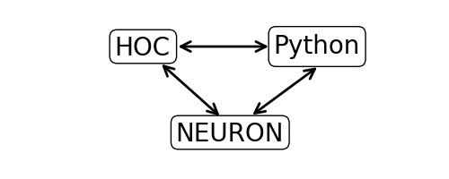
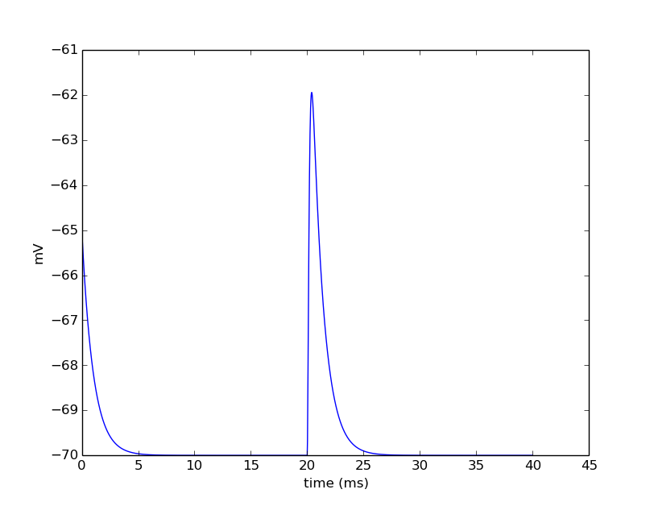

NEURON + Python Basics
======================

The objectives of this part of the tutorial are to get familiar with basic operations of NEURON using Python. In this worksheet we will:

* Create a passive cell membrane in NEURON.
* Create a synaptic stimulus onto the neuron.
* Modify parameters of the membrane and stimulus.
* Visualize results with matplotlib.

What is NEURON?
---------------

The NEURON simulation environment is a powerful engine for performing simulations of neurons and biophysical neural networks. It permits the construction of biologically realistic membranes with active and passive ion channels, combined with virtual connectivity and electrophysiology tools to drive and measure neuron and network behaviors.

Step 1: Import the neuron module into Python.
---------------------------------------------

Any code that is not part of Python's :py:ref:`built-in-funcs` must be imported. The Python interface to NEURON goes through the "h" module. The h module permits a direct interface to NEURON as well as to NEURON's other interpreter language, hoc. This permits Python to utilize existing hoc models (or parts of models). The relationships of these modules are illustrated below.

We begin by loading NEURON's h module and its graphical user interface:

.. code-block::
    python
    
    from neuron import h, gui

The results of evaluating this code should look something like the following output.

.. code-block::
    none

    NEURON -- Release 7.3 (1314:6accae5c3677) 2015-01-30
    Duke, Yale, and the BlueBrain Project -- Copyright 1984-2014
    See http://www.neuron.yale.edu/neuron/credits

Step 2: Create a cell
---------------------

We create a single-compartment cell as a NEURON :ref:`Section <geometry>`. Evaluate the line below:

.. code-block::
    python
    
    soma = h.Section(name='soma')

There is no output, so how can we tell we successfully created a section?

Aside 1: NEURON's psection() function.
~~~~~~~~~~~~~~~~~~~~~~~~~~~~~~~~~~~~~~

NEURON's :func:`psection` (short for "print section") function can provide a lot of detail on sections. Let's validate that we have a soma and view some of its properties.

.. code-block::
    python
    
    h.psection()

The results tell us: the soma is a closed cylinder of membrane of length 100 microns, a diameter of 500 microns, an axial resistance of 35.4 ohm*cm, and with a membrance capacitance of 1 :math:`\mu F/cm^2`

Aside 2: Python's dir() function.
~~~~~~~~~~~~~~~~~~~~~~~~~~~~~~~~~

We can also probe objects with Python's built-in :func:`dir` function. Let's see what it says about soma.

.. code-block::
    python
    
    dir(soma)

This tells us all of the Python methods and variables associated with the object. Any method with two leading and trailing underscores are reserved by Python and may or may not be implemented by the object. The other items in the list are additional members of soma that we can call. To see all of the functions available to the neuron variable h, try calling ``dir(h)``.

Aside 3: Getting more help.
~~~~~~~~~~~~~~~~~~~~~~~~~~~

In addition to probing objects with :func:`dir`, help from docstrings are available using :func:`help`.

.. code-block::
    python
    
    help(object_or_variable)

For example, from ``dir(soma)``, we know that connect is available. Let's look inquire about that.

.. code-block::
    python
    
    help(soma.connect)
    
Biophysical Mechanisms
----------------------

NEURON comes standard with a few biophysical mechanisms that can be inserted into the membrane and permit the cell to be dynamic:

+--------------------+--------------------------------------------------------+
| ``pas``            | Passive membrane "leak" channel.                       |
|                    | For simulating the stimulation with extracellular      |
|                    | electrodes, response in the presence of an             |
|                    | extracellular potential boundary condition.            |
+--------------------+--------------------------------------------------------+
| ``extracellular``  | computed by some external program, leaky patch         |
|                    | clamps, incomplete seals in the myelin sheath          |
|                    | along with current flow in the space between the       |
|                    | myelin and the axon.                                   |
+--------------------+--------------------------------------------------------+
| ``hh``             | Hodgkin-Huxley sodium, potassium, and leakage channels.|
+--------------------+--------------------------------------------------------+

Step 3: Insert a passive mechanism.
-----------------------------------

We see from the list of elements after calling ``dir(soma)`` that insert is available. This is the method we will use to insert mechanisms into the membrane. Let's insert a passive leak conductance across the membrane and do this by passing 'pas' as the mechanism type:

.. code-block::
    python
    
    soma.insert('pas')

Aside 4: Sections and segments.
~~~~~~~~~~~~~~~~~~~~~~~~~~~~~~~

A NEURON Section is considered a piece of cylindrical cable. Depending on the resolution desired, it may be necessary to divide the cable into a number of segments where each segment is isopotential across its spatial range. The number of segments within a section is given by the variable, nseg. To access a part of the cylinder, specify a value between 0 and 1, where 0 is typically the end closest to the soma and 1 is the distal end. Because nseg divides the cable into equal-length parts, it should be an odd number so that to address the middle of the cable, (0.5), gives the middle segment.

.. Segments of a section are illustrated below.
.. NOTE: THIS WAS MISSING IN THE SAGE VERSION

To summarize, we access sections by their name and segments by some location on the section.

* Section: ``section``
* Segment: ``section(loc)``

Using the Python :func:`type` function can tell us what a variable is:

.. code-block::
    python
    
    print "type(soma) =", type(soma)
    print "type(soma(0.5)) =", type(soma(0.5)) 

Aside 5: Accessing segment variables.
~~~~~~~~~~~~~~~~~~~~~~~~~~~~~~~~~~~~~

Segment variables follow the idiom:

    ``section(loc).var``

And for mechanisms on the segment:

    ``section(loc).mech.var``

or

    ``section(loc).var_mech``

.. code-block::
    python

    mech = soma(0.5).pas
    print dir(mech) 

.. code-block::
    python
            	
    print mech.g
    print soma(0.5).g_pas 

Step 4: Insert an alpha synapse.
--------------------------------
        	
Let's insert an :class:`AlphaSynapse` object onto the soma to induce some membrane dynamics.

.. code-block::
    python
    
    asyn = h.AlphaSynapse(soma(0.5)) 
        	

AlphaSynapse is a Point Process. Point processes are point sources of current. When making a new PointProcess, you pass the segment to which it will bind.

Again, with :func:`dir` function, we can validate that asyn is an object and contains some useful parameters. Let's look at some of those parameters.

.. code-block::
    python
    
    dir(asyn) 
    
.. code-block::
    python
       	
    print "asyn.e", asyn.e
    print "asyn.gmax", asyn.gmax
    print "asyn.onset", asyn.onset
    print "asyn.tau", asyn.tau 
        	

Let's assign the onset of this synapse to occur at 20 ms and the maximal conductance to 1.

.. code-block::
    python
    
    asyn.onset = 20
    asyn.gmax = 1 
        	

Let's look at the state of our cell using neuron's :func:`psection`.

.. code-block::
    python
    
    h.psection() 

Step 5: Set up recording variables.
-----------------------------------

The cell should be configured to run a simulation. However, we need to set up variables we wish to record from the simulation. For now, we will record the membrane potential, which is ``soma(0.5).v``. References to variables are available as ``_ref_rangevariable``.

.. code-block::
    python
    
    v_vec = h.Vector()             # Membrane potential vector
    t_vec = h.Vector()             # Time stamp vector
    v_vec.record(soma(0.5)._ref_v)
    t_vec.record(h._ref_t) 
        	
Step 6: Run the simulation.
---------------------------

To run the simulation, we execute the following lines.

.. code-block::
    python
        
    h.tstop = 40.0
    h.run() 
        
.. note::
    
    If we had not included ``gui`` in the list of things to import, we would
    have also had to execute:
    
    .. code-block::
        python
        
        h.load_file('srdrun.hoc')
    
    which defines the :func:`run` function (the alternative would be to specify
    initialization and advance in more detail).

Step 7: Plot the results.
-------------------------

We utilize the pyplot module from the matplotlib Python package to visualize the output. 

.. code-block::
    python
    
    from matplotlib import pyplot
    pyplot.figure(figsize=(8,4)) # Default figsize is (8,6)
    pyplot.plot(t_vec, v_vec)
    pyplot.xlabel('time (ms)')
    pyplot.ylabel('mV')
    pyplot.show()

The last line displays the graph and allows you to interact with it (zoom, pan, save, etc). NEURON and Python will wait until you close the figure window to proceed.

Step 8: Saving and restoring results.
-------------------------------------

Many NEURON objects cannot be pickled, including :class:`Vector`. However, data values can often be pickled and restored. For example, using NEURON's :meth:`Vector.to_python` method we can write a file and restore values as illustrated below.

Saving:

.. code-block::
    python
    
    # Pickle
    import pickle
    with open('t_vec.p', 'w') as t_vec_file:
        pickle.dump(t_vec.to_python(), t_vec_file)
    with open('v_vec.p', 'w') as v_vec_file:
        pickle.dump(v_vec.to_python(), v_vec_file)

Loading:

.. code-block::
    python
    
    from neuron import h, gui
    from matplotlib import pyplot
    import pickle
    
    # Unpickle
    with open('t_vec.p') as t_vec_file:
        py_t_vec = pickle.load(t_vec_file)
    t_vec_restore = h.Vector(py_t_vec)
    with open('v_vec.p') as vec_file:
        py_v_vec = pickle.load(vec_file)
    v_vec_restore = h.Vector(py_v_vec)

    # Confirm
    pyplot.figure(figsize=(8,4)) # Default figsize is (8,6)
    pyplot.plot(t_vec_restore, v_vec_restore)
    pyplot.xlabel('time (ms)')
    pyplot.ylabel('mV')
    pyplot.show()
