SpikePlot Demo
==============

.. topic:: Before we begin

    The examples on this page use Thomas McTavish's ``neuronpy`` module, available
    from `<https://pypi.python.org/pypi/neuronpy>`_. On Linux or Mac, this may be
    installed by typing: ``sudo pip install neuronpy``

Introduction
------------

This tutorial illustrates how to make spike raster plots using the neuronpy.graphics.spikeplot module. Spike trains are formatted as single vectors (Lists or 1D numpy arrays) or as 2D vectors (List of Lists or 2D numpy arrays). The elements of the vectors are the spike times. Plots are such that time is in the horizontal axis and each row is a given cell.

Basic example
~~~~~~~~~~~~~

The following example shows the basic steps. We first create spikes. Then we create a SpikePlot object. Then we plot the spikes.

.. code-block:: python

    import numpy
    from neuronpy.graphics import spikeplot

    spikes = []
    num_cells = 10
    num_spikes_per_cell = 20
    frequency = 20

    # Make the spike data. Use a simple Poisson-like spike generator 
    # (just for illustrative purposes here. Better spike generators should 
    # be used in simulations).
    for i in range(num_cells):
        isi = numpy.random.poisson(frequency, num_spikes_per_cell)
        spikes.append(numpy.cumsum(isi))
        
    # spikes is now a list of lists where each cell has a list of spike
    # times. Now, let's plot these spikes.
    sp = spikeplot.SpikePlot()
    sp.plot_spikes(spikes) 

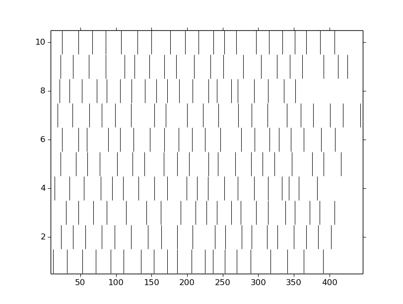

Import the module
-----------------

First, import the module.

.. code-block:: python

    from neuronpy.graphics import spikeplot 
       	
Basic plot
----------

Plotting spike data requires an instance of a SpikePlot object. Instantiate the object and call :func:`plot_spikes`. (The SpikePlot constructor accepts an optional savefig=True option that makes drawing write to a file; the default value is False.)

.. code-block:: python

    sp = spikeplot.SpikePlot()
    sp.plot_spikes(spikes) 

.. note::

    Here we are assuming ``spikes`` is already defined.

In addition to noting that the tick marks are by default black vertical bars that just touch each other, there are a few things to note about this plot. In particular, :class:`SpikePlot` uses Matplotlib Figures. As such, this figure takes many Matplotlib.Figure and Axes defaults.

* The figure size is 8x6 inches.
* Axis tick marks are automatically generated.
* There are no axis labels, no title, and no legends.

We will add these elements and add/edit other properties of the spike plot as we progress throug the tutorial.

SpikePlot variables
-------------------

SpikePlot has several different variables below that can be set and retrieved:

* marker
* markercolor
* markerscale
* markeredgewidth
* linestyle
* linewidth
* fig_name
* figsize
* fig

These variables are illustrated below. Python does not have the capability of hiding variables, so these variables are accessible directly as ``_<var_name>`` (note the underscore in front of the variable name). However, the ``set_<var_name>`` methods perform error checking to help ensure that the proposed variable value is valid, so use the accessor methods instead of setting the variable directly. (Python of course supports properties which could mask the function calls, but SpikePlot uses explicit setters instead.)

marker
~~~~~~

By default, the marker is a vertical line. This can be changed to any valid `Matplotlib.lines.Line2D marker <http://matplotlib.sourceforge.net/api/artist_api.html#matplotlib.lines.Line2D.set_marker>`_. For example, the marker can be set to circles.

.. code-block:: python

    # Make the marker filled circles.
    sp = spikeplot.SpikePlot(marker='.')
    sp.plot_spikes(spikes) 

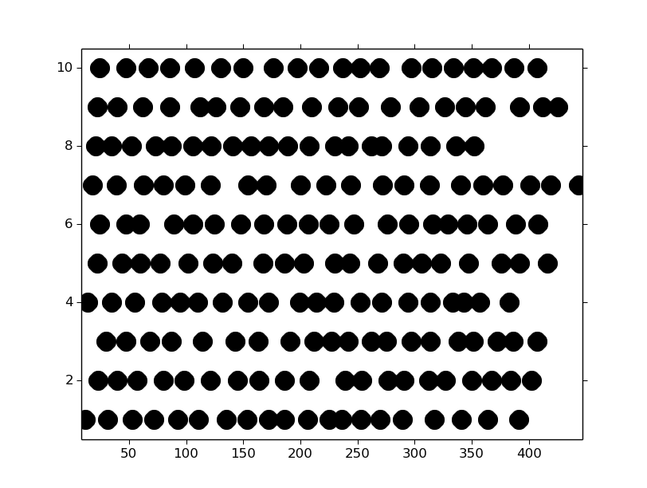

Note that this is equivalent to

.. code-block:: python

    sp = spikeplot.SpikePlot()
    sp.set_marker('.')    # Make all subsequent marks circles
    sp.plot_spikes(spikes) 

markercolor
~~~~~~~~~~~

The markercolor can be changed with any valid `Matplotlib color <http://matplotlib.sourceforge.net/api/colors_api.html>`_. This means strings like 'red' and 'blue' can be used as well as RGB tuples and html strings. This sets the complete element to a solid color. There is no discrepancy between facecolor and edgecolor. If horizontal lines are shown (shown below), this also colors the line with the same color.

.. code-block:: python

    sp = spikeplot.SpikePlot()
    sp.set_markercolor('red')
    sp.plot_spikes(spikes) 

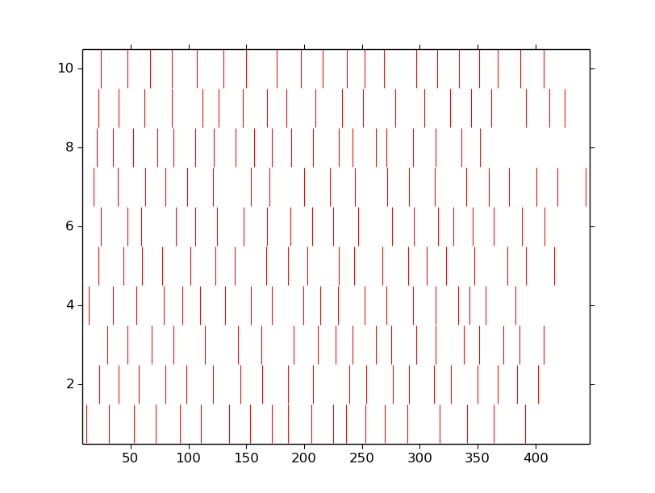

markerscale
~~~~~~~~~~~

The markerscale corresponds to the height of the rows. With a default value of 1 and when vertical bars are used as the tick marks, each row just touches the other. With a value of 0.5, the tick marks would be half as tall. In the previous examples using circle tick marks, the marks were quite large. Setting this value to a smaller value may help that issue. Additionally, larger values than 1 will bleed across rows, which may be desired in some situations.

.. code-block:: python

    sp = spikeplot.SpikePlot()
    sp.set_markerscale(0.5)
    sp.plot_spikes(spikes) 

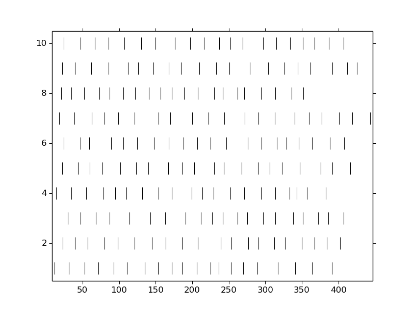

The markeredgewidth also defines the size of the tick mark. By default, this has a value of 1. This can be made even smaller for sharper tick marks or larger to widen the mark. For example, here we set the width to 10.

.. code-block:: python

    sp = spikeplot.SpikePlot()
    sp.set_markeredgewidth(10)
    sp.plot_spikes(spikes) 

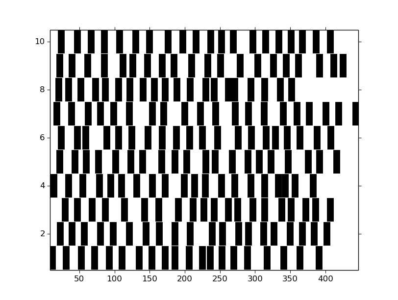

linestyle
~~~~~~~~~

The linestyle defines the horizontal line that is drawn across each spike train. By default, the linestyle is ``None`` so that no lines are drawn. This can accept any linestyle defined by `Matplotlib.lines <http://matplotlib.sourceforge.net/api/artist_api.html#matplotlib.lines.Line2D.set_linestyle>`_, but for the most part, either ``None`` or ``'-'`` will be used.

.. code-block:: python

    sp = spikeplot.SpikePlot()
    sp.set_linestyle('-')
    sp.set_markerscale(0.5)
    sp.plot_spikes(spikes) 

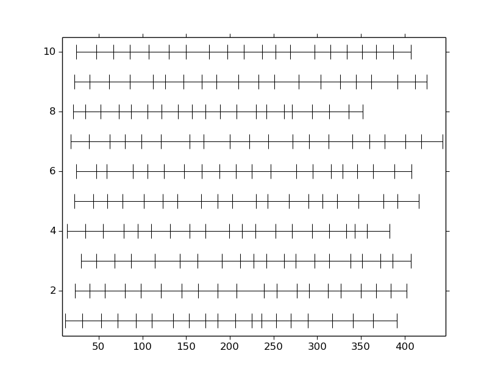

linewidth
~~~~~~~~~

When the linestyle is not ``None``, then a horizontal line is drawn. The width of that line can be set to be different from its default value of 0.75.

.. code-block:: python

    sp = spikeplot.SpikePlot()
    sp.set_linestyle('-')
    sp.set_linewidth(3)
    sp.set_markerscale(0.5)
    sp.plot_spikes(spikes) 

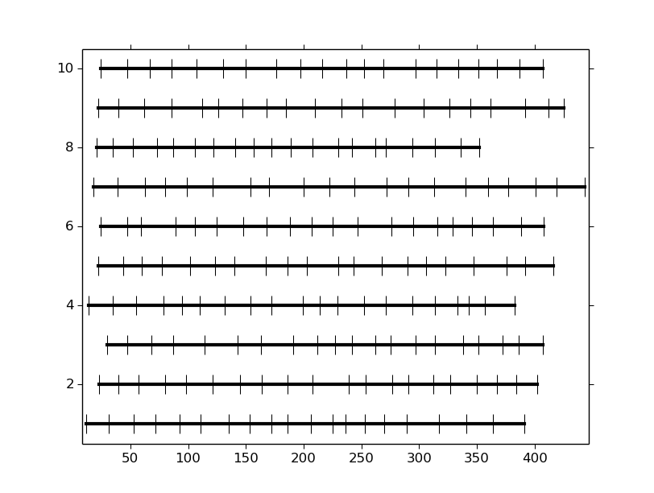

fig_name
~~~~~~~~

When the :class:`SpikePlot` is created with the ``savefig=True`` option, :func:`plot_spikes` will write its output to a file. The default file name is :file:`spikeplot.png``, but changing this to "<filename>.<format>" allows other options. Allowable file formats are largely determined by the graphics backend that is used, but for the most part, png, pdf, ps, eps and svg extensions are permitted.

.. code-block:: python

    sp = spikeplot.SpikePlot(savefig=True)
    sp.set_fig_name('myplot.pdf')
    sp.plot_spikes(spikes, draw=False) 

The above generates the file :download:`myplot.pdf`. The ``draw=False`` option prevents :func:`plot_spikes` from immediately displaying the result on the screen. The plot still exists, but has not been rendered; a subsequent call to ``pyplot.show()`` would reveal the plot.

figsize
~~~~~~~

The figsize parameter is a tuple of length 2 specifying the width and height of the figure in inches. By default, this is 8x6 (or to the value specified in the Matplotlib rc file). Avoid setting this value by getting the figure handle and setting the size. Use the set_figsize() method, or start with the desired output size as the parameter.

.. code-block:: python

    sp = spikeplot.SpikePlot(figsize=(6,2))
    sp.plot_spikes(spikes) 

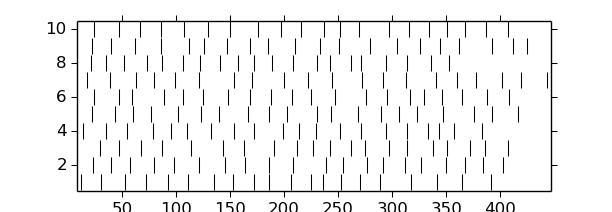

figure and axes handles
~~~~~~~~~~~~~~~~~~~~~~~

It is possible to pass a figure handle to the SpikePlot object as well as an axes object. This can be useful for specifying titles, axis labels, tick marks, and general layout.

The following example creates a figure and axes, then sets an axes title, a x-axis label, and removes the ticklabels and tick marks from the vertical axis.

.. code-block:: python

    from matplotlib import pyplot
    # Pre-process some figure variables
    fig_handle = pyplot.figure(figsize=(6,2))
    ax = fig_handle.add_subplot(111)
    ax.set_title('Pre-formatted figure')
    ax.set_xlabel('$t$ (ms)') # Note LaTeX
    ax.set_yticks([])

    # Now pass the figure handle to SpikePlot.
    # The spike_axes will be set to the first axes object assigned to the figure
    sp = spikeplot.SpikePlot(fig=fig_handle)
    sp.plot_spikes(spikes) 

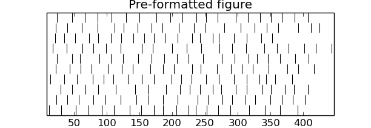

The title is slightly clipped (note how thin the tops of the two letter ``f``s are) and the xlabel is not even visible. Adjust the axes size.

.. code-block:: python

    fig_handle = pyplot.figure(figsize=(6,2))
    ax = fig_handle.add_subplot(111)
    ax.set_title('Pre-formatted figure')
    ax.set_xlabel('$t$ (ms)') # Note LaTeX
    ax.set_yticks([])

    # Next two lines are new
    pos = ax.get_position()
    ax.set_position([pos.xmin, pos.ymin + 0.1, pos.width, pos.height - 0.17])

    # Now pass the figure handle to SpikePlot.
    # The spike_axes will be set to the first axes object assigned to the figure
    sp = spikeplot.SpikePlot(fig=fig_handle)
    sp.plot_spikes(spikes) 

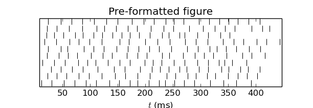
    
.. warning::

    This image is what resulted from saving the matplotlib window. On my screen, the x-axis label was still missing but the title showed improvement from the previous figure.
    
That's better.

We can also work backwards by plotting the spikes (with the ``draw=False`` option) and then doing some post-processing formatting. This requires getting the figure handle and spike_axes from the SpikePlot object and manipulating them. After any manipulation to the axes, the SpikePlot object needs to be told so that it can adjust the spike rasters properly. Additionally, we do not draw the figure to a file when we call plot_spikes, which normally writes a file. So we do not initialize SpikePlot with a savefig=True, but then write the file later.

.. code-block:: python

    sp = spikeplot.SpikePlot()
    sp.plot_spikes(spikes, draw=False)

    # Post-processing
    fig_handle = sp.get_fig()
    fig_handle.set_size_inches(6, 2)
    ax = sp.get_raster_axes()
    ax.set_title('Post-formatted figure')
    ax.set_xlabel('$t$ (ms)') # Note LaTeX
    ax.set_yticks([])
    pos = ax.get_position()
    ax.set_position([pos.xmin, pos.ymin + .1, pos.width, pos.height - .17])

    # After modifying the spike_axes, be sure to update the SpikePlot object
    sp.set_raster_axes(ax)

    pyplot.show()

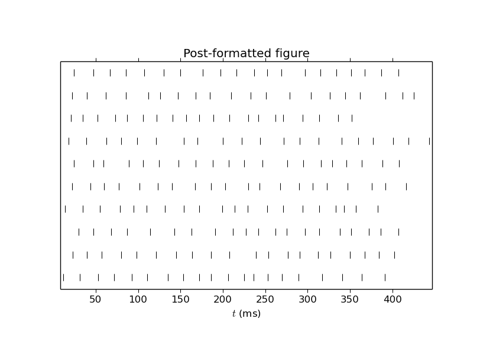

Multiple trains
---------------

We can write multiple trains by either overlaying a second set of spikes on top of the original set, or by stacking. This example creates a second set of spikes and draws them red.

.. code-block:: python

    # Create a second list of spikes
    spikes2 = []
    num_cells = 10
    num_spikes_per_cell = 20
    frequency = 20

    # Make the spike data. Use a simple Poisson-like spike generator 
    # (just for illustrative purposes here. Better spike generators should 
    # be used in simulations).
    for i in range(num_cells):
        isi = numpy.random.poisson(frequency, num_spikes_per_cell)
        spikes2.append(numpy.cumsum(isi)) 

.. code-block:: python

    # Draw the first spikes as before, but set draw to False so that we do 
    # not draw to the screen with this plot_spikes() call, but wait until 
    # later, when we have drawn all spike traces to draw to the screen.
    sp = spikeplot.SpikePlot()
    sp.plot_spikes(spikes, draw=False, label='spikes')

    # Make subsequent marks red
    sp.set_markercolor('red')
    sp.plot_spikes(spikes2, label='spikes2') 

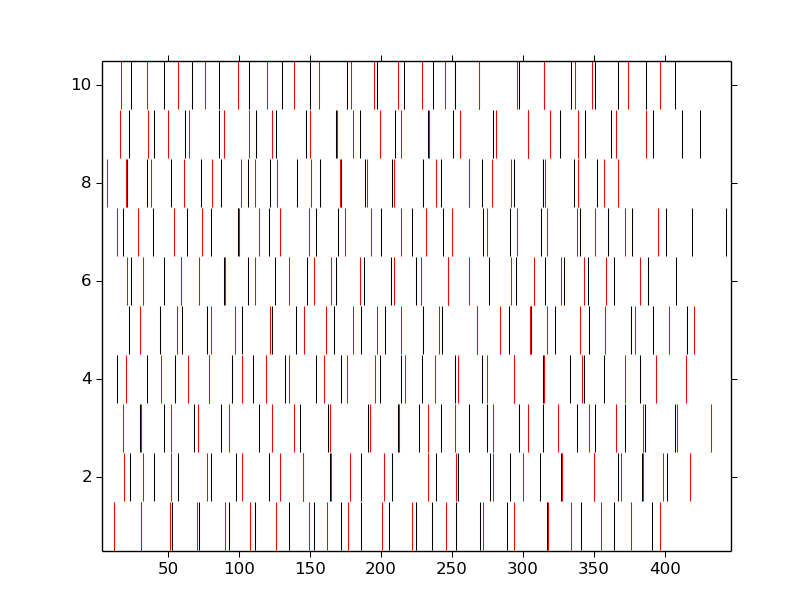

The two uses of ``label`` here tell :class:`SpikePlot` that these are distinct spike sets. If the label argument was omitted, then the second call to plot_spikes would clear the first set of results.

.. code-block:: python

    # Make the marker filled circles.
    sp = spikeplot.SpikePlot()
    sp.set_markerscale(0.5)
    sp.set_marker('.')

    # Set draw to false so that we do not draw to the screen now, but
    # wait until later, when we have drawn all spike traces.
    # Make new marks black
    sp.set_markercolor('black')
    sp.plot_spikes(spikes, draw=False, label='spikes')

    # Make subsequent marks red
    sp.set_markercolor('red')

    # Set refresh to False so that old marks are not erased.
    sp.plot_spikes(spikes2, cell_offset=len(spikes)) 

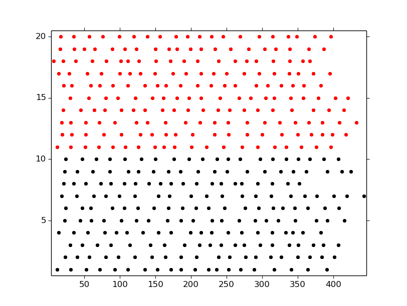

.. the original version had a large data section here, but it consisted of a example of loading pickled data and an interactive widget that didn't work
